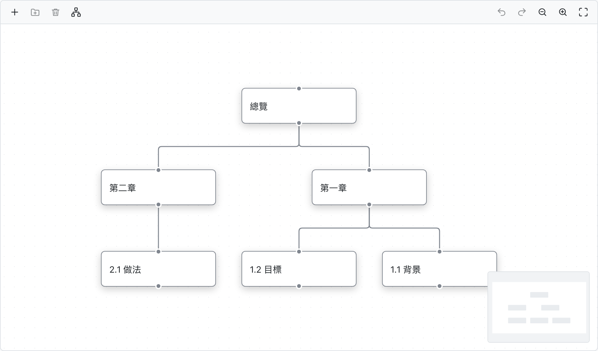
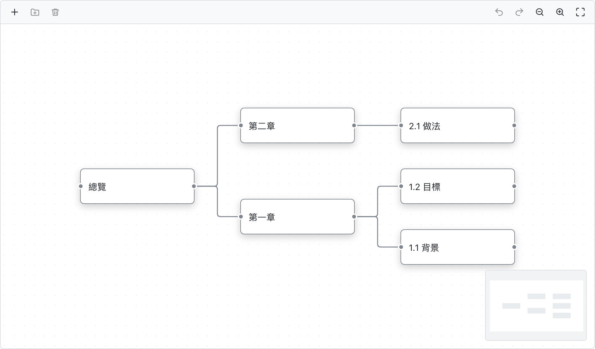
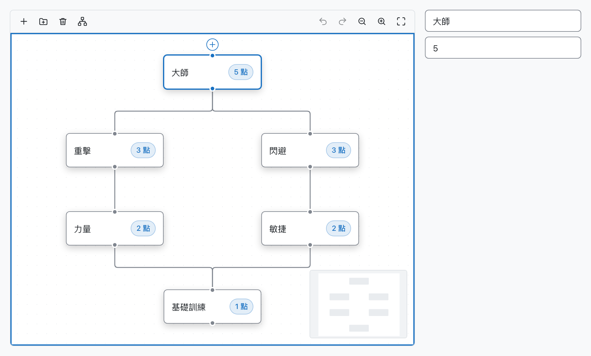
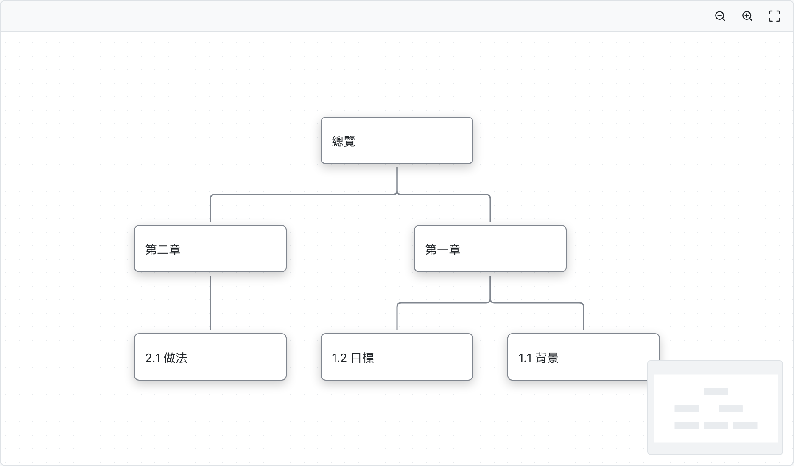
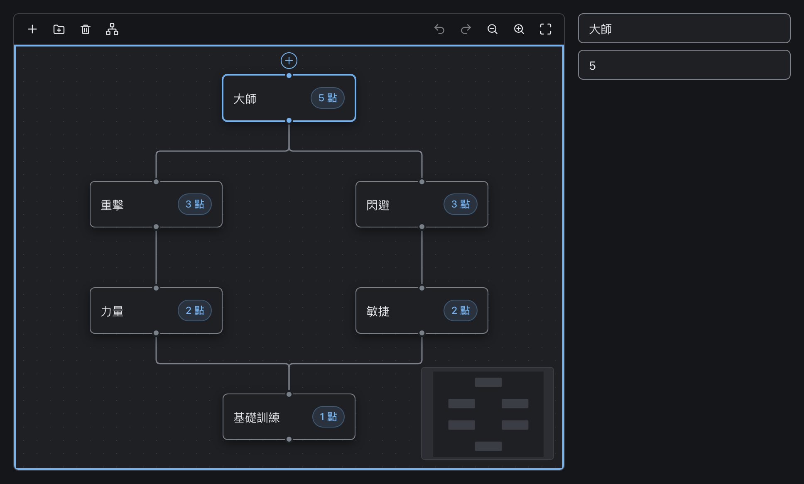
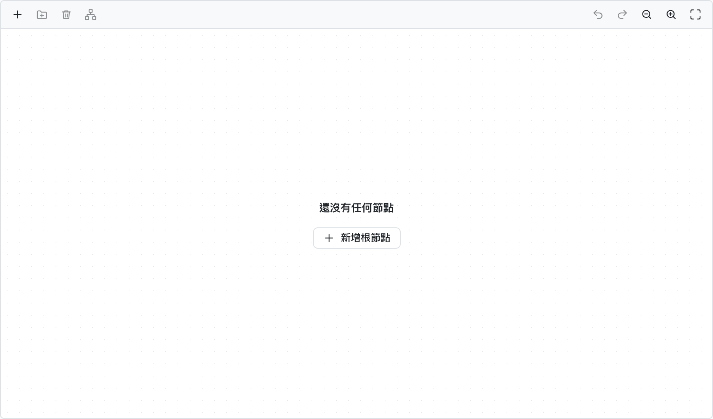
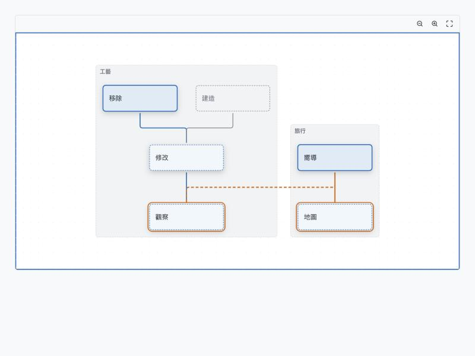

# 前端 07 — UI 系統（Base UI）

## 1. 分工

```
┌──────────────────────────────────────────────────────────┐
│ features/*/components/       業務元件（RoleTable、UserStatusChip）│
├──────────────────────────────────────────────────────────┤
│ @b2b-system/ui               ★ 設計系統元件（我們寫的）         │
│                              Button · Input · Select · Dialog … │
├──────────────────────────────────────────────────────────┤
│ @base-ui/react               行為與可近性（無樣式）             │
│                              焦點管理 · 鍵盤 · ARIA · 定位      │
├──────────────────────────────────────────────────────────┤
│ @b2b-system/ui 的 styles/    Design Token（CSS 變數，三層）     │
│ UnoCSS                       工具類                           │
└──────────────────────────────────────────────────────────┘
```

Base UI 提供 **狀態機與可近性**，一點樣式都沒有。`@b2b-system/ui` 是我們把它
變成「B2B System 的樣子」的地方。這一層會比搭配 MUI 時厚得多——搭 MUI 時
`components/Select` 只是薄包裝，我們的要自己寫完整外觀。

這是有意識的成本，換來的是：**沒有要對抗的既有樣式**，而且未來畫布、屬性面板、
時間軸這些非標準 UI 不會與設計系統打架。

設計系統放在 workspace package `packages/ui`（`@b2b-system/ui`，只有原始碼，由各 app 的 Vite 編譯），backstage 與 platform 共用：

| 位置 | 內容 | 匯入 |
| --- | --- | --- |
| `packages/ui/src/components/<Name>/` | 元件（含測試與 story） | `@b2b-system/ui/<Name>`（例：`@b2b-system/ui/Button`）；`labels`、`slots`、`types`、`useControllableState`、`useLatestRef` 同樣以子路徑匯入 |
| `packages/ui/src/styles/` | `tokens.css`、`contrast.test.ts`；`index.css` = token ＋ 全域 base 層 | app 的 `src/index.css` 只寫 `@import '@b2b-system/ui/styles.css';` |
| `packages/ui/src/icons/` | SVG 圖示（§7） | `@b2b-system/ui/icons/x.svg?react` |
| `packages/ui/src/testing/` | `fakeLayout`、`flowDom` 等測試替身 | `@b2b-system/ui/testing` |
| `packages/ui/uno.config.ts` | 共用的 UnoCSS 設定 | app 的 `uno.config.ts` 轉出 `@b2b-system/ui/uno.config` |

本文其餘提到的 `components/<Name>/` 都指 `packages/ui/src/components/<Name>/`；`themes/` 指 `packages/ui/src/styles/`。

---

## 2. 元件清單

### 2.1 有 Base UI 對應的（包裝）

| 我們的元件                    | Base UI 匯入                                |
| ----------------------------- | ------------------------------------------- |
| `Button`                      | `@base-ui/react/button` ＋ `use-button`     |
| `Input`                       | `@base-ui/react/input`、`field`             |
| `Checkbox` / `CheckboxGroup`  | `@base-ui/react/checkbox`、`checkbox-group` |
| `Radio` / `RadioGroup`        | `@base-ui/react/radio`、`radio-group`       |
| `Switch`                      | `@base-ui/react/switch`                     |
| `Dialog`                      | `@base-ui/react/dialog`                     |
| `AlertDialog`                 | `@base-ui/react/alert-dialog`               |
| `Popover`                     | `@base-ui/react/popover`                    |
| `Tooltip`                     | `@base-ui/react/tooltip`                    |
| `ContextMenu`                 | `@base-ui/react/context-menu`               |
| `Tabs`                        | `@base-ui/react/tabs`（放不下的分頁收進「更多」下拉，§3.14） |
| `Accordion` / `Collapsible`   | `@base-ui/react/accordion`、`collapsible`   |
| `Toast`                       | `@base-ui/react/toast`                      |
| `ScrollArea`                  | `@base-ui/react/scroll-area`                |
| `Progress` / `Meter`          | `@base-ui/react/progress`、`meter`          |
| `NumberField`                 | `@base-ui/react/number-field`               |
| `Separator`                   | `@base-ui/react/separator`                  |
| `Avatar`                      | `@base-ui/react/avatar`                     |
| `Field` / `Fieldset` / `Form` | `@base-ui/react/field`、`fieldset`、`form`  |

### 2.2 Base UI 沒有的（自己實作）

| 元件                             | 實作基礎                                             |
| -------------------------------- | ---------------------------------------------------- |
| `Table`                          | TanStack Table ＋ TanStack Virtual ＋ 原生 `<table>` |
| `Pagination`                     | 純自製（`<nav>` ＋ Button）                          |
| `DatePicker` / `DateRangePicker` | 自製，日期運算用 `dayjs`；彈層用 Base UI `Popover`   |
| `Breadcrumbs`                    | 純自製（`<nav aria-label="breadcrumb">`）            |
| `Skeleton` / `Spinner`           | 純 CSS                                               |
| `Icon`                           | SVG sprite ＋ `vite-plugin-svgr`                     |
| `Empty`                          | 版面元件                                             |
| `FormError`                      | 純自製：表單層級的錯誤（常駐的 `<p role="alert">`，沒有訊息時 `:empty` 隱藏；錯誤碼放 `data-value`） |
| `Chip` / `Badge`                 | 純自製                                               |
| `ConfirmDialogProvider` / `useConfirm` | 包在 `AlertDialog` 外的命令式 API（§3.11）       |
| `FileUpload`                     | 自製（`<input type="file">` ＋ 拖放）                |
| `TextEllipsis` / `BoxEllipsis` / `ButtonEllipsis` | 自製：CSS 省略號 ＋ `ResizeObserver` 量測；提示框用 `Tooltip`、下拉用 `Menu`（§3.8） |
| `Select`（含搜尋，取代原本的 `Combobox`）/ `Menu` | 自製列表 ＋ Base UI `Popover`（定位、點外面／Esc 關閉、焦點歸還）＋ TanStack Virtual（§3.10） |
| `VirtualList`                    | TanStack Virtual；長列表的虛擬捲動 ＋ 無限捲動（§3.10） |
| `DataGrid`                       | 試算表式的表格（`react-data-grid`）：列與欄虛擬捲動、鍵盤移動、儲存格編輯（文字、自動完成、包成儲存格的 `Select`）、貼上 TSV、儲存格狀態（§3.15） |
| `Typography` / `Title` / `Text` / `Paragraph` | 自製；`copyable` 的複製按鈕用 `Tooltip` ＋ `navigator.clipboard`（§3.9） |
| `JsonViewer` / `JsonEditor`      | `JsonEditor` 是 CodeMirror 6；`JsonViewer` 自製（逐行渲染 ＋ `useVirtualRows`），外觀對齊 CodeMirror（§3.12、§11） |
| `JsonDiff`                       | 自製：Myers 逐行差異 ＋ `useVirtualRows`，外觀沿用 `JsonViewer`（§3.12） |
| `TreeEditor`                     | React Flow（`@xyflow/react`）＋ dagre 自動排版；樣式改寫進 CSS Module，工具列用 `Toolbar`（§3.13、§12） |
| `Toolbar`                        | 自製：`role="toolbar"` ＋ 方向鍵移動焦點；放不下的按鈕收進「更多」下拉（`Menu`），量測與 `BoxEllipsis` 共用 `useFitItems`（§3.14） |
| `RichTextEditor` / `LazyRichTextEditor` / `RichTextViewer` | `RichTextEditor` 是 Tiptap 3（ProseMirror），頁面用延遲載入的 `LazyRichTextEditor`；`RichTextViewer` 自製（JSON → React 元素，不載入編輯器），兩者共用排版；格式定義與轉換在 `@b2b-system/rich-text`（§3.16、§14） |
| `JustifiedGrid`                  | 自製：等高排列或方格的分區段版面（純函式 `computeGridLayout`，增量快取）＋ 依捲動位置的虛擬渲染；`hitTestGrid` 給框選（§3.19） |
| `ImageViewer`                    | 自製：可縮放與平移的單張圖片，依縮放倍率漸進換解析度（§3.20） |

> **DatePicker 是最大的一塊自製工作**，排入
> [`../../features/roadmap.md`](../../features/roadmap.md) 的 M2，已完成：`components/DatePicker/` 底下是
> `Calendar`（真正的 `<table>` ＋ roving tabindex）、`DatePicker` 與
> `DateRangePicker`，稽核日誌的時間篩選用的就是它。

---

## 3. 包裝的契約

每個 `packages/ui/src/components/<Name>/` 遵循同一個形狀：

```
components/Button/
├── Button.tsx          主元件
├── IconButton.tsx      變體
├── Link.tsx            ButtonLink：按鈕外觀的 TanStack Link（createLink ＋ <a>）
├── Button.module.css   該元件的樣式（CSS Module，用 component 層 token）
├── Button.test.tsx
├── Button.stories.tsx  Storybook（§9）
└── index.ts            只匯出公開 API
```

### 3.1 六條規則

| #   | 規則                                                | 理由                    |
| --- | --------------------------------------------------- | ----------------------- |
| 1   | **不洩漏 Base UI 的型別到 props**                   | 換掉底層時 props 不變   |
| 2   | **forward `ref`、`className`、`data-*`、`aria-*`**  | 呼叫端需要能覆寫與標註  |
| 3   | **受控／非受控都支援**（`value` ＋ `defaultValue`） | 表單與獨立使用都要能用  |
| 4   | **樣式只用 token，不寫死顏色與尺寸**                | 主題與 dark mode 的前提 |
| 5   | **每個元件有 `data-testid` 透傳**                   | E2E 依賴                |
| 6   | **多層元件開出 `classNames` / `styles` / `testIds`** | 內層也要能覆寫與標註，不必退回複合形式 |

#### 規則 6：逐層覆寫

元件內部有兩層以上 DOM（`Dialog` 的 backdrop / header / body、`Table` 的 row / cell …）時，
除了根元素的 `className` / `data-testid`，再開出三個 `Partial<Record<XxxSlot, T>>` 參數：

| 參數         | 型別                  | 行為                                         |
| ------------ | --------------------- | -------------------------------------------- |
| `classNames` | `string`              | 疊加在該層預設 class 之後                    |
| `styles`     | `CSSProperties`       | 與該層預設 inline style 逐屬性合併，呼叫端優先 |
| `testIds`    | `string`              | 取代該層預設 `data-testid`；`data-value` 保留 |

- 層名以 `export type XxxSlot = 'header' | 'body' | …` 匯出，寫在 Props 介面上方，
  並在註解標明頂層 `className` / `data-testid` 落在哪一層（不一定是最外層，例如 `Select` 落在觸發按鈕）。
- 頂層 `data-testid` 落到的那一層，頂層值優先於 `testIds` 的同名鍵。
- 實作一律用 `components/slots.ts` 的 `createSlots()`：
  `<div {...slot('body', styles.body)}>`；攤開後不再另寫 `className` / `style` / `data-testid`。
- `styles` prop 與 `import styles from './Xxx.module.css'` 同名：一律在解構時改名為
  `styles: styleOverrides`，再傳 `createSlots({ classNames, styles: styleOverrides, testIds })`。
- 被當成內層的設計系統元件（`Icon`、`Popover`、`Select`、`Empty`、`Calendar`）因此也接受 `style`。
- 只有單層的元件（`Button`、`Chip`、`Input` …）不開這三個參數。

```tsx
<Dialog
  title={t('role.create.title')}
  classNames={{ body: 'grid gap-4' }}
  testIds={{ footer: 'role-create-footer' }}
/>
```

### 3.2 範例：`Dialog`

Base UI 的 Dialog 是複合元件（`Root` / `Trigger` / `Portal` / `Backdrop` /
`Popup` / `Title` / `Description` / `Close`）。我們把最常見的組合收成一個
元件，同時保留複合形式：

```tsx
// components/Dialog/Dialog.tsx
import { Dialog as BaseDialog } from "@base-ui/react/dialog";
import { cn } from "@b2b-system/web-shared/utils";
import styles from "./Dialog.module.css";

export interface DialogProps {
  open?: boolean;
  defaultOpen?: boolean;
  onOpenChange?: (open: boolean) => void;
  title: ReactNode;
  description?: ReactNode;
  footer?: ReactNode;
  size?: "sm" | "md" | "lg" | "xl"; // xl（72rem）放得下畫布，例如角色權限的技能樹
  /** 點擊遮罩或按 Esc 是否關閉。破壞性操作應設為 false */
  dismissible?: boolean;
  children: ReactNode;
  className?: string;
  "data-testid"?: string;
}

export function Dialog({
  open,
  defaultOpen,
  onOpenChange,
  title,
  description,
  footer,
  size = "md",
  dismissible = true,
  children,
  className,
  ...rest
}: DialogProps) {
  return (
    <BaseDialog.Root
      open={open}
      defaultOpen={defaultOpen}
      // Base UI 的 disablePointerDismissal 只擋點遮罩；Esc 要在 onOpenChange 依 reason 擋下
      onOpenChange={(next, details) => {
        if (!next && !dismissible && DISMISS_REASONS.has(details.reason)) {
          details.cancel(); // 'escape-key'、'outside-press'、'close-watcher'
          return;
        }
        onOpenChange?.(next);
      }}
      disablePointerDismissal={!dismissible}
    >
      <BaseDialog.Portal>
        <BaseDialog.Backdrop forceRender className={styles.backdrop} />
        <BaseDialog.Popup
          className={cn(styles.popup, className)}
          data-size={size}
          {...rest}
        >
          <header className={styles.header}>
            <BaseDialog.Title className={styles.title}>{title}</BaseDialog.Title>
            {description && (
              <BaseDialog.Description className={styles.description}>
                {description}
              </BaseDialog.Description>
            )}
          </header>
          <div className={styles.body}>{children}</div>
          {footer && <footer className={styles.footer}>{footer}</footer>}
        </BaseDialog.Popup>
      </BaseDialog.Portal>
    </BaseDialog.Root>
  );
}

/** 需要完全自訂版面時使用複合形式 */
export const DialogPrimitive = BaseDialog;
```

**`dismissible` 的預設值是產品決定**：刪除確認對話框設 `false`，避免誤觸遮罩
造成「以為取消了但其實什麼都沒發生」的困惑。

`dismissible={false}` 同時擋 **點遮罩與 Esc**（對話框內的按鈕照常關閉）。只顯示一次的內容也用它：
建立 API token、建立 Webhook 與輪替簽章密鑰之後，明文顯示中只剩「我已保存」能關閉，誤按 Esc 不會讓密鑰消失
（[`06-external-api.md`](../06-external-api.md) §9.2 D7、[`backend/17-webhook.md`](../backend/17-webhook.md) §6）。

**巢狀的對話框逐層關閉**：在對話框裡再開一個對話框（例：使用者詳情 → 有效權限）時，Esc、點遮罩、對話框內的「關閉」都只關最上層，
焦點回到開啟它的按鈕。Base UI 預設不渲染巢狀對話框的遮罩，點最上層之外會點到下層的遮罩、把兩層一起關掉，
所以 `Dialog` 與 `AlertDialog` 的遮罩一律 `forceRender`。`Dialog` 的遮罩與彈窗用同一個 `--z-dialog`、由 DOM 順序疊放，
上層的遮罩才會蓋住下層的彈窗（下層變暗，看得出現在在哪一層）。

### 3.3 Base UI 的狀態屬性

Base UI 用 `data-*` 屬性暴露狀態，樣式直接掛在上面，不需要在 React 裡算
className：

```css
/* Button.module.css */
.root[data-disabled] {
  opacity: 0.5;
  cursor: not-allowed;
}
/* Select.module.css */
.item[data-highlighted] {
  background: var(--ge-color-surface-hover);
}
.item[data-selected] {
  font-weight: 600;
}
/* Dialog.module.css */
.popup[data-open] {
  animation: dialog-in 160ms ease-out;
}
.popup[data-closed] {
  animation: dialog-out 120ms ease-in;
}
```

我們自己的變體（`variant`、`size`、`tone`、`block` …）也用同一套寫法：元件把 prop 寫成
`data-variant={variant}`、`data-block={block || undefined}`，CSS 選 `.root[data-variant='primary']`、
`.root[data-block]`，不再維護「prop → modifier class」的對照表。

### 3.4 樣式檔：CSS Module ＋ `@layer`

每個元件的樣式是同資料夾的 `Xxx.module.css`（🔒 `design-system.test.ts` 擋下非 module 的 `.css`）：

```css
/* Button.module.css */
@layer components {
  .root { … }
  .root[data-variant='primary'] { … }
  .icon { … }
}
```

```tsx
import styles from './Button.module.css';

<button className={cn(styles.root, className)} data-variant={variant} data-size={size} />
```

| 約定 | 說明 |
| --- | --- |
| class 名稱 | 模組內的短名：根元素 `.root`，其餘以該層的角色命名（`.title`、`.popup`、`.itemText`），不再寫 `ge-` 前綴與 BEM |
| 變體 | 用 `data-*` 屬性（§3.3），不用 modifier class；測試也斷言屬性，不斷言 class |
| 產出的 class | 開發時 `ge-[檔名]__[本地名]__[hash]`，正式建置 `ge-[hash]`（`vite.config.ts` 的 `css.modules`）；Vitest 產生 `_本地名_hash` 這種穩定名稱 |
| keyframes | 寫在模組裡，名稱會自動加上作用域，不會和其他元件撞名 |
| 外部覆寫 | 呼叫端只能透過 `className` / `classNames` / `styles`，不能選到元件內部的 class（hash 過，也不是公開 API） |

**`@layer` 決定覆寫順序。** `index.html` 的 `<head>` 以內嵌 `<style>` 宣告
`@layer reset, base, components, utilities;`：

- 元件模組、`app/`、`core/` 與 web-core 的版面 CSS 都包在 `@layer components`。
- UnoCSS 以 `outputToCssLayers` 輸出到 `utilities`，排在元件之後，
  所以 `classNames={{ body: 'grid gap-4' }}` 這類工具類 **一定** 蓋得過元件預設值，與選擇器權重、CSS 載入順序無關。
- 順序宣告必須是頁面上第一個出現的 `@layer`，所以放在 `index.html`，不放在任何 CSS 檔：
  正式建置時 CSS 會被拆成多個 chunk，`<link>` 的先後不保證與 import 順序相同（例如 `Toast` 的 CSS 會排在 `index.css` 之前）。

### 3.5 `render` prop — 換底層元素

Base UI 每個 part 都支援 `render` 來改變實際渲染的元素，讓我們能把
TanStack Router 的 `Link` 塞進 Menu item 而不失去鍵盤行為：

```tsx
<Menu.Item render={<Link to="/role/$roleId" params={{ roleId }} />}>{t("role.detail")}</Menu.Item>
```

### 3.6 `ButtonLink` — 會換頁的按鈕

「點了就換頁」的動作（建立、管理權限…）用 `ButtonLink`，不寫 `<Button onClick={() => navigate(...)}>`：
它是 TanStack `createLink()` 包住與 `Button` 同一份樣式的 `<a>`，所以有真正的 `href`
（可中鍵開新分頁、看得到目的網址、可預先載入），props 是 `to` / `params` / `search` ＋ `Button` 的外觀。

```tsx
<ButtonLink variant="primary" to={RoleCreateRoute.to} search={search} data-testid="role-create-button">
  {t("role.create.action")}
</ButtonLink>
```

| 需求               | 用                                           |
| ------------------ | -------------------------------------------- |
| 按鈕外觀、站內換頁 | `ButtonLink`（`components/Button`）          |
| 文字連結           | `Link`（`components/Link`），站內時以 `render` 傳 router 的 `Link` |
| 不換頁的動作       | `Button`                                     |

`disabled` 時 TanStack 會拿掉 `href` 並擋下點擊，`ButtonLink` 另外標上 `aria-disabled` 與 `data-disabled`。

### 3.7 Toast 與 eventBus

提示走全域 eventBus，發的一方不需要在 Provider 底下、也不需要知道 toast 怎麼渲染：

```
useToast().success(…)  ─┐
plugin / 攔截器         ─┼─ eventBus.emit(GlobalEvents.TOAST_SHOW, options)
                         │
web-core/shell/ToastHost ◀──────────┘ eventBus.on(TOAST_SHOW) → toaster.show(options)
  └─ <ToastProvider toaster={toaster}>   components/Toast（Base UI 的 toast manager）
```

- `components/Toast` 只提供 `createToaster()`（可在 React 樹外呼叫的 `show` / `close`）與 `ToastProvider`，
  不認識 eventBus；Base UI 的 manager 不出現在公開型別上。
- `web-core/notify` 的 `useToast()` 是 React 裡的入口；React 之外直接 `eventBus.emit(GlobalEvents.TOAST_SHOW, …)`。
- 整個 app 只有 `web-core/shell/ToastHost` 持有 toaster；各類型的預設停留時間在 `DEFAULT_TOAST_TIMEOUT`（錯誤 8 秒，其餘 4 秒）。
- 測試用 `web-core/testing/renderWithPermissions.tsx` 的 `AllProviders`，它已經掛好 eventBus 與 `ToastHost`。

### 3.8 省略號：`TextEllipsis` / `BoxEllipsis` / `ButtonEllipsis`

`components/Ellipsis/`。放不下時截斷或收起來，並在 hover／聚焦時讓使用者看到被藏起來的東西。

| 元件 | 放不下時 | 隱藏判斷點 | 隱藏替代節點 |
| --- | --- | --- | --- |
| `TextEllipsis` | 文字以省略號截斷（`lines` 可多行） | `collapseAt`：數字（父元素寬度 px）或 `'overflow'` | `collapsedContent` |
| `BoxEllipsis` | 一排項目從尾端收進溢出區 | `maxVisible`：數字或 `(寬度) => 數量`；`fit={false}` 只看它 | `renderOverflow`（預設 `+N`，提示框列出被隱藏的項目） |
| `ButtonEllipsis` | 一組按鈕從尾端收進「更多」下拉（`Menu`） | `maxVisible` 同上；`iconOnly`：數字（寬度 px）時先縮成只剩圖示 | `renderMoreTrigger`、`moreIcon`、`moreLabel` |

提示框：`TextEllipsis` 的 `tooltip` 為 `auto`（預設，被截斷或已收合才顯示）／`always`／`never`；
`ButtonEllipsis` 只剩圖示的按鈕以 `label` 為提示，`item.tooltip` 可覆寫。

**`TextEllipsis`**

- 數字判斷點量 **父元素** 而不是自己：收合後自己會變窄，拿自己比會永遠展不回來。
  父元素寬度為 0（尚未布局、`display: none`）時不判斷。
- `'overflow'` 收合時記下「當時的容器寬度」與「還差多少寬度」，容器變寬到補得回差額才展開，避免在臨界點來回閃動。
- 收合後原內容以視覺隱藏的方式保留給螢幕報讀器。

**`BoxEllipsis`**

- 每個頂層子節點是一個項目（Fragment 不展開）；容器寬度由父層決定（block，或在 flex 裡給 `min-width: 0` ＋ `flex: 1`）。
- 量測：項目的 key 或 `measureKey` 改變時，先渲染全部項目與「全部隱藏」時的溢出區量寬度，
  在 layout effect 裡同步算出可見數量（不會閃）；之後縮放只用快取寬度重算，`document.fonts.ready` 後再量一次。
- 可見數量的演算法是純函式 `fitCount()`，有 table-driven 測試。
- 容器 `overflow: hidden`，以 `padding: 4px; margin: -4px` 外推裁切邊界，項目的 focus ring 才不會被切掉。

**`ButtonEllipsis`**

- 以 `items: ButtonEllipsisItem[]`（`key`、`label`、`icon`、`onClick`、`disabled`、`loading`、`variant`、`tooltip`）描述按鈕；
  同一份資料渲染成外面的按鈕與下拉選項，`variant: 'danger'` 在下拉中顯示為危險色。
- `iconOnly` 切換會改變按鈕寬度，所以當成 `measureKey` 傳給 `BoxEllipsis` 觸發重新量測。
- 下拉按鈕預設 `aria-label="更多"`；`features/` 使用時以 `t()` 傳入 `moreLabel`。
- testid：按鈕 `button-ellipsis-item` ＋ `data-value={key}`、下拉按鈕 `button-ellipsis-more`、選項沿用 `menu-item`。

**共通**

- `BoxEllipsis`、`Tabs`、`Toolbar` 的量測都是 `Ellipsis/useFitItems.ts`：`signature`（項目的 key、會改變寬度的狀態）改變時重新量，
  可見項目由呼叫端的 `pick(layout)` 決定（純函式 `fitIndices()`，可指定 `limit` 與一定要顯示的 `pinned`）。
  寬度 0 的項目（`display: none`，例如渲染成空的工具）不佔位置也不多算間距。
  `ResizeObserver` 的回呼以 `flushSync` 重算，縮放時不會先閃出一幀溢出的版面。
- 狀態以 `data-truncated`、`data-collapsed`、`data-overflowing` 表達。
- 提示框切換用 `Tooltip` 的 `disabled`，而不是清空 `content`——後者會讓觸發元素重新掛載，量測狀態跟著遺失。
- 測試用 `@b2b-system/ui/testing` 的 `fakeLayout`：以 `data-testid` 指定元素尺寸並手動觸發 `ResizeObserver`（jsdom 沒有布局）。

### 3.9 文字：`Typography` / `Title` / `Text` / `Paragraph`

`components/Typography/`。`Typography` 是以 `variant` 指定外觀的底層元件；日常使用語意更明確的三個包裝：

| 元件 | 預設標籤 | 外觀參數 | 對應的 `variant` |
| --- | --- | --- | --- |
| `Title` | `h1`～`h3`（跟著 `level`） | `level`：`1` / `2` / `3` | `pageTitle` / `sectionTitle` / `bodyStrong` |
| `Text` | `span`（行內） | `size`：`md` / `sm`；`code` | `body` / `caption`；`code` 優先 |
| `Paragraph` | `p` | `size`：`md` / `sm` | `body` / `caption` |

- 共通參數：`tone`（`default` / `muted` / `brand` / `danger` / `success`）、`strong`、`copyable`、`as`（只換標籤、保留外觀）。
- 以 `data-variant`、`data-tone`、`data-strong` 表達外觀（§3.3）。

**`copyable`**

- `true` 或 `TypographyCopyableConfig`：`text`（省略時取 children 的純文字）、`copyLabel` / `copiedLabel`、
  `resetAfter`（預設 3000 ms）、`tooltip`（`false` 只留 `aria-label`）、`onCopy`、`onError`。
- 文字後面渲染一個行內 `<button>`（圖示 `copy`，成功後換成 `check` 並帶 `data-copied`），
  `aria-label` 與提示框都是目前的文案；預設 `複製` / `已複製`，`features/` 使用時以 `t()` 傳入。
- children 的純文字由 `getNodeText()` 攤平：只走字串、數字與元素的 `children`；
  children 是會自己產生文字的元件（例如 `<Trans>`）時要明確給 `text`。
- 寫入剪貼簿失敗（權限被拒、非安全環境）不切換成「已複製」，交給 `onError`；元件本身不發 toast（`components/` 不認識 eventBus）。
- 逐層覆寫（§3.1 規則 6）：`TypographySlot = 'copy'`；頂層 `className` / `data-testid` 落在文字本身，
  按鈕預設 `data-testid="typography-copy"`。

### 3.10 下拉列表：`Select` / `Menu` / `VirtualList`

Base UI 的 `Select` / `Menu` / `Combobox` 需要 **所有項目都掛在 DOM 上**（靠它們做鍵盤導覽），
無法虛擬捲動。所以這兩個元件改成：

- **Base UI `Popover`**：定位、點外面／Esc 關閉、焦點歸還、`--anchor-width` 等 CSS 變數。
- **自己的列表**：焦點留在列表容器（有搜尋框時留在輸入框），以 `aria-activedescendant` 指向作用列；
  鍵盤、虛擬捲動、無限捲動的 hook 都在 `components/VirtualList/`，三個元件共用：

| hook | 用途 |
| ---- | ---- |
| `useVirtualRows` | 列數超過 `virtualThreshold`（預設 100）才虛擬化；`scrollToIndex` 只在鍵盤移動與開啟時呼叫 |
| `useInfiniteScroll` | 距底部 64px 內呼叫 `onLoadMore`；同一筆數只觸發一次、內容不滿一屏自動補頁、失敗後要再捲動才重試；`resetKey` 換資料集時解鎖 |
| `useListNavigation` | ↑↓ / Home / End / PageUp / PageDown / typeahead，跳過停用列 |

**Select 的功能**（單選 props 不變；多選以 `multiple` 區分型別）：

| 功能 | props |
| ---- | ---- |
| 多選 | `multiple`、`value: T[]`；勾選不關閉 |
| 值與標籤的順序 | `valueOrder`：`selection`（勾選先後，預設）／`options`（選項順序） |
| 已選置頂 | `pinSelected`：取 **開啟當下** 的快照，開啟期間勾選不重排 |
| 全選 | `selectAll`（半勾狀態、Ctrl/⌘ + A）；只作用在目前看得到、未停用的選項 |
| 選項排序 | `sortOptions`：`asc` / `desc`（自然順序）或比較函式，含子選項 |
| 可展開的列 | 選項帶 `children` 即成為 `role="tree"`；群組列不是值，多選時勾群組 = 勾所有子孫；←／→ 收合展開 |
| 群組列也是值（單選） | `selectableGroups`（例如資料夾樹）：點列選取並關閉，展開收合改由列首箭頭與 ←／→；`disabled` 只停用該列、不連帶停用子孫，鍵盤仍可停在停用的群組上展開 |
| 搜尋（原 `Combobox`） | `searchable`、`searchValue` / `onSearchChange`、`filterOption`（`false` = 後端搜尋）、`searchPlaceholder`、`noMatchLabel`、`clearSearchOnClose` |
| 無限捲動 | `hasMore`、`loading`、`onLoadMore`；搜尋字改變時自動解鎖分頁 |
| 兩行選項 | 選項 `description`，`itemSize` 設 48 |

**不抖動的約定**（改這幾個元件時要守住）：

1. 觸發鈕高度固定；多選標籤單行，放不下的收成 `+N`（`BoxEllipsis`）——觸發鈕尺寸不變，彈出層就不會移位。
2. 列高固定（`itemSize` 與 CSS 一致）、文字不換行；勾選框／✓ 常駐，只換 `data-state`，勾選不改變列的寬高。
3. 開啟期間不重排（`pinSelected` 用快照）；勾選、載入更多都不動捲動位置；捲軸以 `scrollbar-gutter: stable` 預留。
4. 列元件 `memo` ＋ 固定參考的 callback：勾一個項目只重繪狀態改變的列。

**Select 的檔案**：`Select.tsx` 只渲染；資料與狀態（排序、索引、搜尋、受控的已選／展開／開啟、攤平的列與勾選狀態）在 `useSelectModel`，
作用列、勾選與鍵盤在 `useSelectActions`，計算交給 `selectModel.ts` 的純函式；列元件是 `SelectRowView`，props 型別在 `selectProps.ts`。

### 3.11 命令式確認：`useConfirm`

`components/ConfirmDialog/`。`AlertDialog` 是宣告式的，每個要確認的地方都得自己維護「待確認項目」的 state
與一份 `<AlertDialog>`；`useConfirm()` 把它收成一個回傳 `Promise<boolean>` 的函式：

```tsx
const confirm = useConfirm();

const handleDelete = async (row: RoleRowVM) => {
  await confirm({
    title: t('role.delete.title'),
    description: t('role.delete.confirm', { name: row.name }),
    confirmLabel: t('common.delete'),
    onConfirm: () => deleteRole.mutateAsync({ params: { roleId: row.id } }),
  });
};
```

| 行為 | 說明 |
| --- | --- |
| 回傳值 | 確認 → `true`；取消按鈕、Esc → `false`（沿用 `AlertDialog`：點遮罩不關閉） |
| `onConfirm` | 執行期間兩顆按鈕都 disabled、Esc 無效；成功才關閉並回傳 `true`；丟錯時對話框留著，使用者可重試或取消，錯誤提示交給全域處理 |
| 同時呼叫兩次 | 同時只有一個對話框：前一個還沒回答的以 `false` 結束 |
| 預設文案 | `ConfirmDialogProvider` 的 `confirmLabel` / `cancelLabel`；每次呼叫可覆寫 |
| 覆寫內層 | Provider 收 `AlertDialogSlot` 的 `classNames` / `styles` / `testIds`；每次呼叫的 `className` / `data-testid` 落在彈窗 |

**刪除確認一律用 `useConfirm`**（`tone: 'danger'`，`onConfirm` 回傳 mutation 的 `mutateAsync`，錯誤交給 mutation 的 `onError`）：
失敗時對話框留著讓使用者重試或取消，各頁的行為一致。只有確認途中要改變對話框內容的才用宣告式的 `AlertDialog`
（例：角色列表收到 `ROLE_IN_USE` 時把同一個對話框換成「強制刪除」的說明）。

- `web-core/shell/ConfirmDialogHost` 掛在 `GlobalProvider`（`ToastHost` 內側），以 `t('common.confirm')` / `t('common.cancel')` 當預設文案；
  測試的 `AllProviders` 也已經掛好。
- 按鈕的 testid 與 `AlertDialog` 相同：`alert-dialog-confirm`、`alert-dialog-cancel`。
- 需要在對話框裡放表單或其他內容時，仍用宣告式的 `AlertDialog`（`children`）或 `Dialog`。

**什麼時候要確認**：點一下就生效、而且無法復原或會影響一群人的操作，一律先 `confirm({ tone: 'danger' })` 並在說明寫出影響：
刪除、停用（對方會被登出）、駁回（申請人會收到結果）、移除群組成員（子群組的成員一起失去角色）、
移除或降低資料夾授權（對象是角色、群組或所有人時說明是一群人）、降低平台管理者的角色。
升級、新增這類放寬的操作不必確認。

### 3.12 JSON：`JsonViewer` / `JsonEditor`

`JsonEditor` 以 **CodeMirror 6** 實作；`JsonViewer` 自製、不載入 CodeMirror，但外觀與它一致——
行號欄（行號 ＋ 摺疊箭頭）、原始 JSON 文字、同一套語法上色。兩者並排（例如編輯器下方預覽目前的值）時看起來是同一個元件。
決策見 §11（取代自製樹狀編輯器的做法見 §11.6）。

**共用外觀**：`JsonViewer/jsonTheme.module.css` 是唯一的定義。

| 項目 | 內容 |
| ---- | ---- |
| 變數（`.theme`） | 版面：`--json-font-size`、`--json-line-height`（1.25rem）、`--json-padding-block`、`--json-content-inset`、`--json-fold-width`；顏色：`--json-background`、`--json-gutter-*`、`--json-key-color` → `--color-fg`、`--json-string-color` → `--color-success-text`、`--json-number-color` → `--color-danger-text`、`--json-boolean-color` → `--color-warning-text`、`--json-null-color` → `--color-brand`、`--json-delimiter-color` → `--color-fg-muted`、`--json-placeholder-*`、`--json-selection-background`、`--json-search-match-*`、`--json-error-color` |
| 語法上色 class | `.key` `.string` `.number` `.boolean` `.null` `.punctuation`；`JsonViewer` 直接用，`JsonEditor` 以 `HighlightStyle` 的 `class` 對應 `@lezer/json` 的標記 |
| 摺疊 | `.foldMarker`（邊框畫的箭頭，`data-open` 朝下）、`.foldPlaceholder`（`{…}` 中間的 `…`，滑過顯示 `labels.summary`） |

CodeMirror 的版面（`.cm-gutters`、`.cm-lineNumbers`、`.cm-line`…）在 `JsonEditor/editorTheme.ts` 以 `EditorView.theme` 設定，
值只引用上述變數：CodeMirror 的預設樣式是不分層的 `<style>`，`@layer components` 裡的規則壓不過它。
`JsonViewer.module.css` 以同一組變數畫出相同的行號欄寬（位數由元件以 `--json-line-number-digits` 提供，至少 2 位）、行高與留白。

**`JsonViewer`**（`components/JsonViewer/`）：顯示任意 JSON（稽核日誌的 `changes` / `metadata`、之後的設定檔與業務資料）。

| 功能 | props / 行為 |
| ---- | ---- |
| 內容 | 與 `JSON.stringify(value, null, 2)` 相同的文字：鍵名帶引號、縮排是真的空白（選取複製出來就是 JSON） |
| 行號 | 完整展開時的行號；收合的容器之後跳號，與 CodeMirror 摺疊後相同 |
| 收合 | 行號欄的箭頭；收合後顯示 `{…}` / `[…]`，滑過 `…` 顯示 `labels.summary`。`defaultExpandDepth` 決定一開始展開到第幾層；換一份 `value` 時收合狀態回到預設 |
| 高度 | `maxHeight`（預設 `20rem`），超過在框內捲動；長行不換行、在框內水平捲動，行號欄固定在左側 |
| 虛擬捲動 | 攤平成「一行一個元素」（`toJsonLines`，迴圈走訪不遞迴、循環參照顯示 `[Circular]`），行數超過 `virtualThreshold`（預設 100）以 `useVirtualRows` 只渲染可視範圍 |
| 可近性 | 捲動框是 `<section>`，傳 `aria-label` 即成為 `region` 地標；箭頭是 `<button aria-expanded>`；行號 `aria-hidden` |
| testid | 行：`json-viewer-item` ＋ `data-value`（節點路徑，如 `$["a"][0]`）＋ `data-line-number`；箭頭：`json-viewer-toggle` |

**`JsonDiff`**（`components/JsonDiff/`）：兩份 JSON 的逐行差異（unified diff），稽核日誌的「變更前後」與版本紀錄的比較（[`14-revisions.md`](./14-revisions.md) §3）用它。

| 功能 | props / 行為 |
| ---- | ---- |
| 內容 | `before` / `after` 各自以 `JSON.stringify(value, null, 2)` 攤成行，以 Myers 演算法逐行比對（O((N + M)·D)）；同一段變更先列刪除、再列新增。`undefined` 代表這一邊不存在（建立／刪除），另一邊整份是新增／刪除 |
| 行尾逗號 | 比對時忽略行尾逗號（陣列尾端加一項不會讓原本的最後一行變成「刪一行、加一行」）；未變更的行顯示新版的文字 |
| 外觀 | 行號欄並列舊版／新版行號，後接 `+` / `-` 標記；新增的行 `--color-success`、刪除的行 `--color-danger` 混色的底色；語法上色與 `JsonViewer` 相同（`jsonTheme.module.css`） |
| 摺疊 | 只保留變更前後 `context` 行（預設 3），其餘連續未變更的行收成摺疊列（只有一行的不收），點一下展開該段；換一份 `before` / `after` 時回到預設 |
| 沒有變更 | 兩邊相同或都不存在時顯示 `labels.empty` |
| 高度 | `maxHeight`（預設 `20rem`）；列數超過 `virtualThreshold`（預設 100）以 `useVirtualRows` 虛擬捲動 |
| 文案 | `labels.expandUnchanged(count)`、`labels.empty`；`features/` 以 `t()` 傳入 |
| testid | 行：`json-diff-item` ＋ `data-value`（`equal` / `added` / `removed`）＋ `data-old-line-number` / `data-new-line-number`；摺疊列：`json-diff-fold` ＋ `data-value`（區段起點） |

純邏輯在 `JsonDiff/diffLines.ts`：`diffJsonLines`（比對）、`toJsonDiffRows`（摺疊）、`tokenizeJsonLine`（一行切成語法上色的片段）。

**`JsonEditor`**（`components/JsonEditor/`）：

| 功能 | props / 行為 |
| ---- | ---- |
| 值 | `value` / `defaultValue` / `onChange`（受控／非受控）。內容是合法 JSON 時回報解析後的值，打到一半不回報。傳入的值與最後一次回報的不是同一個參考時，整份內容重新產生（復原紀錄、游標、摺疊重設） |
| 編輯 | CodeMirror：語法上色、行號、摺疊（行號欄的箭頭、⌘/Ctrl + Shift + [ ／ ]）、括號配對與自動補上、目前行底色 |
| 不合法的內容 | 解析錯誤以 lint 標在出錯的位置，下方顯示 `labels.parseError` ＋ 瀏覽器的訊息（`role="alert"`）；編輯區 `aria-invalid` |
| 工具列 | `Toolbar`（§3.14）：搜尋、全部展開／全部收合（根節點保持展開）、格式化／壓縮（只改排版，不回報 `onChange`，可復原）、復原／重做（⌘/Ctrl + Z、⌘/Ctrl + Shift + Z）；放不下的從尾端收進「更多」 |
| 搜尋 | ⌘/Ctrl + F 或工具列的放大鏡：搜尋列（`JsonSearchBar`，設計系統元件）以 portal 渲染進 CodeMirror 的搜尋面板位置，查詢交給 `@codemirror/search`。不分大小寫、顯示「2 / 5」；Enter / Shift + Enter 上下一筆，跳到的位置會打開包住它的摺疊並置中；Esc 關閉 |
| 驗證 | `validator`（可非同步）；JSON Schema 用 `createJsonSchemaValidator(schema, { formatMessage })`。結果放進 CodeMirror 的 state，以 lint 畫波浪底線（滑過顯示訊息）：物件成員標鍵名（值是基本型別時連值），容器只標開頭的括號。編輯區下方列出錯誤，點一下打開摺疊並選取；`onValidationChange` 回報結果。validator 請保持參考固定 |
| 唯讀 | `readOnly`：可搜尋、摺疊、選取複製；不能改，沒有格式化／壓縮與復原 |
| 高度 | `maxHeight`（預設 `20rem`），超過在編輯區內捲動 |
| 文案 | `labels`（延伸 `JsonViewerLabels`）；`features/` 以 `t()` 傳入 |
| testid | 工具列 `json-editor-toolbar`（按鈕 `toolbar-item` ＋ `data-value`：`search` / `expand-all` / `collapse-all` / `format` / `compact` / `undo` / `redo`）、編輯區 `json-editor-content`、錯誤 `json-editor-error`、搜尋列 `json-editor-search`（輸入 `-input`、筆數 `-status`）、驗證清單 `json-editor-validation`（每筆 `json-editor-validation-item` ＋ `data-value` 路徑） |

檔案分工：

| 檔案 | 內容 |
| ---- | ---- |
| `JsonViewer/jsonTheme.module.css` | 兩個元件共用的變數與 class（見上） |
| `JsonViewer/jsonLines.ts` | `toJsonLines`（攤平成行，含行號）、`formatPath`（`['a', 0]` → `$["a"][0]`） |
| `JsonViewer/useJsonTree.ts` | 收合狀態：以「與 `defaultExpandDepth` 相反的路徑」記錄，換 `value` 時重設 |
| `JsonEditor/editorTheme.ts` | CodeMirror 的 `EditorView.theme` 與 `HighlightStyle` |
| `JsonEditor/jsonDocument.ts` | 在語法樹上找路徑的位置（`findPathRange`）、依深度摺疊（`foldAtDepth`）、摺疊摘要（`describeFold`） |
| `JsonEditor/validation.ts` | `JsonValidator` 型別與 `createJsonSchemaValidator`；ajv 在 `ajvValidator.ts`，第一次驗證時才動態載入 |
| `JsonEditor/useJsonValidation.ts` | 值改變時重新驗證（`useDeferredValue`），丟掉過期的非同步結果 |
| `JsonEditor/jsonEditorExtensions.ts` | CodeMirror 的 extension 組裝：解析與驗證結果的 `StateField`、linter、摺疊、搜尋面板（交給 React 渲染）、快捷鍵；元件以 `EditorBridge` 把最新的文案與 callback 交給它 |
| `JsonEditor/jsonSearch.ts` | 搜尋列用的查詢：所有符合的位置、目前是第幾筆、選取並捲到某一筆 |
| `JsonEditor/jsonEditorLabels.ts`、`jsonEditorToolbar.tsx` | 文案的鍵與預設值；工具列的按鈕 |
| `JsonEditor/JsonEditor.tsx` | 元件：props、受控的值與 CodeMirror 狀態的同步、搜尋列與驗證清單 |

**Bundle**：CodeMirror（用到的部分）約 120 KB gzip，只被 `JsonEditor` 匯入；沒有頁面用到 `JsonEditor` 時，正式建置不含 CodeMirror。
預覽一律用 `JsonViewer`。

**測試**：jsdom 沒有 `Range.getClientRects`，`JsonEditor.test.tsx` 補上替身；也無法模擬 contenteditable 的輸入，
測試以 `EditorView.findFromDOM()` 取得編輯器後直接送 transaction。

**JSON Schema 驗證器用 ajv**（與 svelte-jsoneditor 相同；依 `$schema` 選 draft-07／2019-09／2020-12，未宣告時 draft-07，含 `ajv-formats`）：

- 錯誤路徑：`required` 標在缺欄位的物件上；`additionalProperties` 標在多出來的那個鍵上。
- 訊息是 ajv 的英文；`features/` 要中文時傳 `formatMessage`，依 `keyword` / `params` 用 `t()` 組字。
- ajv 以動態 `import()` 載入：沒用到 schema 的頁面整個 bundle 都不含 ajv。
- ajv 會把 schema 編譯成 JavaScript（`new Function`）；之後若啟用不含 `unsafe-eval` 的 CSP，要改成建置時預先編譯（ajv standalone）。
- 評估過 `@cfworker/json-schema`（不用 eval、體積小），但屬性本身驗證失敗時會被誤報成 `additionalProperties`，不採用（§11.6）。

尚未實作：取代（`@codemirror/search` 已支援，需要時在 `JsonSearchBar` 加欄位）、摺疊處的驗證錯誤標記。

### 3.13 樹狀圖：`TreeEditor`

在可平移、縮放的畫布上編輯樹狀／分層結構：技能樹、目錄、組織圖、流程。
底層是 React Flow（`@xyflow/react`）＋ dagre，決策見 §12。



| 功能 | props / 行為 |
| ---- | ---- |
| 值 | `value` / `defaultValue` / `onChange`（受控／非受控）：`{ nodes: { id, data, position? }[], edges: { source, target }[] }`。`data` 是呼叫端自己的型別（泛型 `TData`），元件原樣保存。每一次編輯回報一整份新值；拖曳只在放開時回報 |
| 結構 | `mode`：`tree`（預設，單一父節點；連到已有父節點的節點＝換父節點）／`dag`（多個前置）。自己連自己、重複連線、形成循環一律擋下；`isValidConnection` 加額外規則 |
| 方向 | `direction`：`TB`（預設）/ `BT`（技能樹常見）/ `LR` / `RL`；決定排版方向與把手位置 |
| 排版 | `layout`：`manual`（預設，可拖曳、座標存在 `value`，沒有座標的節點自動補上）／`auto`（每次結構改變都重排、不能拖）。`manual` 的工具列有「自動排版」。`nodeSize`（預設 180 × 56）、`nodeGap`、`rankGap` |
| 新增 | 給 `createNode({ parentId? })` 才出現：工具列的新增根節點／子節點、節點外側的 `+`、Tab（選取一個節點時）。新節點就近放置（`placeChild` / `placeRoot`）並被選取 |
| 刪除 | Delete / Backspace 或工具列；刪節點時連同它身上的連線，子節點變成根節點。`onBeforeDelete` 可非同步確認（例如 `useConfirm()`），回傳 `false` 取消 |
| 復原 | 工具列、⌘/Ctrl + Z、⌘/Ctrl + Shift + Z（或 ⌘/Ctrl + Y），最多 100 步；外部換掉 `value`（不是元件剛回報的那一個參考）時清空 |
| 節點內容 | `renderNode(node, { selected, readOnly })`；沒給時顯示 `getNodeLabel(node)`（預設 `id`，也是節點的無障礙名稱）。框內的輸入框取得焦點時，快捷鍵交還給輸入框 |
| 選取 | `onSelectionChange(nodeIds)`：搭配旁邊的屬性面板，以 `updateNodeData` 改資料；`onNodeClick`、`onNodeDoubleClick`（有傳時關掉畫布的雙擊放大：不可拖的節點沒有 `nopan`，雙擊會先被 d3-zoom 吃掉）。`selectable={false}`：節點與連線不能選取、不能聚焦（結構唯讀、互動放在 `renderNode` 裡的按鈕時用，Tab 只停在按鈕上） |
| 狀態 | `getNodeState(node)` → `active`（已啟用）／`derived`（由其他節點帶出）／`available`（可啟用）／`locked`（不能操作），外框與底色由元件呈現（`data-state`）；`renderNode` 的第二個參數也拿得到 `state` |
| 強調 | `highlightedNodeIds`（`data-highlighted`，例如滑過節點時標出前置）、`activeEdgeIds`（已啟用的路徑，品牌色）、`highlightedEdgeIds`（強調的路徑）；連線 id 是 `getEdgeId(edge)` |
| 連線外觀 | `TreeEditorEdge.variant`：`solid`（預設）／`dashed`（例：跨分支的「需要」關係）；元件原樣保存 |
| 分組 | `groups: { id, label, nodeIds }[]`：在成員節點外畫出帶標題的背景（`computeGroupBounds`，不可選、不可拖、不接收滑鼠事件、在連線底下）；搭配 `layout="manual"` 自己排好分組最整齊 |
| 畫布 | 點陣背景、拖曳對齊 8px 格線、滾輪縮放（0.2–2 倍）、`showMinimap`（預設顯示）、`height`（預設 `32rem`）。初次顯示與「顯示全部」不放大超過 1 倍 |
| 唯讀 | `readOnly`：只能平移、縮放、選取；工具列只剩縮放與顯示全部 |
| 工具列 | `Toolbar`（§3.14），一律只顯示圖示；放不下時從尾端（縮放、顯示全部）收進「更多」，下拉選項是 `menu-item` ＋ 同樣的 `data-value` |
| 文案 | `labels`（含「更多」的 `more`）；沒有傳的鍵用 `ComponentLabelsContext` 的 `treeEditor`（目前語系，[`08-i18n.md`](./08-i18n.md) §3.3） |
| slot | `toolbar` / `canvas` / `node` / `group` / `minimap` / `empty`；`className` / `data-testid` 落在最外層 |
| testid | 工具列 `tree-editor-toolbar`、按鈕 `tree-editor-action` ＋ `data-value`（`add-root` / `add-child` / `delete` / `auto-layout` / `undo` / `redo` / `zoom-in` / `zoom-out` / `fit-view`）、畫布 `tree-editor-canvas`、節點 `tree-editor-item` ＋ `data-value`（節點 id）＋ `data-selected`＋ `data-state` ＋ `data-highlighted`、節點上的 `+` `tree-editor-add-child`、分組背景 `tree-editor-group` ＋ `data-value`（分組 id）、空狀態 `tree-editor-empty` |

```tsx
<TreeEditor<Skill>
  value={value}
  onChange={setValue}
  mode="dag"
  direction="BT"
  getNodeLabel={(node) => node.data.name}
  renderNode={(node) => <SkillCard skill={node.data} />}
  createNode={() => ({ id: crypto.randomUUID(), data: { name: t('skill.untitled'), cost: 1 } })}
  onBeforeDelete={() => confirm({ title: t('skill.deleteConfirm') })}
  onSelectionChange={(ids) => setSelectedId(ids[0])}
  labels={{ addRoot: t('skill.addRoot'), /* … */ }}
  aria-label={t('skill.tree')}
/>
```

檔案分工：

| 檔案 | 內容 |
| ---- | ---- |
| `TreeEditor/treeGraph.ts` | 型別與純函式：`checkConnection`、`connectNodes`、`addNode`、`removeElements`、`moveNodes`、`updateNodeData`、`getRootIds`、`getParentIds`、`getDescendantIds`、`getEdgeId` |
| `TreeEditor/layout.ts` | dagre 排版（`computeTreeLayout`、`layoutTree`、`fillMissingPositions`）、新節點的就近位置（`placeChild`、`placeRoot`）與分組背景的範圍（`computeGroupBounds`） |
| `TreeEditor/useTreeHistory.ts` | 以整份快照記錄的復原／重做 |
| `TreeEditor/TreeNode.tsx` | 畫布上的節點：外框、狀態、把手、`+`；分組背景（`TreeGroupNode`）；經由 context 取得 `renderNode` 等設定 |
| `TreeEditor/treeEditorFlow.ts` | 與 React Flow 之間的設定（節點類型、連線樣式、對齊格線、對焦選項）與轉換：畫面上的值 → React Flow 的節點與連線 |
| `TreeEditor/treeEditorToolbar.tsx` | 工具列的按鈕（依可否編輯、能否新增、排版方式組出） |
| `TreeEditor/useTreeSelection.ts` | 節點與連線的選取；只留還存在的節點，選取改變時通知 `onSelectionChange` |
| `TreeEditor/useTreeEditActions.ts` | 編輯動作：拖曳、連線、刪除、新增、自動排版、縮放、復原／重做與 Tab 新增的快捷鍵 |
| `TreeEditor/TreeEditor.tsx` | 元件：props、受控的值與歷史、把上面幾個接起來並渲染（props 型別在 `treeEditorTypes.ts`） |
| `TreeEditor/TreeEditor.module.css` | 元件樣式，以及改寫自 `@xyflow/react/dist/base.css` 的必要樣式（`--xy-*` 變數對應到 alias token） |

**樣式**：不 import React Flow 的 `base.css`（不分層的全域 CSS 會蓋過 `@layer components`，而且寫死色碼），
用得到的規則改寫在 `TreeEditor.module.css` 最後一段，以 `.root :global(.react-flow__*)` 限定範圍。升級 React Flow 大版本時對照它的 base.css。

**測試**：jsdom 沒有布局，`TreeEditor.test.tsx` 補上 ResizeObserver、DOMMatrixReadOnly 與 `getBBox` 的替身；
點節點用 `fireEvent.click`（`userEvent` 的 mousedown 沒有 `view`，d3-drag 會拋錯）。拖線連線與拖曳無法在 jsdom 模擬，
規則在 `treeGraph.test.ts` 以純函式測，互動以 Storybook 確認。jsdom 也不畫連線（需要量測把手位置），連線的 `variant`／強調同樣以 Storybook 確認。

**可解鎖的技能樹**（story `UnlockableSkillTree`）：`readOnly` ＋ `selectable={false}`，互動是節點內的 `<button className="nodrag">`
（原生焦點、Enter／Space、`disabled`）。React Flow 會對「不可選、不可拖、不可連、也沒有點擊處理」的節點設 `pointer-events: none`，
所以元件一律傳 `onNodeClick` 給 React Flow，節點內的按鈕才點得到。實際用例：角色權限的技能樹（`features/role`）。

**Bundle**：React Flow 約 67 KB gzip、dagre 約 17 KB gzip，只被 `TreeEditor` 匯入。

**Storybook 截圖**（2026-09-30，`docs/architecture/frontend/images/tree-editor/`）：

| 自動排版（`layout="auto"`、`LR`） | 技能樹（`dag`、`BT`、自訂內容 ＋ 屬性面板） |
| --- | --- |
|  |  |
| **唯讀** | **技能樹（深色主題）** |
|  |  |
| **空狀態** | **可解鎖的技能樹**（學會「嚮導」、滑過時強調前置路徑；2026-09-30） |
|  |  |

尚未實作：收合子樹、連線上的標籤、拖曳連線端點改接（React Flow 的 `onReconnect`）、複製／貼上節點。

### 3.14 放不下時收進下拉：`Toolbar` / `Tabs` / 頂列工具

一排操作放不下時（窄螢幕、側欄展開、項目很多），從尾端收進「更多」下拉，並隨容器寬度即時展開／收合。
三者都以 `useFitItems`（§3.8「共通」）量測；jsdom 沒有布局（寬度 0）時全部顯示，所以既有測試不受影響。

**`Toolbar`**（`components/Toolbar/`）

| 功能 | props / 行為 |
| ---- | ---- |
| 項目 | `items: ToolbarItem[]`（`key`、`label`、`icon`、`onClick`、`disabled`、`loading`、`variant`、`tooltip`、`iconOnly`、`align`、`pressed`、`data-testid`）；同一份資料渲染成按鈕與下拉選項，`variant: 'danger'` 在下拉中顯示為危險色 |
| 開關 | `pressed`（`true`／`false`）：按鈕帶 `aria-pressed` 並以 `data-pressed` 顯示按下的底色（例：編輯器的粗體）；收進「更多」時以勾號表示（下拉選項沒有 `menuitemcheckbox` 語意）。`undefined` 是一般按鈕 |
| 靠右 | `align: 'end'`：從第一個 `end` 項目起靠右（`data-push`）；`end` 項目都收起時改由「更多」靠右 |
| 只顯示圖示 | 項目的 `iconOnly`，或整列的 `iconOnly`（`true`，或數字：寬度小於此 px 時）——先縮成圖示，仍放不下的才收起；`label` 成為無障礙名稱與提示 |
| 收合 | `fit`（預設 `true`）；從 **尾端** 收，所以把較少用的操作排在後面 |
| 鍵盤 | `role="toolbar"`；←／→ 在按鈕間移動焦點（頭尾循環）、Home／End 到頭尾。按鈕各自仍是 tab stop（沒有做 roving tabindex） |
| 外觀 | `variant`（預設 `ghost`）、`size`（預設 `sm`）；工具列是 `flex: 1` 的 block，放在任何容器裡都會填滿寬度 |
| 文案 | `moreLabel`（預設「更多」）；`features/` 以 `t('common.more')` 傳入 |
| slot | `item` / `more` / `menuItem`；`className` / `data-testid` 落在工具列 |
| testid | 按鈕 `toolbar-item` ＋ `data-value={key}`（`item['data-testid']` 可覆寫）、下拉按鈕 `toolbar-more`、選項 `menu-item` ＋ `data-value={key}` |

不包 Base UI 的 `Toolbar`：它的 `Toolbar.Button` 要以 `render` 套進我們的 `Button`，停用狀態（`focusableWhenDisabled`）與 `Tooltip` 的停用按鈕處理（§3.1 的 `Tooltip` 說明）會互相覆蓋；
工具列需要的只是 `role` 與方向鍵，自己做比較單純。`ButtonEllipsis`（§3.8）是「一組按鈕」，沒有 toolbar 語意與靠右分組，兩者並存。

**`Tabs`**

- 放不下的分頁從尾端收進分頁列右側的「更多 ▾」（`Menu`），選項會切換分頁；分頁帶 `render`（連結）時選項也渲染成連結。
- **選取中的分頁一定看得到**：它被收起時改佔最後一個可見位置（`fitIndices` 的 `pinned`），底線跟著移過去。
- 底線畫在 `bar` 層（分頁列與「更多」的外框），「更多」不在 `tablist` 裡（`tablist` 只能有 `tab`）。
- `textValue`：分頁的純文字。`label` 不是字串（例如帶圖示）時給它，下拉的 typeahead 才找得到；文字改變（切換語系）時也會重新量寬度。
- props：`fit`（預設 `true`）、`moreLabel`（預設「更多」，`features/` 以 `t('common.more')` 傳入）；slot 多了 `bar` / `more` / `menuItem`；testid `tabs-more`。

**頂列工具**（`web-core/layout/HeaderToolbar.tsx`，[`02-plugin-system.md`](./02-plugin-system.md) §4.4）

- `BoxEllipsis` 佔滿頂列剩下的寬度並靠右；放不下的工具收進「更多」彈層（`Popover`，`header-toolbar-more` / `header-toolbar-overflow`）。
- 工具是任意元件（語言、主題本身就是下拉），沒辦法轉成選單項目，所以彈層裡直接渲染被收起的工具元件，行為不變。
- 渲染成空的工具（例如沒有東西時的批次佇列）不佔位置（`.boxItem:empty`）。

### 3.15 試算表式的表格：`DataGrid`

匯入預覽用的受控表格：列、欄、儲存格狀態（錯誤、警告、有變更、沒有變更、驗證中）都由 props 傳入，編輯與貼上以 `onCellsChange` 回報；
平常每一格是唯讀的顯示元件，只有正在編輯的那一格掛上輸入元件。底層是 `react-data-grid`（以 Design Token 覆寫它的 CSS 變數），型別不外露。
編輯器依欄位設定：文字（`loadSuggestions` 加上自動完成）、下拉選單（`options`／`rowOptions`／`loadOptions`，`multiple` 多選）。
下拉選單 **直接包 §3.10 的 `Select`**，只把觸發鈕的樣式改成儲存格（`DataGrid.module.css` 的 `.selectTrigger`），搜尋、虛擬捲動、多選與鍵盤操作都是 `Select` 的，不另寫一份。
行為與鍵盤見 [`21-data-transfer.md`](21-data-transfer.md) §3。

### 3.16 富文本：`RichTextEditor` / `RichTextViewer`

`RichTextEditor` 以 **Tiptap 3**（ProseMirror）實作；`RichTextViewer` 自製、不載入編輯器，把文件 JSON 直接轉成 React 元素。
兩者共用排版（`RichTextViewer/richTextContent.module.css`），並排時看起來是同一份內容。決策見 §14。

**值**：ProseMirror 的文件 JSON（`RichTextDocument`，根節點 `doc`；`editor.getJSON()` 的形狀）。存進資料庫、送給 API、
進版本歷史（`JsonDiff`）與匯入匯出的都是這份 JSON，**不存 HTML**。要純文字（通知摘要、搜尋、字數）用 `richTextToPlainText`，
必填檢查用 `isRichTextEmpty`（只有空段落或分隔線也算空），不要比對 JSON。

格式定義與轉換在 **`@b2b-system/rich-text`**（`packages/rich-text`，api 與 ui 共用，[README](../../../packages/rich-text/README.md)）：

| 函式 | 用途 |
| ---- | ---- |
| `findRichTextIssue` / `isValidRichTextDocument` | 與編輯器 schema 相同的內容規則（節點、標記、父子關係、標題層級、連結網址、深度與節點數）。前端送出前檢查，通過後型別縮小成 API 接受的形狀；api 經由 `/schema` 的 `createRichTextDocumentSchema` 驗證請求 |
| `richTextToHtml` | JSON → HTML（Email、對外 API、Webhook）：不需要 DOM，只輸出白名單元素，文字與屬性跳脫 |
| `htmlToRichText`（`@b2b-system/rich-text/html`） | HTML → JSON（外部系統、匯入）：htmlparser2 解析，只留白名單內的格式，`<script>` 等連同內容丟掉；結果一定通過內容規則。`richTextToHtml` 的輸出轉回來得到相同的內容（段落裡連續的空白依 HTML 規則合併；連結只留 `href`） |
| `plainTextToRichText` | 既有的純文字資料轉成文件（每行一段），migration 的回填用同樣的規則 |

app 不直接依賴 `@b2b-system/rich-text`，型別與純函式由 `@b2b-system/ui/RichTextViewer` 轉出。

| 節點 | 標記 |
| ---- | ---- |
| `paragraph`、`heading`（level 2、3）、`bulletList`、`orderedList`、`listItem`、`blockquote`、`codeBlock`、`horizontalRule`、`hardBreak`、`text` | `bold`、`italic`、`underline`、`strike`、`code`、`link`（`attrs.href`） |

**`RichTextEditor`**（`components/RichTextEditor/`）

| 功能 | props / 行為 |
| ---- | ---- |
| 值 | `value` / `defaultValue` / `onChange`（受控／非受控），每次編輯回報整份文件。傳入的值與最後一次回報的不是同一個參考時，整份內容重建，復原紀錄清空、不回報 `onChange`（與 `JsonEditor` 相同的語意） |
| 格式 | `formats`（預設全部 `RICH_TEXT_FORMATS`）：關掉的格式 **不進 schema**——沒有按鈕，貼上的 HTML 也只留下允許的節點與標記。既有內容含沒開放的格式時，`fitToSchema` 把它整理成段落與純文字（Tiptap 對不合 schema 的 JSON 會整份清空，這裡不讓內容消失）。內容改變時重建編輯器 |
| 編輯 | 工具列與快捷鍵（⌘/Ctrl + B / I / U、⌘/Ctrl + Shift + S、⌘/Ctrl + E、⌘/Ctrl + Alt + 2 / 3、⌘/Ctrl + Shift + 7 / 8、⌘/Ctrl + Shift + B）；Markdown 式輸入（`## `、`- `、`1. `、`> `、```` ``` ````、`---`）。最後一個區塊不是段落時，尾端自動補一個空段落 |
| 連結 | 工具列的連結鈕或 ⌘/Ctrl + K：工具列下方出現連結列（`fieldset`：網址、套用、移除、取消；Enter 套用、Esc 取消並把焦點還給編輯區）。沒寫協定的補上 `https://`；只接受 `isSafeLinkHref`（`http:`、`https:`、`mailto:`、站內的 `/path`）。沒有選取文字時插入網址本身。貼上網址自動成為連結 |
| 字數 | `maxLength`：純文字的字元數上限；超過的編輯整筆擋下（貼上則截斷），下方顯示 `labels.characterCount`，到上限時 `data-full` |
| 狀態 | `readOnly`（沒有工具列、`aria-readonly`）、`disabled`（不能編輯、工具列停用、`aria-disabled`）、`invalid`（外框變色、`aria-invalid`）；`placeholder`（空白時顯示，並標在 `aria-placeholder`） |
| 表單 | 放在 `Field` 裡時：編輯區帶 `controlId`（點標籤會聚焦）、沒有 `aria-label` 時以標籤命名、說明與錯誤接到 `aria-describedby`、`Field` 的 `error` 讓它成為 invalid；`onBlur` 給表單標記 touched |
| 可近性 | 編輯區是 `role="textbox"`、`aria-multiline`；格式按鈕只顯示圖示，`label` 是名稱與提示，按下時 `aria-pressed`；按鈕在目前的選取範圍不能用時停用（例：游標在標題裡時清單按鈕） |
| 高度 | `minHeight`（預設 `6rem`）、`maxHeight`（預設 `20rem`，超過在框內捲動） |
| 文案 | `labels`；沒有傳的鍵用 `ComponentLabelsContext` 的 `richTextEditor`（目前語系，[`08-i18n.md`](./08-i18n.md) §3.3） |
| slot | `toolbar` / `link` / `content` / `footer`；`className` / `data-testid` 落在最外層 |
| testid | 工具列 `rich-text-editor-toolbar`（按鈕 `toolbar-item` ＋ `data-value`：`bold` / `italic` / `underline` / `strike` / `code` / `heading-2` / `heading-3` / `bullet-list` / `ordered-list` / `blockquote` / `code-block` / `horizontal-rule` / `link` / `undo` / `redo`）、連結列 `rich-text-editor-link`（輸入 `-link-input`、套用 `-link-apply`、移除 `-link-remove`）、編輯區的捲動框 `rich-text-editor-content`、字數 `rich-text-editor-footer` |

**`LazyRichTextEditor`**（`components/LazyRichTextEditor/`）：**頁面一律用它**，不直接 import `RichTextEditor`。props 與 `RichTextEditor` 完全相同；
第一次渲染時以 `React.lazy` 下載編輯器（獨立的 chunk），期間顯示同尺寸的骨架（`<output aria-busy>`，名稱是 `labels.loading`；`data-testid="rich-text-editor-loading"`），
版面不跳動。`preloadRichTextEditor()` 先開始下載（重複呼叫只下載一次、失敗時不丟錯，可直接當事件處理函式），
放在會打開編輯器的按鈕的 `onPointerEnter`／`onFocus`。檔案只以 `import type` 參照 `RichTextEditor`，Tiptap 不會跟著它進到呼叫端的 chunk。

**`RichTextViewer`**（`components/RichTextViewer/`）：`value` 是同一份 JSON。只認得上表的節點與標記；認不得的節點只顯示裡面的文字、
認不得的標記忽略；連結只渲染 `isSafeLinkHref` 的網址（`target="_blank"`、`rel="noopener noreferrer nofollow"`），其餘只顯示文字。
不用 `innerHTML`；超過 32 層的巢狀只顯示純文字。

檔案分工：

| 檔案 | 內容 |
| ---- | ---- |
| `packages/rich-text/src/` | 型別、格式清單、內容規則、純文字、連結白名單、JSON ⇄ HTML、zod schema（見上表） |
| `RichTextViewer/index.ts` | 元件 ＋ 轉出 `@b2b-system/rich-text` 給 app 用的型別與純函式 |
| `LazyRichTextEditor/LazyRichTextEditor.tsx` | 延遲載入、骨架、`preloadRichTextEditor` |
| `RichTextViewer/richTextContent.module.css` | 兩個元件共用的排版（`.content`） |
| `RichTextEditor/richTextExtensions.ts` | Tiptap 的 extension 組裝：`formats` → StarterKit 的開關、連結的網址檢查、Placeholder、字數上限、⌘/Ctrl + K |
| `RichTextEditor/richTextToolbar.tsx` | 格式按鈕的表（`FORMAT_BUTTONS`）、以 `useEditorState` 訂閱的工具列狀態、`Toolbar` 的項目 |
| `RichTextEditor/fitToSchema.ts` | 內容整理成目前 schema 接受的形狀 |
| `RichTextEditor/LinkBar.tsx` | 連結列 |
| `RichTextEditor/RichTextEditor.tsx` | 元件：props、受控的值與編輯器狀態的同步、編輯區的 ARIA |

**樣式**：`injectCSS: false`，Tiptap 不插入自己的 `<style>`（不分層，會蓋過 `@layer components`）；
ProseMirror 必要的樣式（`white-space: break-spaces`、`.ProseMirror-hideselection`、選取節點的外框）改寫在 `RichTextEditor.module.css`，
提示文字以 `.is-editor-empty::before` 顯示。gapcursor 關掉（沒有圖片、表格這類需要它的節點）。

**Bundle**（2026-10-08 以 backstage 的正式建置量測）：編輯器的 chunk（`RichTextEditor-*.js`：Tiptap ＋ ProseMirror ＋ linkifyjs）約 123 KB gzip，
只有 `LazyRichTextEditor` 以動態 `import()` 載入；`RichTextViewer` 約 1 KB；首屏的 chunk 裡沒有任何富文本的程式；
`@b2b-system/rich-text` 的 `/schema`（zod）與 `/html`（htmlparser2）不在任何前端 chunk。預覽一律用 `RichTextViewer`。

**編輯器可能暫時不存在**：Tiptap 會銷毀沒有掛載的編輯器（外層 Suspense 顯示 fallback、`<Activity mode="hidden">`、StrictMode 的重新掛載），
`useEditor` 回傳 null，重新顯示時才建新的；這段空檔裡元件仍可能 render，`useEditorState` 的訂閱也可能對已銷毀的編輯器再算一次 selector。
元件把它收斂成「可用的編輯器或 null」，空檔裡工具列全部停用（`INACTIVE_TOOLBAR_STATE`）、字數是 0。

**測試**：與 `JsonEditor` 相同，jsdom 沒有 `Range.getClientRects`（補替身）、無法模擬 contenteditable 的輸入：
測試從編輯區的 DOM 取得 Tiptap 的 `Editor`（`TiptapEditorHTMLElement.editor`）直接下指令；工具列、連結列、快捷鍵仍以 user-event 操作。
app 的頁面測試用 `@b2b-system/ui/testing` 的 `installRangeLayoutStub()` 與 `insertRichText(textbox, text)`（不必直接依賴 Tiptap）；
E2E 以 `getByTestId('<欄位>').getByRole('textbox').fill(...)` 輸入（Playwright 支援 contenteditable）。
真實的輸入（Markdown 式輸入、⌘/Ctrl + B、⌘/Ctrl + K）以 Storybook 手動確認。

**後端**：DTO 以 `core/validation` 的 `richTextInput({ maxLength, required })`（包 `@b2b-system/rich-text/schema`）驗證請求，
回應用具名元件 `RichTextDocumentSchema`（OpenAPI 的 `RichTextDocument`／`RichTextNode`／`RichTextMark`，節點以 `$ref` 遞迴）。
資料庫存文件 JSON（jsonb），另存一欄純文字給搜尋與字數。第一個使用者是公告的內文（[`../backend/19-announcement.md`](../backend/19-announcement.md) §9.2 D21、D22）。

尚未實作：圖片與附件（節點只存圖片資產的 id，讀取時展開成 `ImageSources`，[`../backend/25-image.md`](../backend/25-image.md) §7）、@提及節點、表格、多人同時編輯（Yjs）。

### 3.17 頭像與有簽章網址的圖片：`Avatar` / `SignedImage`

`Avatar`（`@b2b-system/ui/Avatar`）顯示名字縮寫；有圖片時二擇一：

| prop | 用途 |
| --- | --- |
| `src` | 單一網址（Base UI 的 `Avatar.Image`，載入失敗退回縮寫） |
| `image` | 呼叫端渲染的圖片（`ReactNode`），疊在縮寫之上、填滿圓形；還沒載入或失敗時呼叫端不畫任何東西，縮寫就露出來 |

api 回的圖片是一組有效期的簽章網址（`ImageSources`：多個具名版本 × 主格式 ＋ WebP），由 `@b2b-system/web-core/image` 的 `SignedImage` 顯示：
`<picture>`、寬高、`loading="lazy"`；載入失敗時呼叫 `onExpired` 一次讓查詢重抓，仍失敗才顯示 `fallback`。
頭像用 `SignedAvatar`（`Avatar` ＋ `SignedImage`）：`ui` 不認識 `ImageSources`，組合放在 web-core。規則見 [`../backend/25-image.md`](../backend/25-image.md) §5。

### 3.18 圖片裁切：`ImageCropper`

`@b2b-system/ui/ImageCropper`：拖曳裁切框移動、拖曳四個角縮放；鍵盤以方向鍵移動、Shift ＋ 方向鍵縮放（裁切框是可以聚焦的按鈕）。

| prop | 用途 |
| --- | --- |
| `src`、`alt` | 要裁切的圖；顯示用的可以是縮小版 |
| `naturalWidth`／`naturalHeight` | 原圖的尺寸（比例與最小尺寸以它換算）；省略時用載入後的尺寸 |
| `aspectRatio`、`minWidth`／`minHeight` | 固定比例（寬 ÷ 高）、最小尺寸（原圖的像素） |
| `value`／`defaultValue`／`onValueChange` | 以 **比例**（0～1）表示的範圍；沒給時取中央最大的範圍（`centeredCrop`） |
| `shape` | `circle` 顯示圓形參考線（頭像），範圍仍是方形 |

只輸出範圍，不在瀏覽器重新編碼圖片：套用由伺服器做（[`../backend/25-image.md`](../backend/25-image.md) §15.5）。選圖的流程見 [`23-image-picker.md`](./23-image-picker.md) §5。

### 3.19 圖片的版面：`JustifiedGrid`

`@b2b-system/ui/JustifiedGrid`：分區段的等高排列（justified：每一列高度相同、寬度依寬高比分配、填滿容器）或正方形方格，
只渲染可視範圍上下 `overscan` 內的項目與區段標題。輸入是寬高比，不必等圖片載入就算得出版面；版面計算是純函式（`computeGridLayout`），
每個區段以輸入快取，無限捲動時只重算新載入的那一段。

| prop | 用途 |
| --- | --- |
| `sections` | `{ key, label?, items: { key, width, height }[] }[]`；`label` 是預設的區段標題 |
| `mode`、`rowHeight`、`gap`、`headerHeight`、`maxRowHeightRatio` | 排版（預設 `justified`、180、4、40、1：最後一列放不滿時不拉伸） |
| `renderItem`、`renderHeader` | 項目與區段標題的內容；元件包一層絕對定位、尺寸等於格子的容器，標題黏在上方 |
| `ref` | 根元素就是捲動容器，呼叫端可以設 `scrollTop`、做框選 |
| `onLayoutChange`、`onEndReached`、`onVisibleSectionChange` | 版面重算之後（框選以 `hitTestGrid(layout, rect)` 算命中）、接近底部（無限捲動）、最上方的區段改變（外部的日期捲軸） |
| slots | `scroller`、`section`、`header`、`item`（§3.1 規則 6） |

不含業務名詞：日期分組、選取框、佔位由呼叫端在 `renderItem` 做（圖片庫，[`24-gallery.md`](./24-gallery.md) §3）。

### 3.20 可縮放的圖片：`ImageViewer`

`@b2b-system/ui/ImageViewer`：滾輪與觸控板以游標為中心縮放、拖曳平移、雙擊（觸控是點兩下）在「符合視窗」與「100%」之間切換、雙指縮放；
平移限制在圖片不離開視窗的範圍。

| prop | 用途 |
| --- | --- |
| `levels` | 由小到大的解析度 `{ src, width, height, srcSet?, sources? }[]`：第一個先顯示（通常已在快取），放大到需要時才換成更大的（漸進載入） |
| `width`、`height`、`alt`、`maxZoom` | 原圖尺寸（決定「100%」）、替代文字、最大縮放（預設 4 倍） |
| `placeholderColor`、`placeholderSrc` | 載入前的背景色（資料，只套 inline style）與模糊預覽 |
| `controllerRef` | `zoomIn`／`zoomOut`／`fit`／`actualSize`／`toggle`：快捷鍵由呼叫端綁 |
| `onZoomChange`、`onSwipe` | 縮放狀態；「符合視窗」時左右滑或拖曳超過門檻 → 呼叫端切換上一張／下一張 |
| `showControls`、`labels` | 右下角的放大、縮小、符合視窗按鈕與它們的名稱（預設 zh-TW） |
| slots | `stage`、`image`、`controls` |

只處理一張圖；上一張與下一張、底片列、幻燈片、資訊面板是呼叫端的事（圖片庫的檢視器，[`24-gallery.md`](./24-gallery.md) §9）。
檔案管理器的 LightBox 這一版不改用它（[`../backend/26-gallery.md`](../backend/26-gallery.md) D12）。

---

## 4. Design Token

三層 CSS 變數。

```
packages/ui/src/styles/
├── tokens.css        ① seed ② alias（淺色 :root ＋ 深色 :root[data-theme='dark']）③ component
├── index.css         tokens.css ＋ 全域 base 層（app 以 @b2b-system/ui/styles.css 引入）
└── contrast.test.ts  兩個主題各自的對比度驗證
```

> 下方 §4.1 的範例是設計時的命名草稿（`--ge-*` 前綴）；實作的名稱以 `tokens.css` 為準
> （`--seed-*`、`--color-*`、`--button-*`）。

### 4.1 三層的意義

```css
/* ① seed：沒有語意，只是值 */
:root {
  --ge-seed-blue-500: #2f6feb;
  --ge-seed-gray-050: #f7f8fa;
  --ge-seed-gray-900: #16181d;
  --ge-seed-red-600: #d32f2f;
  --ge-seed-space-2: 8px;
  --ge-seed-radius-md: 6px;
}

/* ② alias：有語意，可依主題換值 */
:root {
  --ge-color-primary: var(--ge-seed-blue-500);
  --ge-color-primary-on: #fff;
  --ge-color-surface: #fff;
  --ge-color-surface-hover: var(--ge-seed-gray-050);
  --ge-color-text-primary: var(--ge-seed-gray-900);
  --ge-color-danger: var(--ge-seed-red-600);
  --ge-color-border: #e3e6eb;
}

/* ③ component：元件自己的旋鈕 */
:root {
  --ge-button-height-md: 36px;
  --ge-button-radius: var(--ge-seed-radius-md);
  --ge-button-bg-primary: var(--ge-color-primary);
  --ge-dialog-radius: 12px;
  --ge-dialog-width-md: 560px;
}
```

**元件 CSS 只准引用第 ③ 層**（必要時第 ② 層），**絕不引用第 ① 層或寫死值**。
這條規則讓換主題＝換第 ② 層的一份對照表。

### 4.2 `-main` / `-text` 的區分

飽和的狀態色作為 **背景填色** 沒問題，作為 **前景文字** 常常過不了 WCAG AA。
所以每個狀態色有兩個值：

```css
--ge-color-danger: #d32f2f; /* 填色：搭配 --ge-color-danger-on 使用 */
--ge-color-danger-text: #b3261e; /* 前景：在所有 surface 上 >= 4.5:1 */
```

`styles/contrast.test.ts` 對每一組 `-text` × 每一種 surface 斷言對比度 ≥ 4.5:1，
CI 會擋下不合格的調色。

### 4.3 UnoCSS 的角色

UnoCSS 負責 **排版**（flex、grid、間距、尺寸），**不負責顏色**。
顏色一律走 token。

```tsx
<div className="flex items-center gap-2 px-4 py-3">
  {" "}
  {/* ✅ UnoCSS 做版面 */}
  <span className="ge-text-danger">…</span> {/* ✅ token 做顏色 */}
  <span className="text-red-500">…</span> {/* ❌ 繞過 token */}
</div>
```

`packages/ui/uno.config.ts`（各 app 共用）裡把顏色相關的工具類 **關掉**，讓錯誤用法無法通過建置。

UnoCSS 的輸出放在 `utilities` 層，排在元件的 `components` 層之後（§3.4），
所以傳進元件的工具類不必加 `!` 就能覆寫元件預設值。

### 4.4 深色主題

換主題 **只換 alias 層**：`tokens.css` 的 `:root[data-theme='dark']` 區塊覆寫顏色與陰影的 alias，
seed、尺寸、字型、z-index 與 component 層都沿用淺色。

| 項目 | 做法 |
| --- | --- |
| 切換機制 | `<html data-theme>`（`light` 或 `dark`）；`color-scheme` 跟著切，原生捲軸與表單控制項一起變 |
| 偏好 | `light` / `dark` / `system`（預設），存在 `preference` dictStorage 的 `theme` 鍵；**只存本機**，不同步到帳號 |
| 跟隨系統 | 在 JS 解析 `prefers-color-scheme` 後寫入 `data-theme`；CSS 不寫 `@media (prefers-color-scheme)`，深色對照表才不必寫兩份 |
| 首次繪製 | `public/theme-init.js` 在 `<head>` 同步執行，先設好 `data-theme`，避免先閃白；獨立成檔是因為正式環境的 CSP 不允許 inline script |
| 之後的變化 | `web-core/plugins/app/theme.ts`：使用者切換、其他分頁同步、系統深淺色變化（只在 `system` 時） |
| 入口 | 頂列的主題選單（`web-core/layout/ThemeMenu.tsx`）與偏好頁；選項表 `THEME_OPTIONS` 在 `web-core/theme` |
| Storybook | 工具列的 **Theme** 切換 |

深色主題的調色原則：

- 主色與狀態色的 **前景**（`--color-brand`、`--color-*-text`）調亮到在深色 surface 上 ≥ 4.5:1；
  主色調亮後白字不夠，`--color-brand-fg` 改成深色。
- 狀態色的 **填色**（`--color-danger` 等）沿用淺色。實心按鈕另有較深的 `--color-danger-fill`／`--color-success-fill`／`--color-warning-fill`：
  按鈕文字是一般文字，搭配 `-on` 的白字要 ≥ 4.5:1（hover 往表面色混 10% 之後也是），而 `--color-success`、`--color-warning`
  本身白字不到 4.5:1（Chip、Progress、邊框等不放文字的地方仍用它們）。
  所以危險按鈕的字用 `--color-danger-on`，不要借用 `--color-brand-fg`。`contrast.test.ts` 會算出 `color-mix` 的 hover 色再比對。
- 中性填色有自己的 alias：`--color-fill-subtle`（停用欄位、中性標籤）、`--color-fill`（軌道、骨架、頭像）、
  `--color-scrollbar(-hover)`、`--color-tooltip-bg/-fg`。元件不直接引用 `--seed-gray-*`
  （🔒 `design-system.test.ts` 擋 `components/` 的 CSS 引用 seed 色）。
- 深色背景上陰影不明顯，陰影與遮罩的 alias 在深色時更重。

新增顏色 alias 時：淺色 `:root` 與深色區塊要一起加；`contrast.test.ts` 會對兩個主題各跑一次，
且深色區塊只能覆寫淺色已有的 token。

### 4.5 疊放層級（z-index）

z-index 也是 token（`packages/ui/src/styles/tokens.css`），元件不寫數字：

| token              | 值  | 用在                                             |
| ------------------ | --- | ------------------------------------------------ |
| `--z-dialog`       | 70  | `Dialog` 的遮罩（popup 為 `+ 1`）                |
| `--z-alert-dialog` | 80  | `AlertDialog` 的遮罩（popup 為 `+ 1`）           |
| `--z-floating`     | 85  | `Popover`、`Select`、`Menu` 的定位層 |
| `--z-tooltip`      | 90  | `Tooltip`                                        |
| `--z-toast`        | 100 | `Toast`                                          |

錨定在觸發元素上的浮層共用 `--z-floating`，而且 **高於所有對話框**：它們常被放在對話框或另一個浮層裡面
（例：`RichTable` 篩選面板裡的 `Select`）。同一層之間由 DOM 順序決定——Base UI 開啟時才 portal 到
`body` 尾端，後開的（巢狀的子浮層）自然在上，不需要再分層。

---

## 5. 可近性基線

Base UI 已處理焦點陷阱、roving tabindex、ARIA 角色與鍵盤互動。我們仍需負責：

| 項目     | 要求                                                               |
| -------- | ------------------------------------------------------------------ |
| 對比度   | 文字 ≥ 4.5:1，大字與圖示 ≥ 3:1；表單控制項的外框用 `--color-border-control`（≥ 3:1，WCAG 1.4.11），裝飾性分隔線才用 `--color-border`（`contrast.test.ts` 驗證） |
| 焦點可見 | 每個互動元素有 `:focus-visible` 外框，`--ge-color-focus-ring` 2px  |
| 表單標籤 | 一律用 Base UI `Field.Label`，不用純視覺標籤。Base UI 只認得向它登記 id 的控制項（`Input`、`NumberField`、`Checkbox`、`Switch`）；`Select`、`DatePicker`、`DateRangePicker` 的觸發鈕是 `Popover.Trigger`，登記不到，改讀 `Field` 的 `FieldControlContext`（`useFieldControl()`）：沒有 `aria-label` 時以 `aria-labelledby` 指向標籤（日期選擇器另外帶上目前的值）；觸發鈕帶 `controlId`，點標籤時 `Field` 以它聚焦觸發鈕（只聚焦、不打開下拉，同原生 `<select>`）。之後新增的自製控制項照同樣的方式接上 |
| 錯誤訊息 | `Field.Error` 帶 `aria-describedby` 連到輸入元素；`Input` 依 Field 的錯誤狀態補 `aria-invalid`；自製控制項從 `FieldControlContext` 取得說明與錯誤的 id（`describedBy`）與 `invalid`（`Select` 標上 `aria-invalid`；日期選擇器的觸發鈕是 `button`，不支援 `aria-invalid`，只以 `data-invalid` 改變外觀）；表單層級的錯誤區（送出失敗、伺服器錯誤）一律用 `FormError`（`role="alert"`，常駐渲染：live region 先存在、內容改變時報讀器比較確定會念出；焦點留在送出鈕上也聽得到） |
| 必填     | `Field` 的 `required` 除了 aria-hidden 的星號，另有給報讀器的「必填」文字（`ComponentLabelsContext`） |
| 圖示按鈕 | 必須有 `aria-label`                                                |
| 停用說明 | 原生 `disabled` 的按鈕收不到 hover／focus，提示出不來。`Button` / `IconButton` 的 `focusableWhenDisabled` 改用 `aria-disabled`（仍可聚焦、hover，點擊與 Enter／Space 被擋下）；包在 `Tooltip` 裡的停用按鈕自動打開，「為什麼不能按」一定看得到（[06-permission.md](./06-permission.md) §6.1）；`loading` 一律隱含開啟（送出中焦點不被踢回 `<body>`）。日曆超出 min / max 的日子同樣用 `aria-disabled`（roving tabindex 要能把焦點移過去）。Base UI 的 `Checkbox` 沒有這個開關，停用理由改寫進常駐的 `description`。其他元素用原生 `disabled` 時提示不會顯示 |
| 動態內容 | toast 用 Base UI Toast（已含 `aria-live`）；表格載入用 `aria-busy` |
| 減少動效 | `@media (prefers-reduced-motion: reduce)` 關閉所有非必要動畫       |

---

## 6. 表格

`components/Table/` 是自製元件中最複雜的一個：

```
components/Table/
├── Table.tsx             版面外殼 ＋ TanStack Table 整合（排序、分頁都交給伺服器）
├── features.ts           TanStack Table v9 登記的功能（TABLE_FEATURES）、TableColumnDef 與欄位 meta 的型別
├── TableHeader.tsx       表頭；可排序欄位以 <button> 承接點擊（鍵盤可操作）、aria-sort
├── TableRow.tsx          選取、hover、單擊/雙擊行為、展開列
├── TableSkeleton.tsx     載入中的骨架列（不帶 table-row testid）
├── sorting.ts            TableSorting 型別、toggleSorting()、排序圖示與 aria-sort 對照
├── pinning.ts            欄位固定、釘選列：預設值（actions 靠右）與量測 sticky 位移的 usePinLayout
├── columns.tsx           工具欄：createSelectColumn（勾選欄 CheckboxColumn）
├── useTableSelection.ts  跨頁保留的選取狀態（id ＋ 勾選當下的資料），批次操作用
├── BatchActionBar.tsx    勾選後的批次操作列：已選筆數、清除選取、呼叫端的按鈕（§6.2）
├── slots.ts              TableSlot
└── index.ts
```

尚未實作（需要時再加）：`TableBody` 虛擬捲動（列數 > 100 時啟用）、欄寬拖曳。

勾選欄（CheckboxColumn）與批次操作的準備：`createSelectColumn(labels)` 產生 id 為 `__select` 的欄位——表頭全選／取消本頁
（部分勾選時半選）、每列一個勾選框；搭配 `useTableSelection(data, getRowId)` 取得 `rowSelection` / `onRowSelectionChange`，
以及跨頁保留的 `selectedIds`、`selectedRows`（勾選當下的資料，列還在目前頁時換成最新的一筆）與 `clear()`。
批次操作直接拿 `selectedRows` 送出；篩選條件改變時由呼叫端 `clear()`。列表頁的完整批次流程見 §6.2。

欄位定義用 `TableColumnDef<TData>`（`@b2b-system/ui/Table` 匯出），不直接寫 TanStack 的 `ColumnDef`：
TanStack Table v9 的型別多了第一個型別參數 `TFeatures`（登記了哪些功能），`features.ts` 的 `TABLE_FEATURES`
只登記 `Table` 用到的功能——欄位固定、欄寬（`size`）、列釘選、勾選、排序（只為了欄位的 `enableSorting`；
排序與分頁都交給伺服器，不登記 row model）。欄位的 `meta` 型別是 `TableColumnMeta`（以 `columnMeta` 登記，不再全域擴充 `ColumnMeta`）。

非字串表頭（勾選框、圖示）的欄位以 `meta.settingsLabel` 宣告欄位設定裡的名稱，才會進入欄位設定（排序、隱藏、固定）。

欄寬：只有宣告了 `size` 的欄位會在 `<th>` 設定寬度，其餘交給瀏覽器分配。

換行：**儲存格預設不換行**（`white-space: nowrap`），寬度不夠時整張表水平捲動，左右固定欄留在原位。
自動版面在寬度不夠時，會把「可以斷行」的欄（中文日期、描述，每個字之間都能斷）擠成一字一行，
不能斷的欄（email、識別碼）卻保持原寬，整張表看起來變形；不換行之後每一列都是一行高，欄位也不會被擠扁。

| 需求 | 做法 |
| ---- | ---- |
| 長文字（描述、備註） | `TextEllipsis` 加最大寬度（例：`className="max-w-60"`），放不下以省略號結尾、滑過顯示全文 |
| 真的要多行顯示 | 欄位宣告 `meta: { wrap: true }`（儲存格帶 `data-wrap`），通常再給 `size`，否則仍可能被擠得很窄 |

展開列：`expandedRowIds`（需要 `getRowId`）＋ `renderExpandedRow(row)`。展開的列正下方插入一列
`data-testid="table-expanded-row"`（`data-value` 是列 id），單一儲存格橫跨所有可見欄位；主列帶
`data-expanded`，兩者之間不畫分隔線。展開狀態由呼叫端管理（通常是操作欄的展開按鈕），
內容也由呼叫端決定——例如稽核日誌在展開當下才向後端取明細
（[`backend/06-audit-log.md`](../backend/06-audit-log.md) §7.3）。

展開內容 **不影響欄寬**：自動版面下，跨欄儲存格的內容寬度會被分攤回它橫跨的欄位，內容一寬（長字串、JSON）
展開／收合時整張表就會重新分配欄寬。所以展開儲存格裡包兩層：外層 `contain: inline-size`（對欄寬的貢獻為 0），
內層（slot `expandedContent`）寬度等於外框的可視寬度（外框是 `container-type: inline-size`，內層 `width: 100cqi`）並 sticky 貼左緣——
表格水平捲動時展開內容留在畫面上；過寬的內容在內容自己的捲動框裡處理（例如 `JsonViewer`）。

固定（pinning）：固定欄位、釘選列、固定表頭都用 `position: sticky` 貼在外框（捲動容器）的邊上；
sticky 儲存格有不透明底色（hover、選取狀態會同步），固定區與一般區交界畫分隔線。
位移由 `usePinLayout` 量實際的欄寬、列高算出（`ResizeObserver` 在尺寸改變時重量），所以沒宣告 `size` 的欄位也能多欄固定。

| prop | 型別 | 效果 |
| ---- | ---- | ---- |
| `columnPinning` | `Partial<ColumnPinningState>`（TanStack） | 欄位固定在 `start`（左）或 `end`（右），陣列順序即排列順序；**預設 `{ end: ['actions'] }`**，傳 `{}` 取消。表頭與列都依「start 固定 → 其餘 → end 固定」排列。目前只支援由左至右，儲存格的 `data-pinned` 仍是 `left` / `right` |
| `rowPinning` | TanStack `RowPinningState` | 資料列貼在頂端（`top`）或底端（`bottom`），捲動時留在原位；需要 `getRowId`，列必須在 `data` 裡 |
| `stickyHeader` | `boolean` | 表頭在垂直捲動時留在上方；頂端的釘選列排在表頭下緣 |
| `maxHeight` | CSS 長度 | 固定表頭或有釘選列時外框的最大高度，預設 `70vh` |
| `fillHeight` | `boolean` | 填滿父層（有高度上限的 flex 欄）的剩餘高度：外框 `flex: 1`、最矮 `12rem`，固定是雙向捲動框，不套 `maxHeight` |

頁面本身捲動時 sticky 無效（外框為了水平捲動已經是捲動容器），所以 **固定表頭或有釘選列時，外框改成雙向捲動、最高 `maxHeight`**
（`fillHeight` 時高度由父層決定，外框一律是捲動框）。
疊放順序：固定欄 < 釘選列 < 釘選列 × 固定欄 < 表頭 < 表頭 × 固定欄。

`RichTable` 把這些固定都記在每張表的偏好裡（§6.1）。

固定的互動行為（這組行為已在實際的管理後台使用者身上驗證過）：

- 尚未進入選取模式時，單擊列身 **不做任何事**
- 已勾選至少一列後，單擊列身 **切換該列選取**
- 雙擊任一列 **開啟詳情**
- 點擊列內的按鈕、連結或勾選框 **只觸發該元件**——`TableRow` 會略過來自互動元素的點擊，
  呼叫端不必各自 `stopPropagation`

### 6.1 列表頁用 `RichTable`（`web-core/components/RichTable/`）

`Table` 不依賴語系與 store；列表頁實際使用的是 `@b2b-system/web-core/components` 的 `RichTable`，它在 `Table` 外面加上：

| 功能 | 元件 | 說明 |
| ---- | ---- | ---- |
| 分頁 | `Pagination` | `pagination={{ offset, limit, total, onChange }}`，文案走 `t()`；第一頁／最後一頁／可輸入頁碼，摘要用千分位；刪到最後一頁沒資料時自動退回最後一頁。頁數只算到 api 接受的最大 offset（`maxOffset`，預設 `LIST_MAX_OFFSET` = 10,000，與 `apps/api/src/core/http/pagination.ts` 的 `MAX_OFFSET` 相同）；`totalCapped` 表示總數是數到上限就停的數字，摘要改寫「以上」（稽核日誌） |
| 版面 | `fillHeight`（預設 `true`） | 表格延展填滿剩餘高度、資料多時在表格內捲動，分頁列固定在底部。外框（web-core 的 `DashboardShell`）的主內容是一個視窗高的 flex 欄（側邊選單與主內容各自捲動），列表頁的根元素給 `flex min-h-0 flex-1 flex-col` 才接得到高度 |
| 篩選 | `FilterBar` | 篩選圖示按鈕（`IconButton`，只有圖示，名稱走 `aria-label`）點開的下拉表單；欄位型別 `text` / `select` / `multiSelect` / `dateRange` / `sort`（多欄排序，`SortEntry[]`，拖曳調整優先順序）/ `custom`。`value` ＋ `onSubmit` 以泛型型別化，一次送出整份值（只更新一次網址） |
| 搜尋 | `search` | `search={{ value, onChange, placeholder }}`：表格上方常駐的搜尋框，停止輸入 300ms 或按 Enter 才送出 |
| 篩選 Chip | `ActiveFilters` | 套用中的篩選（排序除外）以可移除的 Chip 列在表格上方；有篩選卻沒有結果時空狀態改成「沒有符合條件的結果」並提供「清除篩選」 |
| 查詢失敗 | `error` ＋ `onRetry` | 沒有資料時以錯誤訊息＋重試取代表格（不會落到「沒有資料」）；有舊資料時保留表格並在上方提示。**每個 `<RichTable` 都要傳 `error`**，由各 app 的 `app/__tests__/rich-table-error.test.ts` 掃描原始碼守住 |
| 欄位設定 | `TableSettings` | 齒輪按鈕點開的下拉清單：拖曳（dnd-kit，含鍵盤）排序、勾選顯示；依 `tableId` 存在 `web-core/store/tableColumnSettings`，偏好頁的「表格欄位」分頁改的是同一份 |

不經過 `RichTable` 的資料畫面（直接用 `Table`、卡片、設定表單、詳情對話框、頁面的一個區塊）同樣不能把查詢失敗畫成空狀態：
沒有資料而且查詢失敗時，以 `QueryError`（`web-core/components`，本地化訊息＋重試）取代內容；詳情對話框查無資料（`isNotFound`）時不提供重試、改給「回到列表」——以路由開啟的詳情（對話框、面板）一律用 `QueryBoundary`（`web-core/components`：`query`、`skeleton`、`backAction`），規則只寫在一處。
**頁面裡的一個區塊** 用 `QuerySection`（`web-core/components`）：`<QuerySection query={…}>{(data) => …}</QuerySection>`，
載入中顯示骨架、沒有資料又失敗時顯示一行錯誤與重試、有舊資料又失敗時保留內容並提示；「無」只能由 `children` 在拿到資料後判斷。
「沒有權限看這個區塊」由呼叫端決定不渲染或說明需要的權限，不要用 `data === undefined` 表達。
區塊裡的清單自己分頁時（詳情頁的成員、持有者），以 `useOffsetClamp(total, offset, limit, setOffset)` 在刪光最後一頁時退回上一頁；
清單不能只取第一頁而不提示——選擇器在本地過濾的選項以 `fetchAllPages`（`web-core/client`）取完所有分頁。
權限所依據的 profile 查詢失敗時，兩個 app 的 `Layout` 都顯示錯誤頁與重試，不停在載入中。

表頭可以直接設定多欄排序：`sorting` 是 `TableSorting[]`（陣列順序即優先順序），每一欄循環
**不排（`arrow-up-down`，淡化）→ 升冪（`arrow-up`）→ 降冪（`arrow-down`）→ 不排**。新排序的欄位加到最後，
移除時後面的往前遞補；排序中的欄位在圖示旁顯示優先順序數字（1、2、3…）。`onSortingChange` 回報點擊後
完整的陣列，與篩選面板的 `sort` 欄位是同一份狀態。全部取消＝空陣列，不送 `sort`，由後端套用預設排序。
篩選按鈕右上角的數量徽章（同時寫進 `aria-label`，例如「篩選（2 個條件）」）：`sort` 與 `defaultValue`（空陣列）不同才計入。

兩個面板 **都不即時套用**：面板裡的修改只改草稿，按送出鈕才生效，關掉面板就放棄草稿；每次打開都從目前生效的值開始。

| 面板 | 重設鈕（只改草稿） | 送出鈕 | 覆寫文字 |
| ---- | ------------------ | ------ | -------- |
| `FilterBar` | 「清除」→ `defaultValue`（不提供就不顯示） | 「搜尋」；文字欄位按 Enter 同義 | `labels={{ reset, submit }}` |
| `TableSettings` | 「恢復預設」→ `defaultValue` | 「套用」；草稿等於預設時呼叫 `onReset`，不留下多餘的設定 | `labels={{ reset, submit }}` |

兩顆按鈕透過 `Table` 的 `headerTrailing` **固定在最後一欄表頭的右側（與標題垂直置中）**（不論那一欄是什麼，也不會被包進排序按鈕）。
該欄的標題與按鈕都算進最小欄寬（grid `max-content auto`），標題不會被裁切——儲存格不換行後，寬度不夠時整張表水平捲動，欄位不會被擠到比內容窄。
`actions`（操作欄）固定在原位、不列入欄位設定。

**所有 Pin 都記在偏好裡**（`web-core/store/tableColumnSettings`，依 `tableId` 分開、存 localStorage、跨分頁同步）：

| 固定 | 在哪裡改 | 存在哪 | 預設 |
| ---- | -------- | ------ | ---- |
| 欄位固定（Column Pin） | 齒輪面板每一欄右側的「左／右」切換鈕；操作欄在面板下方的「固定」區塊 | `TableColumnSettings.pinnedColumns`（欄位 id → `'start'` / `'end'`） | 操作欄 `end` |
| 固定表頭 | 齒輪面板「固定」區塊的勾選框 | `TableColumnSettings.stickyHeader` | 關 |
| 資料列釘選（Row Pin） | 釘選欄（PinColumn，`__pin`）每列的選單：釘選到頂端／底端／取消 | `pinnedRows[tableId]`（`{ id, side: 'top' \| 'bottom' }[]`；資料只在記憶體的 `pinnedRowData`） | 無 |

**每個 `RichTable` 預設都有這兩個工具欄**，排在所有欄位最前面，和一般欄位一樣進欄位設定（可排序、隱藏、固定）：

| 工具欄 | 出現條件 | 預設 |
| ------ | -------- | ---- |
| 勾選欄（CheckboxColumn，`__select`） | 預設都有；`enableRowSelection={false}` 關閉 | 顯示、固定在 `start`；沒有批次操作的表可以把 `__select` 放進 `defaultHidden` 預設隱藏（例：稽核日誌） |
| 釘選欄（PinColumn，`__pin`） | 有 `settings.tableId` 與 `getRowId`（釘選要記進偏好）；`enableRowPinning={false}` 關閉 | **隱藏**，使用者在欄位設定裡打開 |

勾選欄的選取狀態：呼叫端沒傳 `rowSelection` / `onRowSelectionChange` 時由 `RichTable` 內部的 `useTableSelection` 管理（跨頁保留）；
要做批次操作的頁面自己呼叫 `useTableSelection(data, getRowId)` 並把 `rowSelection` / `onRowSelectionChange` 傳進來接手，
再用 `selectedRows` 送出。沒有 `getRowId` 時與 TanStack 相同，以索引當列 id（換頁後同索引會被視為同一列，因此建議都提供 `getRowId`）。

預設值寫在 `web-core/store/tableColumnSettings` 的 `DEFAULT_PINNED_COLUMNS` / `DEFAULT_HIDDEN_COLUMNS`；
已存過設定的表遇到新加的欄位時，也套用這些預設（新欄位不會突然出現或沒被固定）。
各表另外要預設隱藏的欄位放在 `settings.defaultHidden`，並在 `registerPreferenceTable` 的 `defaultHidden` 登記同一份（兩處共用一個常數），
偏好頁的「恢復預設」才會一致。
偏好頁的卡片預設列出兩個工具欄；關掉勾選欄或釘選欄的表，在 `registerPreferenceTable` 對應設 `selectable: false` / `rowPinning: false`。

- 欄位固定與固定表頭跟欄位順序一樣是 **草稿**，按「套用」才生效；固定的欄位依目前的欄位順序排在左右兩側。
- 資料列釘選 **立即生效**，和欄位設定分開存：「恢復預設」不會清掉釘選列。釘選的列換頁、排序、篩選都不動——
  其他頁的釘選列以釘選當下的資料併進 `data`，回到該頁時改用最新的那一筆。
  **localStorage 只存 id 與側邊**，資料只留在本分頁的記憶體（`pinnedRowData`）：伺服器資料的複本不落地，
  session 結束時由 `SessionWatcher` 清掉（[`09-state-and-storage.md`](./09-state-and-storage.md) §3.3、§4.2）。
  所以重新整理、換分頁或重新登入之後，不在目前這一頁的釘選列先不顯示，回到它所在的頁仍釘在原位；舊版本存過的整筆資料讀到時就丟掉。
  釘選欄被隱藏時，已釘選的列仍然釘在原位（偏好頁可整批清除）。
- 偏好頁「表格欄位」的卡片用同一個齒輪面板，並列出固定的欄位數、固定表頭、釘選的列數（可整批清除）。
- 釘選欄的儲存格由 context 取得狀態（`RowPin/`），理由同下方的 `ToolsHeader`；勾選欄與釘選欄的定義以翻譯後的字串為依賴 memo，
  不以 `t` 為依賴（每次渲染都是新函式，會讓勾選框重新掛載、失去焦點）。
- 呼叫端明確傳入 `columnPinning` / `stickyHeader` 時以它為準。
只有「有 `id` 且表頭是非空字串」的欄位可以設定。

表頭改成模組層級的 `ToolsHeader` 元件、設定由 context 傳入：TanStack 的 `flexRender` 把函式表頭當成元件，
每次渲染產生新函式會讓按鈕重新掛載，下拉面板在值改變時就會被關掉。

### 6.2 批次操作（`RichTable` 的 `batch`）

決策與理由見 §13。後端 **沒有** 批次端點：確認後把適用的列送進
**全域批次佇列**，由佇列逐筆（一次一筆、堵塞式）交給分頁以一般的單筆 API 處理。
上傳這類彼此獨立的操作可以讓同一個工作並行數筆、回報位元組進度（[`frontend/12-file-manager.md`](12-file-manager.md) §14、[12 §8](./12-file-manager.md)）。

| 層 | 檔案 | 職責 |
| -- | ---- | ---- |
| 設計系統 | `components/Table/BatchActionBar` | `role="toolbar"`：已選筆數（`batch-action-bar-count`，`data-value` 是筆數）、清除選取、呼叫端放進來的按鈕；不認識任何業務操作，文案由 `labels` 傳入 |
| 機制 | `web-core/batch` | 佇列：`BatchQueueHost`（在 SharedWorker / dedicated worker 裡）、`BatchQueueClient`（每個分頁一個，由 `batchQueuePlugin` 建立；plugin 在 `web-core/plugins/app/batch-queue.ts`，兩個前端都註冊）、`connectBatchQueue()`；操作註冊表 `registerBatchOperation`；UI：`BatchProgressBar`、`BatchQueueIndicator`（AppHeader）、`BatchQueueNotifier`（結束時彈出）、`BatchResultDialog` |
| 列表 | `web-core/components/RichTable/BatchBar.tsx` | `batch` prop 的接線：勾選後顯示操作列，每個動作一顆按鈕（`data-testid="batch-action"`，`data-value` 是動作 id；顏色依 `tone`：`primary` / `success` / `warning` / `danger`，省略時 secondary；確認框在 `danger` / `warning` 時用危險色）；這張表（`batch.scope`）的工作進行中時換成進度條 |
| feature | `batch.ts` | 在 plugin 的同步階段註冊操作：只帶 id、名稱、語系與一個載入實作的 `run`（[`02-plugin-system.md`](./02-plugin-system.md) §4.8） |
| feature | `batchRuns.ts` | 操作的實作（第一次執行時才下載）：每筆呼叫一次單筆 fetcher，以 `run` 第二個參數的 `invalidate` 宣告變更（同單筆 mutation hook 的 `invalidateResources`，由佇列合併套用，§13.4），**不發 toast**；失敗直接拋出 |
| feature | `pages/<List>/use<Name>BatchActions.ts` | 宣告這張表有哪些批次動作；`operation` 引用註冊的操作 id |

```tsx
// features/user/batch.ts（節錄）
const runs = () => import('./batchRuns');      // 實作第一次執行時才下載（02-plugin-system §4.8）
registerBatchOperation({
  id: UserBatchOperation.DELETE,               // 'user.delete'
  labelKey: 'user.batch.delete.title',         // 佇列面板、進度條、結果對話框上的名稱
  localeScope: USER_LOCALE_SCOPE,              // 佇列 UI 在其他 feature 的頁面也會顯示：顯示前補載
  successKey: 'user.batch.delete.success',     // 全部成功時的 toast，參數 { count }
  run: async (userId, context) => (await runs()).deleteRun(userId, context),
});

// features/user/batchRuns.ts（節錄）
export async function deleteRun(userId: string, { invalidate }: BatchRunContext) { // 第二個參數：signal、reportProgress、version、invalidate
  await deleteUser({ params: { userId } });
  invalidate([{ resource: Resource.USER, kind: 'delete', id: userId }]); // 佇列合併後經依賴圖失效（§13.4）
}

// page.tsx
const selection = useTableSelection(rows, getRowId);
const batchActions = useUserBatchActions();
<UserTable batch={{ scope: USER_LIST_TABLE_ID, selection, actions: batchActions, getRowLabel: (row) => row.email,
                    getRowVersion: (row) => row.version }} … />
// getRowVersion（選填）：該列的樂觀鎖版本隨項目進佇列，操作從 run 的第二個參數取得（`{ version }`），
// 列表資料過時的列以 `<RESOURCE>_VERSION_CONFLICT` 逐筆失敗（backend/03-api-conventions.md §11）。
// 會改動實體欄位的操作一定要給：`version` 必填，操作拿不到版本時讓那一筆失敗，不自己讀最新的版本

// useUserBatchActions.ts（節錄）
{
  id: 'delete',
  label: t('user.batch.delete.action'),
  tone: 'danger',
  hidden: !permission.hydrated || !permission.canDelete, // 永遠不會有 → 隱藏
  isEligible: (row) => row.canDelete,                      // 沿用 adapter 的列旗標
  confirm: ({ eligible }) => ({ title: …, description: t('user.batch.delete.confirm', { count: eligible.length }) }),
  operation: UserBatchOperation.DELETE,
}
```

行為：

| 情境 | 結果 |
| ---- | ---- |
| 沒有勾選，或所有動作都 `hidden` | 不顯示操作列 |
| 選到的列都不適用（`isEligible` 全為 false） | 按鈕停用，tooltip 顯示該動作的 `ineligibleReason`（省略時用通用文案） |
| 部分列不適用 | 只送出適用的列；確認框自動補上「其中 N 筆不適用，將會略過」與「會在背景逐筆處理」 |
| 確認後 | 工作進入全域佇列（前面有工作就排隊）；這張表的操作列換成進度條（`batch-progress-bar`；每個工作一個 `batch-progress`，`data-status` 是 `queued` / `running` / `done` / `cancelled`，已處理筆數在 `batch-progress-count` 的 `data-value`），可以取消 |
| 每一筆 | 成功或失敗都即時反映在進度條（失敗筆數另外標示）；宣告的變更在執行的分頁合併，每秒最多失效一次、工作結束時套用剩下的（§13.4） |
| 被限流（`429 RATE_LIMITED`） | 整個工作暫停 `details.retryAfterSeconds`，時間到重送被擋的那一筆，不記為失敗；進度旁顯示「已達請求上限，稍後自動繼續」（`batch-progress-paused`）。同一筆連續被擋 5 次才記為失敗 |
| 全部成功 | 成功的列移出選取；彈出成功 toast（操作的 `successKey`） |
| 有失敗 | 彈出結果對話框（`batch-result-dialog`）逐筆列出名稱與原因（`batch-result-failure`，`data-value` 是 id）；失敗的列保留勾選，`*_NOT_FOUND`（已被別人刪除）一併移出 |
| 取消 | 處理中的項目收到中止（操作有接 `signal` 時立即停止，被中止的不算失敗），剩下的不再送出；彈出資訊 toast（已完成幾筆），已完成的不會還原 |
| 整頁都勾選、總數比勾選的多（列表有提供 `selectAllMatching`） | 操作列下方多一行「已選取本頁 N 筆。**選取全部符合的 M 筆**」（`batch-select-all-matching`）；按下後筆數顯示總數，下方提示已選取全部符合（`batch-all-matching`）。總數超過 `BATCH_SELECT_ALL_MAX`（10 000）時改為提示縮小篩選範圍（`batch-select-all-too-many`） |
| 「全部符合」模式下按動作 | 先以同樣的篩選與排序逐頁收集（每頁 200，`batch-collecting` 顯示進度，`batch-collect-cancel` 中止——中止不送出任何請求）；收集完才跳確認框，筆數與略過數是實際的。送出後回到明確選取（清空勾選） |
| 「全部符合」模式下取消勾選任一列、或篩選改變 | 回到明確選取（這一版不支援「全部符合，但排除這幾筆」） |

- 結束時的彈出只在 **一個分頁**：發起的分頁；它已經關掉就給任一個還開著的分頁。選取的更新只發生在發起的分頁（選取是頁面狀態）。
- 發起的分頁關掉或換頁，工作仍會繼續（SharedWorker 由其他分頁接手執行）；所有分頁都關掉時停止。
- 同一張表在其他分頁打開時也會看到進度條（佇列狀態經 Channel `batch-queue` 廣播，[09 §5](./09-state-and-storage.md)）。
- **AppHeader 的佇列按鈕**（`batch-queue-trigger`，徽章 `batch-queue-count` 是進行中的工作數）打開面板
  （`batch-queue-panel`），新的在上面：取消（`batch-progress-cancel`）、查看失敗項目（`batch-progress-failures`）、
  移除（`batch-progress-dismiss`）、清除已結束（`batch-queue-clear`）。已結束的工作最多保留 30 筆。
- session 結束時 **清空佇列**（`BatchQueueClient.reset()`）：中止處理中的項目、移除所有工作（含已結束的），不彈出結果；
  檔案的上傳暫存（`uploadSources`，記憶體與 IndexedDB）也一併清除。同源的佇列由所有分頁共用，項目名稱（email、檔名）
  是上一個人的操作紀錄，不能留給下一個登入的人。另外，工作記下送出時的身分（`BatchJob.principal`，租戶＋使用者），
  每個分頁只顯示目前身分的工作，換人登入的過渡期間也看不到別人的工作。
- 略過的列（不適用、沒送出）保留勾選，可以接著做別的批次動作。
- `batch` 提供時由 `batch.selection` 控制勾選欄，不必另外傳 `rowSelection` / `onRowSelectionChange`。
- `batch.selectAllMatching`（選填，§13.7）：`{ total, fetchPage(offset, limit, signal) }`——`total` 是目前篩選的總筆數，`fetchPage` 呼叫列表頁自己的 `apis/`
  （同樣的篩選與排序，只換 offset／limit）並以同一個 adapter 轉成列。目前使用者、角色、審批三個列表提供。
- 篩選條件（不含排序）改變時頁面呼叫 `selection.clear()`：勾選的列可能已不在結果裡。
- 佇列沒有啟用（`batchQueuePlugin` 未註冊，例如元件測試）時不顯示批次操作；測試用 `@b2b-system/web-core/testing` 建一個同行程的佇列並 `setActiveBatchQueue()`。

---

## 7. 圖示

- 來源：一套 SVG（建議 Lucide 或自繪），放在 `packages/ui/src/icons/`
- 透過 `vite-plugin-svgr` 以 `import Icon from '@b2b-system/ui/icons/x.svg?react'` 取得 React 元件
- `components/Icon/Icon.tsx` 統一尺寸（16 / 20 / 24）與 `currentColor` 著色
- **禁止**在元件裡內嵌 `<svg>` 字面量——圖示要可替換

---

## 8. 這一層的驗收

- [ ] 任何 `packages/ui/src/components/**/*.tsx` 都不 export Base UI 的型別
- [ ] 任何 `packages/ui/src/components/**/*.css` 都不出現十六進位色碼
- [ ] 任何 `src/features/**` 都不直接 import `@base-ui/react`
      （🔒 各 app 的 `src/app/__tests__/no-base-ui-in-features.test.ts`）
- [ ] `contrast.test.ts` 全綠
- [ ] 每個元件都有 `.test.tsx`，至少涵蓋鍵盤操作與 disabled 狀態
- [ ] 每個元件都有 `.stories.tsx`（§9，🔒 `packages/ui/src/components/__tests__/design-system.test.ts`）

---

## 9. Storybook

設計系統元件的目錄與互動沙盒。只收 `packages/ui/src/components/`；業務元件（`features/*/components/`）不寫 story——
它們依賴權限、API 與 i18n，要看就開 app。

```bash
pnpm storybook          # http://localhost:6006（= pnpm --filter @b2b-system/ui storybook）
pnpm storybook:build    # 靜態站輸出到 packages/ui/storybook-static/（已 gitignore）
```

| 檔案 | 內容 |
| --- | --- |
| `packages/ui/.storybook/main.ts` | 收 `src/components/**/*.stories.tsx`；addon：docs、a11y |
| `packages/ui/.storybook/preview.tsx` | 載入 `virtual:uno.css` 與 `src/styles/index.css`（token）；全域 `autodocs`；`router` decorator |
| `packages/ui/.storybook/preview-head.html` | 與 app 的 `index.html` 相同的 `@layer` 順序宣告（§3.4），否則工具類蓋不過元件預設值 |

Vite 設定是 `packages/ui/vite.config.ts`（UnoCSS、svgr、CSS Module 命名），只給 Storybook 用；app 以自己的 `vite.config.ts` 編譯這個 package。

### 9.1 寫法

- story 放在元件資料夾內，檔名 `Xxx.stories.tsx`，`title: 'Components/<資料夾名>'`。
- CSF3：`const meta = { … } satisfies Meta<typeof Xxx>; export default meta;`。
  CSF 規定要 default export，這是 [`coding-standards/01-general.md`](../../coding-standards/01-general.md) §2.3 允許的例外。
- 至少有一個 args 驅動的 `Playground`，另外列出有意義的變體、尺寸與狀態（disabled、invalid、loading、empty…）。
- 需要狀態的受控示範寫成同檔的具名元件（`function ControlledDemo()`），`render: () => <ControlledDemo />`。
- 回呼用 `storybook/test` 的 `fn()`，會出現在 Actions 面板。
- 需要 TanStack Router context 的元件（`ButtonLink`、`render` 接 router `Link`）設 `parameters: { router: true }`，
  由 `preview.tsx` 的 decorator 包一層記憶體 router。
- 跟元件本身一樣只 import `@b2b-system/ui` 的元件與 `@b2b-system/web-shared`，不 import app 的程式碼；範例資料用中性內容，不出現業務名詞。
- `design-system.test.ts` 的規則（不寫色碼、不用 `ge-` class）同樣套用在 story 上。

---

## 10. 設計決策：UI 採用 Base UI 而非 MUI

> 原 ADR-0002，2026-09-19 決定。

### 10.1 背景

同類型管理後台的常見作法是 MUI ＋ 一層薄封裝。使用者明確要求本專案改用 Base UI。
這裡記錄這個決定的理由與代價，確保後續不會有人想「改回 MUI 比較快」。

### 10.2 決定

- UI 基礎採用 **Base UI**（`@base-ui/react` 1.x）
- `src/components/`（現為 `packages/ui/src/components/`）是完整的設計系統實作層，不是薄封裝
- 樣式來自 `src/themes/`（現為 `packages/ui/src/styles/`）的三層 CSS 變數 ＋ UnoCSS 的排版工具類
- Base UI 沒有的元件（Table、Pagination、DatePicker、Breadcrumbs…）自己實作

### 10.3 理由

1. **後台會有大量非標準 UI。** 決定當時規劃的編輯器（畫布、屬性面板、時間軸、資源樹）——
   一套 opinionated 的視覺設計在這些場景是要對抗的對象，不是助力。
2. **Base UI 提供的正是我們要的那一半。** 焦點管理、鍵盤互動、ARIA、彈層定位
   ——這些自己寫既難又容易出錯。視覺則本來就要自己決定。
3. **與 UnoCSS 天然契合。** MUI 帶 Emotion，等於同時跑兩套樣式引擎，
   要處理優先序與 SSR 順序問題。Base UI 只吃 `className`。
4. **bundle 更小。** Base UI 沒有樣式引擎與整套設計系統。
5. **狀態透過 `data-*` 屬性暴露**（§3.3），樣式可以純 CSS 表達，不需要在 React 裡算 className。

### 10.4 代價

| 代價 | 評估 |
| --- | --- |
| **`components/` 的初期工作量大幅增加** | 這是主要代價。約 20 個元件要從零寫樣式。排入 [`../../features/roadmap.md`](../../features/roadmap.md) M1–M2 |
| Table / DatePicker 等要自己做 | Table 用 TanStack Table（本來就要用）；DatePicker 是 M2 的一整項工作 |
| 沒有現成的視覺參考 | 需要先定 Design Token 與元件規格，不能邊做邊想 |
| 社群範例比 MUI 少 | Base UI 文件完整；且它的 API 面比 MUI 小得多 |

### 10.5 替代方案

| 方案 | 不採用的理由 |
| --- | --- |
| MUI | 使用者明確要求不用；且與 UnoCSS 衝突 |
| Radix UI | 與 Base UI 定位相同。Base UI 由 MUI 團隊維護，API 風格與團隊既有經驗較接近，且 v1 已 GA |
| shadcn/ui | 它是 Radix ＋ Tailwind 的複製貼上範本，不是函式庫。可作為樣式參考，但不作為相依 |
| 全部自己寫（含可近性） | 焦點陷阱、roving tabindex、彈層定位自己寫的成本遠高於學一套 API |

---

## 11. 設計決策：JsonEditor 以 CodeMirror 6 實作，JsonViewer 對齊它的外觀

> 原 ADR-0011，2026-09-25 決定。取代同日的 §11.6（自製樹狀 ＋ 文字兩種模式的 `JsonEditor`），被取代的做法見 §11.6。規格見 §3.12。

### 11.1 背景

§11.6 的自製 `JsonEditor`（樹狀 ＋ 文字兩種模式，外觀對標 svelte-jsoneditor）重新評估時發現：

- `JsonEditor` 還沒有任何 feature 使用（只有 story 與測試），這時換底層的成本最低；一旦有頁面依賴就會變貴。
- 自製的部分約 1,400 行，已知問題（陣列插入／刪除後收合狀態錯位、文字模式沒有上色與行號）都要繼續自己修；
  搜尋、復原、摺疊這些編輯器的基本功能，成熟的編輯器核心已經做得更好。
- 資料與設定檔的編輯者會直接讀寫 JSON 文字；行內的樹狀操作選單不是必要功能。

### 11.2 決定

- **`JsonEditor` 的底層換成 CodeMirror 6**（`@codemirror/*`，MIT）：語法上色、行號、摺疊、括號配對與自動補上、
  復原／重做、搜尋、lint（JSON 解析錯誤 ＋ `validator` 的結果以波浪底線標示）。**拿掉樹狀模式**與行內的操作選單。
- **公開介面盡量不變**：`value` / `defaultValue` / `onChange`（內容合法時回報解析後的值）、`readOnly`、`maxHeight`、
  `defaultExpandDepth`（初始摺疊）、`validator` / `onValidationChange`、`labels`、slot。
  移除 `mode` / `defaultMode` / `onModeChange`、`virtualThreshold`（CodeMirror 本身只渲染可視範圍）。
- **搜尋列與驗證清單仍用設計系統元件**：搜尋列（`JsonSearchBar`）以 portal 渲染進 CodeMirror 的搜尋面板位置，
  搜尋狀態交給 `@codemirror/search`；驗證清單點一下會打開包住它的摺疊並選取出錯的位置。
- **`JsonViewer` 維持自製、不載入 CodeMirror**，但外觀對齊 CodeMirror：左側行號欄（行號 ＋ 摺疊箭頭）、
  內容是 `JSON.stringify(value, null, 2)` 的原始文字（鍵名帶引號、縮排是真的空白）、收合顯示 `{…}`、行號在收合處跳號。
- **兩者共用一份外觀定義** `JsonViewer/jsonTheme.module.css`：`--json-*` 變數（顏色、字型、行高、欄寬）與語法上色的 class。
  CodeMirror 經由 `HighlightStyle` 的 `class` 直接套同一組 class，版面則在 `JsonEditor/editorTheme.ts` 以 `EditorView.theme` 引用同一組變數。

### 11.3 理由

1. **編輯體驗交給成熟的編輯器核心。** 復原合併、IME、選取、捲動、大型文件、鍵盤操作都已經被大量使用驗證過，
   自製的樹狀編輯器要追上這些細節成本很高。
2. **與 §11.6 當初排除 `vanilla-jsoneditor` 的理由不衝突。** CodeMirror 是無頭的編輯器核心，
   沒有自帶的選單、按鈕或第二個 UI runtime；工具列、搜尋列、驗證清單仍是設計系統元件，顏色只走 token。
3. **預覽不需要付編輯器的成本。** 稽核日誌等唯讀場景用 `JsonViewer`，不下載 CodeMirror；
   兩者用同一份變數與 class，並排時外觀一致（行號欄寬、行高、縮排、顏色逐項對齊）。
4. **不在正式 bundle 裡，直到有頁面使用。** CodeMirror 只被 `JsonEditor` 匯入；決定當時以正式建置確認沒有任何 chunk 含 CodeMirror。

### 11.4 代價

| 代價 | 緩解 |
| ---- | ---- |
| CodeMirror（用到的部分）約 120 KB gzip | 只有用到 `JsonEditor` 的頁面（本身是 lazy 載入）才下載；預覽用 `JsonViewer` |
| 沒有樹狀模式的行內編輯、型別轉換、插入／複製節點 | 編輯者直接改文字；真的需要時可在 CodeMirror 上加指令或 widget，不必回到自製 |
| CodeMirror 的預設樣式是不分層的 `<style>`，會蓋過 `@layer components` | 版面以 `EditorView.theme` 設定（同樣是不分層、較高特異度），值只引用 `--json-*` 變數，仍不寫色碼 |
| 外部換掉 `value`（不是編輯器剛回報的那一個參考）時整份內容重建，復原紀錄、游標、摺疊會重設 | 與 §11.6 相同的語意（外部換值清空復原）；受控時把 `onChange` 的值原樣傳回即可避免 |
| 摺疊中的內容有驗證錯誤時，摺疊處沒有標記 | 錯誤清單一定列出；點一下會打開摺疊並選取 |
| jsdom 沒有 `Range.getClientRects`，元件測試要補上替身，且無法模擬 contenteditable 的輸入 | 測試直接對 `EditorView` 送 transaction；互動以 Storybook 手動確認 |

### 11.5 替代方案

| 方案 | 不採用的理由 |
| ---- | ---- |
| 維持 §11.6 的自製樹狀編輯器 | 見 §11.1；功能與已知問題都要自己維護 |
| 只把文字模式換成 CodeMirror、保留樹狀模式 | 兩套編輯模型（樹狀的不可變操作、CodeMirror 的文字交易）要各自維護復原與同步，成本最高 |
| `JsonViewer` 也用 CodeMirror 的唯讀模式 | 外觀自然一致，但稽核日誌等唯讀頁面要多下載約 120 KB；自製的預覽以共用變數對齊就夠了 |
| Monaco Editor | 體積大一個數量級（含 web worker），深色／淺色主題要另外對應 token |
| 包 `vanilla-jsoneditor` | 見 §11.6 的理由 1、3 |

### 11.6 被取代的做法：自製樹狀 JsonEditor

> 原 ADR-0010，2026-09-25 決定，同日由 §11（原 ADR-0011）取代。

開源方案中最完整的是 [svelte-jsoneditor](https://github.com/josdejong/svelte-jsoneditor)（ISC；React 以 `vanilla-jsoneditor` 使用）：
tree／text／table 三種模式、修復、查詢、JSON Schema 驗證。當時的決定是 **不包它，自製 `components/JsonEditor/`**，
建在 `JsonViewer` 的行模型（`toJsonLines`）、收合狀態（`useJsonTree`）與行渲染（`JsonTree`）上，外觀與操作以 svelte-jsoneditor 為基準
（鍵名不加引號、點鍵名／值直接編輯、每行的操作選單、tree／text 兩種模式、復原／重做、搜尋、JSON Schema 驗證；`--json-*` 與它的 `--jse-*` 一一對應）。理由：

1. **設計系統一致。** 包 `vanilla-jsoneditor` 要用它自己的 DOM 與 CSS，選單、按鈕、焦點樣式、深色主題都要另外覆寫才能和
   `Menu`、`Tooltip`、`Button` 一致；自製直接用這些元件與 alias token（§10 的同一個取捨）。
2. **與 `JsonViewer` 共用一套實作**，預覽與編輯的外觀不會分岔。
3. **不引入第二個 UI runtime。** `vanilla-jsoneditor` 內含 Svelte runtime 與 CodeMirror，只為一個元件就增加可觀的 bundle。
4. **資料操作不可變**，復原／重做只要保存根的參考。

被取代的原因見 §11.1：沒有頁面使用前換底層最便宜，而自製的樹狀編輯器（約 1,400 行）的已知問題與編輯器基本功能都要自己追。
理由 1、3 對 CodeMirror 不成立（它是無頭的核心），所以 §11 改用它而不是 `vanilla-jsoneditor`。

**沿用至今的部分**（驗證器，§3.12）：

- 驗證器介面與 svelte-jsoneditor 相同（`validator(value) => errors`，可非同步），JSON Schema 由 `createJsonSchemaValidator` 以 **ajv** 實作，
  第一次驗證時才動態 `import()`（ajv 含 formats 約 40 KB gzip；沒用到的頁面整個 bundle 不含 ajv）。
- ajv 會在執行時把 schema 編譯成 JavaScript（`new Function`），與不含 `unsafe-eval` 的 CSP 衝突；啟用 CSP 時改用 ajv standalone 在建置時預先編譯已知的 schema，
  驗證器介面不變，只換 `ajvValidator.ts`。
- ajv 的錯誤訊息是英文：`createJsonSchemaValidator(schema, { formatMessage })` 讓 `features/` 依 `keyword` / `params` 以 `t()` 翻譯。
- **不採用 `@cfworker/json-schema`**：直接解譯 schema、不用 eval、體積小，原本是首選；但實測屬性本身驗證失敗時，該屬性會被當成未宣告，
  `additionalProperties: false` 再誤報一次（draft-07／2019-09／2020-12 都一樣）；驗證器誤報不可接受。

當時評估過、不採用的其他方案：`json-edit-react`（React 原生、可主題化，但沒有虛擬捲動，大型資料會卡）、`@uiw/react-json-view`（只有檢視）。

---

## 12. 設計決策：TreeEditor 以 React Flow（`@xyflow/react`）＋ dagre 實作

> 原 ADR-0023，2026-09-30 決定。規格見 §3.13。

### 12.1 背景

後台需要一個能在「可平移、縮放的畫布」上編輯樹狀結構的元件，第一個場景是技能樹（節點自由擺位、
一個技能可以有多個前置），之後也會用在目錄、組織圖、流程這類只在乎結構的樹。需求：

- 畫布：平移、縮放、小地圖、框選；節點內容由呼叫端自訂（名稱、等級、花費…）。
- 編輯：新增根／子節點、刪除、拖曳擺位、從節點拖線建立父子關係（擋下循環）、復原／重做。
- 排版：一鍵自動排版；也要支援「永遠自動排版、不能拖」的模式。
- 外觀全部走 Design Token、支援深色主題；鍵盤可操作；不引入第二套 UI 樣式。

### 12.2 決定

- **畫布與互動用 React Flow 12（`@xyflow/react`，MIT）**；**排版用 dagre（`@dagrejs/dagre`，MIT）**。
- 包成設計系統元件 **`components/TreeEditor/`**，不讓 `features/` 直接碰 React Flow：
  props 只用自己的型別（`TreeEditorValue` = `nodes` ＋ `edges`），不匯出 React Flow 的型別（§3.1 規則 1）。
- **資料模型與 React Flow 分開**：`treeGraph.ts`（新增、刪除、連線規則、循環檢查、子孫查詢）與 `layout.ts`（dagre）是純函式，
  `features/` 在畫布外（屬性面板、匯入）操作同一份資料也用它們。
- **不 import `@xyflow/react/dist/base.css`**：那份是不分層的全域 CSS（會蓋過 `@layer components`）且寫死色碼。
  用得到的規則改寫進 `TreeEditor.module.css`，以 `:global(.react-flow__*)` 限定在元件根元素之下，顏色只引用 alias token。
- 工具列（新增、刪除、排版、復原、縮放）用設計系統的 `IconButton` ＋ `Tooltip`，不用 React Flow 的 `Controls`。
- 同時支援 `mode: 'tree'`（單一父節點，連到已有父節點的節點＝換父節點）與 `'dag'`（多個前置、不能循環）。

### 12.3 理由

1. **React Flow 是 React 生態裡節點編輯器的事實標準。** 平移／縮放（d3-zoom）、拖曳、連線、框選、小地圖、
   鍵盤聚焦與刪除、只渲染可視範圍的節點都已經做好；節點是一般的 React 元件，`renderNode` 可以直接放設計系統元件。
2. **它是「無樣式」可接受的程度。** 樣式只有一份可選的 base.css，外觀全部由 CSS 變數與 class 決定，
   可以完全改用我們的 token；不像 AntV X6／G6 自帶主題與 canvas 繪製，要另外對應深色主題。
3. **dagre 同時處理樹與 DAG。** 分層排版（Sugiyama）會把多個前置的節點放在比所有父節點更深的那一層並減少交叉，
   技能樹與一般樹共用一條路徑；體積小、同步執行、不需要 web worker。
4. **授權乾淨。** 兩者都是 MIT；React Flow 的浮水印可以依授權移除（`proOptions.hideAttribution`）。

### 12.4 代價

| 代價 | 緩解 |
| ---- | ---- |
| 體積：`@xyflow/react`（含 zustand、d3-zoom、d3-drag）約 67 KB gzip、dagre 約 17 KB gzip（2026-09-30 以 vite lib 建置量測） | 只有 `TreeEditor` 匯入；頁面是 lazy 載入，沒用到的頁面不下載 |
| React Flow 的必要樣式要自己維護一份 | 約 60 條規則，集中在 `TreeEditor.module.css` 的最後一段並註明來源；升級大版本時對照 base.css 的差異 |
| 受控模式下每次拖曳都要換算整份 `nodes` | 拖曳中的座標只放在元件內部狀態，放開時才 `onChange` 一次（同時也是一步復原） |
| jsdom 沒有布局，元件測試要補 ResizeObserver、DOMMatrixReadOnly、`getBBox`；拖線連線無法在 jsdom 模擬 | 連線規則在 `treeGraph.test.ts` 以純函式測；拖線、拖曳以 Storybook 手動確認 |
| dagre 的排版只看結構，不保留使用者手動擺的位置 | `manual` 模式下只有按「自動排版」才整份重排；新增的節點以 `placeChild` / `placeRoot` 就近放置 |

### 12.5 替代方案

| 方案 | 不採用的理由 |
| ---- | ---- |
| AntV X6 / G6 | 功能完整，但自帶樣式與 canvas／SVG 繪製引擎，節點要用它的 API 或 React 橋接；深色主題與 token 要另外對應，體積更大 |
| JointJS / GoJS | 進階功能（或全部）是商業授權 |
| Cytoscape.js | 偏圖分析與大量節點的視覺化，canvas 繪製，自訂 HTML 節點與編輯互動要自己補 |
| Rete.js | 針對「有輸入／輸出埠的資料流節點」設計，樹狀編輯用不到它的抽象，維護也較不活躍 |
| react-d3-tree | 只能顯示階層樹（單一父節點），沒有連線編輯、小地圖，也不支援 DAG |
| elkjs（排版） | 排版品質更好、選項多，但約 1.4 MB（要放 web worker），授權是 EPL-2.0；需要正交連線或分組時再評估 |
| d3-hierarchy / d3-flextree（排版） | 樹狀排版很整齊，但只支援單一父節點，DAG 還是要另一套 |
| 完全自製（SVG ＋ d3-zoom） | 平移縮放、拖曳、連線、框選、聚焦與虛擬化都要自己做，成本遠高於改寫一份樣式 |

---

## 13. 設計決策：批次操作改為前端全域佇列

> 原 ADR-0012，2026-09-25 決定：逐筆呼叫單筆 API，SharedWorker 排程。取代同日的 §13.6（後端批次端點），被取代的做法見 §13.6；
> 工作內並行、位元組進度與中止由 [`frontend/12-file-manager.md`](12-file-manager.md) §14 擴充。規格見 §6.2、[`09-state-and-storage.md`](./09-state-and-storage.md) §5、[`../backend/03-api-conventions.md`](../backend/03-api-conventions.md) §10。

### 13.1 背景

§13.6 的做法為每種批次操作各開了一個後端端點（`POST /<resources>/batch-<action>`），一次請求處理一批。實際使用後的問題：

- **每多一種批次操作，就要多一個端點**：DTO、controller、service 的 `xxxMany`、route-audit、OpenAPI、SDK、MSW 各一份，
  而單筆端點早就有完整的檢查與副作用。為了共用檢查，單筆 service 被拆成 prepare → apply → publish，變得難讀。
- **一次請求處理 200 筆**：使用者看不到進度，只能等整批回來；請求逾時或中斷時，已提交的筆數不明。
- **批次只活在發起的頁面**：換頁、關掉分頁，結果就沒了；其他分頁也不知道有批次正在跑。

### 13.2 決定

| # | 問題 | 決定 |
| --- | --- | --- |
| D1 | 批次由誰處理 | **前端逐筆呼叫一般（單筆）API**；後端不再提供任何批次端點 |
| D2 | 同時處理幾筆 | **堵塞式**：整個佇列同一時間只處理一筆，前一筆有結果才送下一筆；多個工作依送出順序排隊 |
| D3 | 佇列放在哪裡 | **SharedWorker**（同源的所有分頁共用一個佇列）；不支援時退回主執行緒開的 **dedicated worker**（每個分頁一個佇列）；連 Worker 都沒有時（測試）跑在主執行緒（`connectInline()` 以 `import()` 載入 `BatchQueueHost`，載入前的訊息留在 `MessageChannel`；佇列本體不進首頁） |
| D4 | HTTP 請求由誰送出 | **分頁**。佇列把「這一筆」交給一個分頁（`execute`），分頁以 `apis/` 的一般 fetcher 送出、回報結果。token、續期單飛、錯誤轉換都只在分頁的 `apis/` 一處；access token 不離開分頁的記憶體（[`backend/04-auth.md`](../backend/04-auth.md) §10） |
| D5 | 由哪個分頁執行 | 優先發起的分頁；它關掉了（`bye`、或 Web Locks 偵測到分頁消失）就交給任一個還在的分頁——每個 feature 在 plugin 的同步階段註冊操作（`registerBatchOperation`），所有分頁都認得 |
| D6 | 進度怎麼讓畫面知道 | 佇列經 **Channel `batch-queue`**（BroadcastChannel）廣播狀態快照；任何分頁（包括連到另一個 dedicated worker 的分頁）都看得到全部工作 |
| D7 | 每筆結果 | 成功或失敗都回報給佇列並記進工作（失敗帶可序列化的錯誤碼）；進度條即時更新。操作照單筆 mutation 的規則宣告變更（`context.invalidate`），執行的分頁合併後失效：每秒最多一次、工作結束時一定套用最後一次（§13.4） |
| D8 | 結束時 | **不論成功或失敗都彈出結果**，只在一個分頁（發起的分頁；它關掉了才給其他分頁）：全部成功 → 成功 toast；有失敗 → 結果對話框逐筆列出原因；取消 → 資訊 toast |
| D9 | 列表的 UI | 勾選後的操作列（`BatchActionBar`）不變；這張表送出的工作進行中時，**操作列換成進度條**（`BatchProgressBar`），在任何分頁打開這張表都看得到 |
| D10 | 全域追蹤 | AppHeader 的佇列按鈕（徽章 = 進行中的工作數）隨時打開面板：所有工作的進度、取消、查看失敗、移除／清除已結束 |
| D11 | 一次的上限 | 不設上限（沒有請求大小的限制了）；逐筆處理，量大只是時間長。碰到每人的限流（`429 RATE_LIMITED`）時工作暫停到伺服器說的時間再重送那一筆，不記為失敗（§13.4） |
| D12 | session 結束 | **清空佇列**（`reset`）：中止進行中的工作、移除所有工作（含已結束的），不彈出結果——之後的每一筆都只會得到 401，留著的結果清單是上一個人的操作紀錄（項目名稱含 email、檔名）。上傳暫存一併清除；工作記下送出時的身分，分頁只顯示目前身分的工作 |

**通道**

| 通道 | 方向 | 內容 |
| ---- | ---- | ---- |
| port（SharedWorker 的 `MessagePort`、dedicated worker 本身） | 分頁 ⇄ 佇列 | `hello` / `bye`、`enqueue`（帶送出者的身分 `principal`）、`cancel`、`dismiss`、`reset`（session 結束）；佇列交派 `execute`、分頁回 `result`；結束通知 `finished` |
| Channel `batch-queue` | 佇列 → 所有分頁 | `snapshot`（帶 `version`，晚到的舊快照略過）；分頁加入時送 `snapshot-request`；dedicated worker 的分頁關閉時送 `host-closed` |

### 13.3 理由

- **單筆端點已經是規則的唯一來源**：權限、業務檢查、稽核、快取失效、推播都在那裡。逐筆呼叫它，批次就不會與單筆行為分歧，
  後端也不必為批次拆 service。
- **逐筆＝天然的進度與部分成功**：每筆各自成功或失敗，進度就是「已處理幾筆」，不需要整批的交易語意。
- **「同一批裡前一筆影響後一筆」（例：最後一位 super-admin）照樣正確**：堵塞式逐筆送出，後一筆送出時前一筆已提交。
- **SharedWorker 讓佇列不屬於任何一個頁面**：換頁、關掉發起的分頁都不中斷；所有分頁看到同一份進度。
- **為什麼不讓 worker 自己打 API**：worker 拿不到分頁記憶體裡的 access token；讓它自己續期會與分頁的續期搶用輪替的
  refresh token（被判定為重用 → 整條家族被撤銷）。把請求留在分頁，攔截器鏈、續期單飛、錯誤轉換、MSW 都不必在 worker 裡再做一份。

### 13.4 取捨

- **比一次請求慢**：N 筆就是 N 個請求、依序等待。後台管理的批次量原本不大，換來的是進度可見與行為一致。
- **批次量與限流**：上傳併入佇列後（[`12-file-manager.md`](12-file-manager.md) §14.2 D1）資料夾上傳沒有數量上限，一個工作可以有上千筆。
  已登入的請求以「人」計、所有端點合計每分鐘 600 次（[`../backend/03-api-conventions.md`](../backend/03-api-conventions.md) §8），
  若每完成一筆就照單筆的規則失效，畫面上的列表、容量會跟著每筆重抓：小檔上傳每筆至少 4 個請求（登記、完成、列表、容量），
  3 筆並行十幾秒就超過額度，之後每一筆都以 429 失敗。所以：
  - 變更在執行的分頁 **合併失效**（`BatchQueueClient`）：距離上一次超過 1 秒就立刻套用，否則等到滿 1 秒再一次套用期間累積的；
    累積變更的工作都結束時立刻套用。依賴圖會把重複的目標去重，一次套用只重抓一輪。上傳的變更帶目的地資料夾（`refs.fileFolder`），只重抓那個資料夾的列表。
  - 重抓 **不取消進行中的請求**（`AppQueryClient.applyInvalidation` 的 `cancelRefetch: false`）：被取消的請求已經送出，伺服器照樣計數；
    進行中的請求回來後再重抓一次，不論期間失效幾次（[`05-data-layer.md`](05-data-layer.md) §6.3）。
  - 仍然碰到 429 時（例：同一個人在其他分頁也在大量操作），佇列 **暫停整個工作** 到 `details.retryAfterSeconds` 之後，重送被擋的那一筆，
    不記為失敗；同一筆連續被擋 5 次才記為失敗，不無限等下去。暫停中取消，被擋的那一筆不算失敗。
  - 代價：批次期間列表最多晚 1 秒反映；結果提示彈出時列表已經套用了最後一次。
- **大批次的進度**：佇列的快照是所有工作的完整複本（上千筆的上傳一份就數百 KB），每個分頁收到都重新計算、重繪。
  - 只有進度變化時，佇列的快照最多每 250 ms 廣播一次（每秒約 4 次），之間的進度合併到下一份；結果、取消等狀態變化照常立刻廣播。
    分頁端另外對每一筆的進度節流 200 ms。
  - 整體進度（`jobProgressAmount()`）先建 id → 份量的表再加總，O(項目數)；一萬筆約 1 ms（舊的寫法每個已完成的 id 線性找一次，約 230 ms）。
  - 訂閱 `useBatchJobs()` 的元件要小：每個快照都讓它重繪。頁面層不要訂閱（例：檔案管理器的進度條是自己訂閱的 `FileBatchProgress`，
    `useFileActions()` 只回傳操作），否則整頁跟著每個快照重繪。
- **執行仍需要至少一個分頁開著**：所有分頁都關掉時 SharedWorker 會被瀏覽器結束，剩下的項目不會處理（沒有伺服器端排程）。
- **執行中的分頁消失時，同一筆會交給其他分頁重送**：若前一次其實已經送達，重送會得到 `*_NOT_FOUND` 等錯誤；
  結果清單會列出來，選取也會把「已不存在」的列移出。
- **dedicated worker 模式下佇列屬於單一分頁**：分頁關掉，它的佇列就消失（其他分頁經 `host-closed` 移除它的工作）；
  跨分頁只共享「看得到進度」，不共享執行。

### 13.5 實作紀錄

- 後端移除 `POST /users/batch-delete`、`/users/batch-unlock`、`/users/batch-status`、`/roles/batch-delete`、
  `/approvals/batch-approve`、`/approvals/batch-reject` 與 api 的 `core/batch`（`runBatch`、`BatchIdsSchema`、`BatchResultSchema`）、
  稽核的 `metadata.batch`；單筆 service 回到原本的形狀。
- 前端 `web-core/batch` 改為佇列（`BatchQueueHost` / `BatchQueueClient` / `connectBatchQueue` / worker 入口）與 UI
  （`BatchProgressBar`、`BatchQueueIndicator`、`BatchQueueNotifier`、`BatchResultDialog`）；`useBatchRunner` 與 `apis/*/batch-*` 移除。
- feature 以 `features/<name>/batch.ts` 註冊操作（每筆呼叫單筆 fetcher ＋ 失效快取、不發 toast），
  列表的 `BatchAction` 以 `operation` 引用它，`RichTable` 的 `batch` 多了 `scope`（這張表在佇列裡的識別）。

### 13.6 被取代的做法：後端批次端點

> 原 ADR-0009，2026-09-25 決定，同日由 §13（原 ADR-0012）取代；批次端點已全部移除。

當時的決定是由 **後端提供批次端點**：`POST /<resources>/batch-<action>`（例：`POST /users/batch-delete`），請求 `{ ids: uuid[] }`（1–200 筆，＝分頁 `limit` 的上限），
回應 `200 { data: { succeeded: string[], failed: { id, code, details? }[] } }`。依 `ids` 的順序 **依序**、**逐筆獨立交易**執行、允許部分成功；
整批結束後合併發佈一次領域事件；不新增權限鍵（沿用單筆的 `user:delete` 等）；每筆一條稽核、同一批共用 `metadata.requestId` 並加 `metadata.batch`。
為了讓單筆與批次共用檢查，單筆 service 方法拆成 `prepare → apply(tx) → invalidate → publish` 四段，由 `web-core/batch` 的 `runBatch()` 串起來。
前端是 `BatchActionBar` ＋ `RichTable` 的 `batch` ＋ `useBatchRunner`（確認 → 執行 → 結果），並以 `isEligible(row)` 預先分出「可執行／會略過」。
範圍是使用者的刪除／解鎖／停用啟用、角色刪除，第二期加上審批單的批次核准／駁回。

當時選後端端點、而不是前端逐筆呼叫，是怕 200 次請求吃掉全域速率限制、觸發 200 次推播與快取失效，以及網路中斷時只剩前端知道做到哪一筆；
`Promise.all` 平行呼叫則會讓「最後一位 super-admin」兩筆同時通過檢查。§13 用 **堵塞式逐筆** 解決了平行的問題，並把「做到哪一筆」放進跨分頁的佇列；
被取代的原因見 §13.1。

仍然適用的觀察：

- 路由命名若要再開批次端點，用扁平的 `batch-<action>` 而不是 `/batch/<action>`：`POST /users/batch/unlock` 會和 `POST /users/:id/unlock` 搶同一個路由（`id = "batch"`）；
  也不用 `DELETE /users` 帶 body（HTTP 沒有定義 DELETE body 的語意，SDK 與代理伺服器的支援不一致）。
- 冪等：目標已經是結果狀態（例如停用已停用的人）算成功；單筆本來就會拒絕的情況（解鎖沒被鎖的人 → `USER_NOT_LOCKED`）維持拒絕，批次不改變單筆的規則。
- 角色的強制刪除（`force`）不做成批次：一次拔掉很多人的權限，影響範圍很難從確認框看清楚。
- 選取存明確的 id，不存「篩選條件」：送出時符合條件的列可能已經變了，使用者確認的和實際執行的會不一致。

### 13.7 選取全部符合的 N 筆

> 2026-10-07 決定（`hardening-followups.md` 設計決策 §7）。

勾選只能涵蓋已載入的頁，「停用篩選出的 1 234 人」要一頁一頁勾。這裡 **不加後端的依條件批次端點**，在前端把條件展開成明確的清單，交給既有的佇列。

| # | 決定 | 理由 |
| --- | --- | --- |
| D13 | **條件在前端展開成清單**：確認執行時以同一個列表 API、同樣的篩選與排序、`limit = 200` 逐頁取回整列（`collectAllPages`，`web-core/batch/collect.ts`），交給佇列；沒有新端點 | 權限、樂觀鎖、單筆的稽核與錯誤處理全部沿用單筆 API；佇列已有進度、暫停、跨分頁接手、失敗清單 |
| D14 | **上限 10 000 筆**（`BATCH_SELECT_ALL_MAX`，與後端的 `MAX_OFFSET` 相同）；總數超過時不提供，提示縮小篩選範圍 | 10 000 筆在 offset 上限之內；以每筆 50–100 ms 計約 10–15 分鐘，佇列可以承擔 |
| D15 | **語意是快照**：清單在確認當下決定；收集之後才被別人改過的項目由單筆 API 回 `409`／`404`，照佇列既有的方式列進失敗清單。收集在確認 **之前**，確認框的筆數與略過數是實際的 | 與單頁選取的語意一致（§13.6「選取存明確的 id」）；不需要「執行時重新套用條件」這種難以解釋的行為 |
| D16 | **UI 採 Gmail 的模式**：整頁勾選後才提供；進入後取消勾選任一列即回到明確選取，不支援排除清單；篩選改變時清除 | 排除清單要跟著快照一起傳遞，複雜度高、需求少 |
| D17 | **`RichTable` 的 `batch.selectAllMatching = { total, fetchPage }`**，由列表頁提供；收集回傳 **整列** 而不只是 `{ id, version }`——動作的 `isEligible` 要用到列的旗標 | web-core 不知道各列表的 API（packages 不 import app）；列表頁本來就擁有篩選條件與 adapter |
| D18 | **先做使用者、角色、審批三個列表**；檔案管理器（資料夾內全選）之後另行評估 | 這三個已有 `RichTable` 的批次；檔案管理器的選取是另一套 |

改成後端批次的觸發條件：單次超過 10 000 筆的需求、或需要關掉分頁仍繼續執行。大量的匯出與匯入已由匯入／匯出框架處理（[`../backend/22-data-transfer.md`](../backend/22-data-transfer.md)），不在這裡另做一套；批次列的「匯出選取」是不入佇列的動作（`kind: 'run'`，[`21-data-transfer.md`](21-data-transfer.md) §2）。

評估過的方案：

| 方案 | 結論 |
| --- | --- |
| 後端 `POST /<resource>/bulk-<action>`（帶篩選條件）＋ 背景工作 ＋ 進度 API | 不採用為這一版：與 D13 與 §13.2 的決定衝突，進度 API 是另一個功能 |
| 新增輕量端點 `GET /<resource>/ids?<篩選>`，一次回傳全部 id | 不採用為第一版：每個資源都要加端點與 OpenAPI；10 000 筆內逐頁收集只要 50 次請求。量測到收集太慢再加 |

---

## 14. 設計決策：富文本以 Tiptap 3 實作，值存 ProseMirror 的 JSON

> 2026-10-08 決定。規格見 §3.16。

### 14.1 背景

留言（[`features/comments-watches.md`](../../features/comments-watches.md)：第一版先做純文字）、公告（[`backend/19-announcement.md`](../backend/19-announcement.md) §9.2 列為不做）
與之後的說明欄位都會需要富文本。這份內容不只在前端顯示，還會進到版本歷史（`JsonDiff`）、匯入匯出（JSON／YAML）、Webhook 的 payload、
通知摘要與 Email（React Email），所以要求：

- 外觀全部由設計系統決定（Base UI ＋ Design Token ＋ CSS Module），不引入第二套 UI 與主題。
- 內容是有結構的格式，能比對差異、匯出、在 Node 上轉成純文字或 HTML，不必先解析 HTML。
- 不靠 `innerHTML` ＋ sanitizer 防 XSS。
- 授權不能是 GPL 或需要付費金鑰；體積要能延遲載入。

### 14.2 決定

- **編輯器用 Tiptap 3**（`@tiptap/react`、`@tiptap/starter-kit`、`@tiptap/extensions`，MIT；底層 ProseMirror）。只用核心與免費的 extension，不用 Pro。
- **值是 ProseMirror 的文件 JSON**，不存 HTML。可用的格式由 `formats` 決定，並且 **決定 schema**：關掉的格式連貼上也進不來。
- **唯讀顯示自製 `RichTextViewer`**：JSON → React 元素，只認得固定的節點與標記，連結以白名單協定檢查；不載入編輯器、不用 `innerHTML`。
- 工具列用設計系統的 `Toolbar`（新增 `pressed`），連結編輯用 `Input` ＋ `Button` 的連結列；不用 Tiptap 的任何 UI。
- 文案經 `ComponentLabelsContext`（`richTextEditor`），跟著語系。

### 14.3 理由

1. **無頭（headless）。** Tiptap 不附 UI，樣式可以完全交給 CSS Module 與 token；`injectCSS: false` 之後連它的 `<style>` 都沒有。
2. **JSON 是一等公民。** ProseMirror 的文件模型就是 JSON 樹；版本歷史、匯入匯出直接沿用既有機制，`@tiptap/core` 的 `generateText`／`generateHTML`
   （與 `@tiptap/static-renderer`）不需要 DOM，後端之後可以在 Node 上驗證與轉換。
3. **schema 就是白名單。** 貼上的 HTML 經過 schema 解析，只留下允許的節點與標記；連結的網址在解析、貼上、輸入時都經過 `isSafeLinkHref`。
   顯示端再檢查一次，資料被改過也不會渲染出可執行的連結。
4. **與 CodeMirror 6 同一位作者、同一種模型**（state／transaction／view），`JsonEditor` 的經驗（受控同步、jsdom 測試以指令代替輸入）可以直接沿用。
5. **生態與延伸。** Mention、圖片、表格、Yjs 協作（`y-prosemirror`）都有現成的 MIT extension，之後要加不必換底層。

### 14.4 代價

| 代價 | 緩解 |
| ---- | ---- |
| 編輯器的 chunk 約 123 KB gzip | 頁面用 `LazyRichTextEditor`，只在第一次渲染（或 `preloadRichTextEditor()`）時下載；預覽用約 1 KB 的 `RichTextViewer` |
| Tiptap 遇到不合 schema 的 JSON 會整份換成空文件 | `fitToSchema` 先把內容整理成目前的 schema（標記拿掉、節點以內容取代），整理後仍不合法就退回純文字段落 |
| 檢視器、編輯器的 schema（Tiptap extension）與內容規則是三處節點清單 | 清單與規則集中在 `@b2b-system/rich-text`（api 與 ui 共用）；檢視器對認不得的節點保留文字，不會因為漏改而遺失內容；新增格式時依它的 README 同一批修改 |
| jsdom 無法模擬 contenteditable 的輸入 | 測試直接對 `Editor` 下指令；真實輸入以 Storybook 手動確認 |
| 連結的 mark 會帶 Tiptap 的預設屬性（`target`、`rel`、`class`、`title`） | 顯示端只讀 `href`，其餘忽略 |

### 14.5 替代方案

| 方案 | 不採用的理由 |
| ---- | ---- |
| Lexical（Meta） | 核心較小、效能好，但仍是 0.x、常有破壞性變更；後端轉換要 `@lexical/headless` 加 DOM 模擬；提及等節點要自己寫 |
| Plate（Slate） | 和 shadcn／Tailwind 綁得深，與 UnoCSS ＋ Base UI 的 token 體系衝突；Slate 的 IME（中文輸入法）問題較多 |
| BlockNote | Notion 式的區塊編輯，UI 寫死（Mantine 或 shadcn），進階功能是 GPL／商業授權；對表單欄位太重 |
| CKEditor 5 / TinyMCE | GPL 或要付費金鑰；自帶 UI 與主題，難以對上 token 與深色主題；以 HTML 為主要格式、體積大 |
| Quill 2 | 格式是 Delta，擴充性弱，React 整合陽春 |
| Milkdown | 同為 ProseMirror，但以 Markdown 為核心、生態較小 |
| Markdown ＋ `textarea` | 不需要 contenteditable，但使用者要會語法；顯示端仍要解析與清理 HTML |
