# 專案介紹 — 一套把邊際情況當成主規格來寫的後台

> 給第一次接觸這個專案的人：每個機制替哪些容易被忽略的情況想過答案、和常見的後台範本有什麼不同。
> 想先看有哪些畫面，讀 [`03-feature-tour.md`](./03-feature-tour.md)；規格細節以各章節文件為準，本文只做導覽並附上連結。
> 截圖與功能導覽共用，由 E2E 的導覽劇本以示範資料拍攝（[`03-feature-tour.md`](./03-feature-tour.md#重新產生截圖)）。

B2B System 是通用型的多租戶 B2B 後台骨架。它不綁任何業務領域，先把每個後台都需要的身分、權限、稽核、檔案、背景工作、通知做成 **會被強制使用** 的機制，業務功能再以 feature（前端）＋ module（後端）的形式加上去。

這份文件的寫法是「情況 → 怎麼處理」：每一列都是一個在 demo 時看不出來、上線後才會遇到的問題。

---

## 目錄

1. [一張對照表](#1-一張對照表)
2. [登入與 token](#2-登入與-token攻擊者和網路都不可靠)
3. [多租戶](#3-多租戶每個租戶一個資料庫由網域決定租戶)
4. [權限](#4-權限伺服器解析關係圖可以解釋)
5. [稽核、樂觀鎖、版本、回收桶](#5-稽核樂觀鎖版本回收桶)
6. [背景工作、寄信、通知](#6-背景工作寄信通知)
7. [檔案](#7-檔案直傳分塊同源防護)
8. [圖片](#8-圖片存參照不存網址讀圖不打-api)
9. [前端架構](#9-前端架構plugin依賴圖單一連線)
10. [工程紀律](#10-工程紀律漏掉就跑不起來)

---

## 1. 一張對照表

大多數後台範本（ant-design-pro、vue-element-admin，或一個 NestJS／Spring 的 admin 起手式）都能在一週內跑起來：一張 roles 表、一串權限字串、JWT 放 localStorage、所有租戶共用一個資料庫並用 `tenant_id` 區分。它們在 demo 時沒有問題，問題出在上線之後。

| 主題 | 常見後台範本 | B2B System |
| --- | --- | --- |
| Token | JWT 存 localStorage，權限寫進 token，要等過期才能撤銷 | 5 分鐘 access token 只在記憶體；不帶權限；refresh 輪替＋重用偵測；`token_version` 加一即全面失效 |
| 多租戶 | 共用 DB＋`tenant_id`，漏一個 WHERE 就跨租戶外洩 | 每個租戶一個 database、一個 DB 角色、一組網域；沒有租戶脈絡時直接拋錯，不退回預設 DB |
| 權限模型 | roles × permissions 靜態表 | Zanzibar 式關係圖（`relation_tuples`），角色、群組、資料夾授權是同一張圖上的邊；可以回答「他為什麼能做 X」 |
| 忘了加 guard | 端點預設公開 | 程序啟動時掃描所有路由，漏宣告就啟動失敗 |
| 授權給別人 | 能進角色頁就能勾任何權限 | 反提權：你給出去的能力，你自己必須全部持有 |
| 前端路由守衛 | 沒權限就導回首頁或 404 | 原網址顯示 403；權限水合前顯示骨架屏，不閃、不洩漏有哪些頁面 |
| 併發編輯 | 後寫者勝 | `version` 必填，衝突回 409 並保留使用者輸入 |
| 刪除 | 直接 DELETE，或加了 `deleted_at` 之後就不管 | 回收桶；還原時重驗唯一值與反提權；到期清除逐列 savepoint，一列卡住不拖垮整批 |
| 稽核 | 另寫一張 log 表，失敗就算了 | 和業務寫入同一個交易，寫不進去整個操作就失敗；DB trigger 禁止 UPDATE／DELETE |

---

## 2. 登入與 token：攻擊者和網路都不可靠

登入不在產品本身。`apps/api` 用經過 OpenID 認證的 `oidc-provider` 當 OIDC Provider，`apps/platform` 是全平台共用的登入入口，每個後台都是它的 client（授權碼＋PKCE＋BFF）。全部是 host-only cookie，不用 iframe、不用 `postMessage` 傳 token，產品和登入入口不必同站。租戶可以接自己的 OIDC（Google、Entra、Okta、Keycloak 有範本）或 SAML 2.0 IdP，已註冊的通行金鑰可以取代密碼。規格見 [`architecture/04-sso.md`](../../architecture/04-sso.md)、[`architecture/backend/04-auth.md`](../../architecture/backend/04-auth.md)。

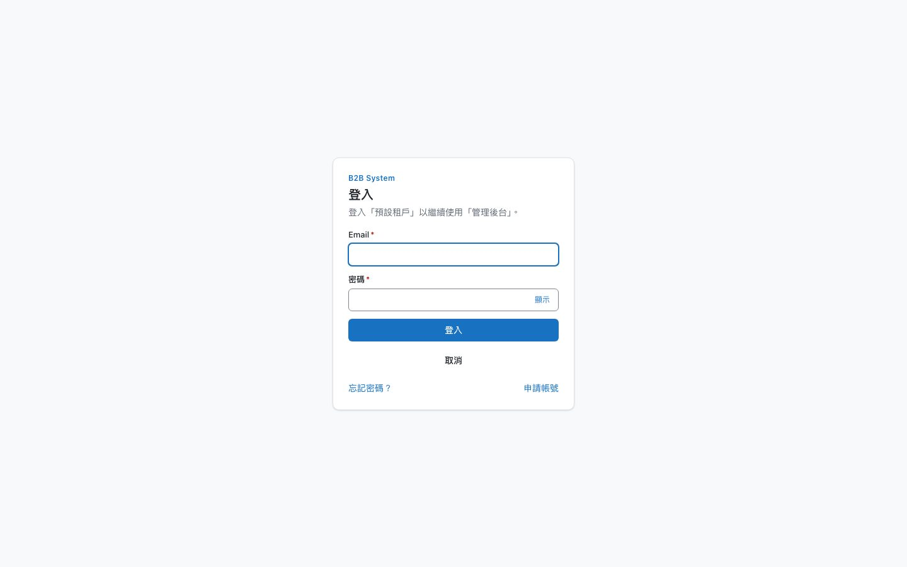

*apps/platform 的登入互動頁。從後台被導到 apps/platform 的 `/interaction/…`；畫面寫明正在登入哪個租戶、哪個產品。*

| 情況 | 怎麼處理 |
| --- | --- |
| 兩個分頁同時續期 | refresh token 每用一次就換新，兩個分頁拿同一張去換會被判定為重用攻擊。前端用 Web Locks 做跨分頁互斥，加上分頁內單飛；筆電闔上再打開、所有分頁同時醒來也不會互相踢掉 |
| 回應在路上遺失 | 續期成功但回應沒送到，瀏覽器會拿剛用掉的那張再試。30 秒寬限期內，若它是該 family 最後被使用的那張，視為重送而非攻擊，稽核記 `auth.refresh.replayed` |
| 真正的重用 | 拿出一張早已用過的 token，整條 family 全部撤銷並寫高嚴重度稽核。標記「已用」是條件式 `UPDATE … WHERE used_at IS NULL`，兩個併發請求不可能都換到新 token |
| 偷到 cookie 一直續期 | family 有 30 天絕對壽命 |
| 用回應時間猜帳號 | 帳號不存在時照樣用實際參數算一次 Argon2 dummy hash；忘記密碼一律回 200 並只入列 |
| 猜錯 5 次踢人下線 | 鎖定只寫 `locked_until`，不改狀態也不踢掉既有 session，否則任何人都能把線上的 super-admin 踢下線 |
| Cookie 永遠送不出去 | 文件原寫 `Path=/auth`，但瀏覽器看到的路徑帶 `/api` 前綴；實作改成 `/api/auth`，記在 `CLAUDE.md` 的「與文件不同的實作決定」 |
| 外部 IdP 帳號接管 | 以 email 自動連結既有帳號時，要求 `email_verified`、網域登記在這條連線上、帳號沒有 member 以外的系統角色。否則有 `identityProvider:update` 的人可以自架 IdP，簽出 super-admin 的 email |
| 一般 Gmail 帳號也帶 `email_verified` | `google` 範本另外要求 `hd` 等於 email 的網域，userinfo 不能蓋掉 ID token 的 `hd`；Entra 以 `xms_edov` 判斷網域已驗證，issuer 用 `common` 端點直接拒絕（[`04-sso.md`](../../architecture/04-sso.md) §3.3.1） |
| SAML 的 signature wrapping、IdP 主動發起的回應 | 用 node-saml，不自己處理 XML 簽章；assertion 本身必須簽章、Issuer 自己再比對一次。IdP 發起的回應一律拒絕（沒有我們發的 state 就是登入 CSRF），`InResponseTo` 只認那一次 request（§3.3.2） |
| 用別人的通行金鑰 id 把人鎖住 | 通行金鑰登入同時比對 user handle、要求使用者驗證；失敗不累計鎖定。只允許 SSO 的網域不接受通行金鑰登入，企業 IdP 停用離職員工才會立即生效（§3.6） |
| 外部身分連錯人 | 管理員可以解除；目標是 super-admin 時套反提權，因為解除後他可能被只允許 SSO 的網域鎖在門外（§3.3.4） |
| 密碼對了就算登入 | MFA 是登入互動裡的第二步：密碼通過時只記下「待驗證」，不寫登入結果，握著回呼網址也跳不過第二步（[`backend/21-mfa.md`](../../architecture/backend/21-mfa.md) D6） |
| 平台關掉某種驗證方式 | fail-closed：只剩那種方式的人不能改綁新裝置（否則只知道密碼的人就能綁上自己的手機），出路是備用碼與管理員重設；備用碼屬於框架、不能被關掉 |
| 在租戶網域註冊的通行金鑰，到登入頁用不了 | 憑證綁 RP ID，登入在 apps/platform，所以 WebAuthn 只在 apps/platform 註冊；租戶的使用者經登入互動進去，順便當 step-up。簽章計數倒退視為複製的金鑰而拒絕（[`backend/21-mfa.md`](../../architecture/backend/21-mfa.md) §9.3） |
| 簡訊灌量詐騙（SMS pumping） | 只送到平台允許的國碼（預設 `886`），加上冷卻與速率限制；平台參數填齊並實際驗證過（Twilio 讀帳號、自訂閘道送 `ping`）才能開啟（§9.4） |
| Telegram／LINE 的 Bot 不知道是哪個租戶 | 使用者先把綁定碼傳給 Bot，webhook 以綁定碼的 HMAC 在平台 DB 找到那一列；收到驗證碼的人必須回到同一個設定流程輸入，別人拿到綁定連結也完成不了設定。webhook 的簽章不符回 401（§9.5） |
| 放寬 MFA 跟改上傳上限是同一個權限 | 政策另有 `mfaPolicy:update`，預設只有 super-admin；系統設定可以交給 admin，而不交出安全政策。平台管理者的政策在環境變數，production 強制啟用 |

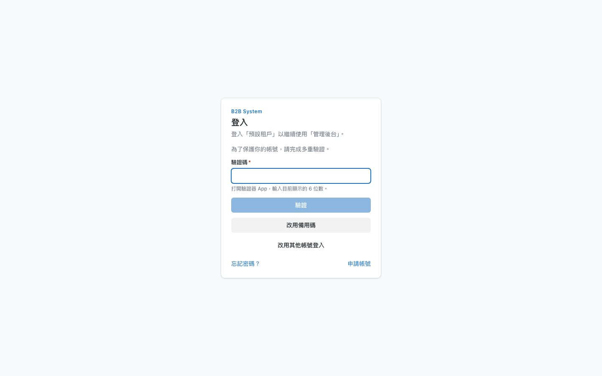

*多重驗證的第二步。每種驗證方式（驗證器 App、Email 驗證碼、安全金鑰／通行金鑰、簡訊、Telegram、LINE）是登記進註冊表的模組，登入流程、資料表、限流與稽核只認介面；需要外部服務的方式由平台填好參數才能開啟。*

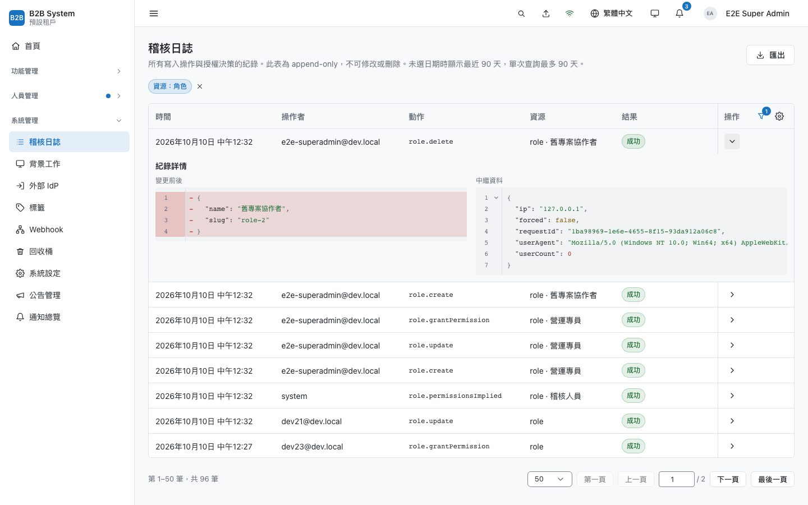

*稽核日誌。登入、續期、重送與重用偵測都會留下紀錄（例如寬限期內的重送記為 `auth.refresh.replayed`）。展開的列只記實際變更的欄位，右邊是請求的中繼資料。*

---

## 3. 多租戶：每個租戶一個資料庫，由網域決定租戶

專案曾經用共用資料表加 `workspace_id` 做完一整套工作區隔離，後來整個丟掉，改成實體隔離（[`architecture/05-tenancy.md`](../../architecture/05-tenancy.md) §10）。被否決的方案也寫得很清楚：schema-per-tenant 只要 `search_path` 設錯一次就讀到別人的表；RLS 仍然是同一個資料庫裡的應用層紀律。規格見 [`architecture/05-tenancy.md`](../../architecture/05-tenancy.md)。

| 情況 | 怎麼處理 |
| --- | --- |
| 沒有租戶脈絡 | `TENANT_DB` 是一個 Proxy，每次存取轉到目前租戶的 DB；沒有脈絡時直接拋錯。切換時所有 repository 只換了注入的 token |
| A 租戶的 token 拿到 B 租戶 | access token 帶 `tid`，必須等於請求網域對應的租戶 |
| 亂造 Host 打爆記憶體 | 網域解析的三個快取都是上限 5000 筆的 LRU；不在快照裡的 Host 直接當找不到，不查平台 DB |
| 平台管理暴露在每個網域 | 平台端點在 apps/platform 以外的網域一律回 `404 PLATFORM_ONLY`，WAF 和 IP 白名單只要套在一個網域上 |
| 滾動部署時 migration 落後 | api 不自己跑 migration；進入租戶時比對 journal，落後的租戶回 `503 TENANT_UNAVAILABLE`，其他租戶不受影響 |
| 關掉的功能還露出痕跡 | 權限鍵、審批類型、系統設定都屬於某個 feature：關掉之後角色編輯器、API token 範圍、審批列表與待審數都不列，對應的詳情回 404。關掉檔案管理後，待審的資料夾存取申請不能再被核准而寫入授權；角色的權限是增減語意，看不到的鍵不會因為儲存被移除（[`05-tenancy.md`](../../architecture/05-tenancy.md) §15） |
| 佈建到一半程序重啟 | 生命週期 provisioning → active／failed → disabled → deleted，每一步冪等；每 5 分鐘把卡住的租戶收成 failed。`pnpm db:drop-tenant` 不加 `--confirm` 只列出要做的事 |

> **整合測試抓到的漏洞**：實作 [`architecture/05-tenancy.md`](../../architecture/05-tenancy.md) §10 時，整合測試發現 A 租戶簽發的 token 拿到 B 租戶的網域，以 userId 為 key 的權限快取會用 A 的使用者與權限判斷 B 的請求。修正是把租戶前綴提前到解析的第 2 步，並在 access token 加上 `tid`。這段記在同一份文件 §10.6「實作時改掉的做法」表裡。

*平台後台的租戶詳情（apps/platform）。可啟用的功能（檔案、稽核、背景工作、回收桶、系統設定、外部 IdP、切換租戶、Webhook、公告、對外 API、群組、匯入匯出、組織、多階段審批、圖片庫）都在這裡管；同一頁還有用量、試行開關與 MFA 驗證方式的分頁。關掉某個功能，租戶的 API 對它回 `404 FEATURE_DISABLED`，前端在執行期卸載該 feature，而且畫面上一律看不到它（不灰掉、不註明「未啟用」）；資料不刪，重新打開即恢復。功能下方另可調整配額與上限（檔案容量、稽核熱／冷資料天數、背景工作同時執行數、外部 IdP 連線數、Webhook 網址數）。*

---

## 4. 權限：伺服器解析、關係圖、可以解釋

權限不進 token。每個請求查一次記憶體快取（命中時小於 1 ms），換來權限變更立即生效（[`backend/05-rbac.md`](../../architecture/backend/05-rbac.md) §11）。底層是在 Postgres 上自建的 Zanzibar 子集：角色持有、角色的權限鍵、資料夾授權、群組成員，全部是 `relation_tuples` 上的邊（[`iam/01-model.md`](../../architecture/iam/01-model.md) §9）。否決 OpenFGA／SpiceDB 的理由是：稽核和授權寫入必須在同一個交易，外部服務會變成雙寫問題。切換採 trigger 雙寫加影子比對，分 G1～G3b 逐步完成。

模型刻意沒有 deny。[`iam/01-model.md`](../../architecture/iam/01-model.md) §8 的理由是：一旦有 deny，「為什麼不能做 X」就變成需要推理的問題。

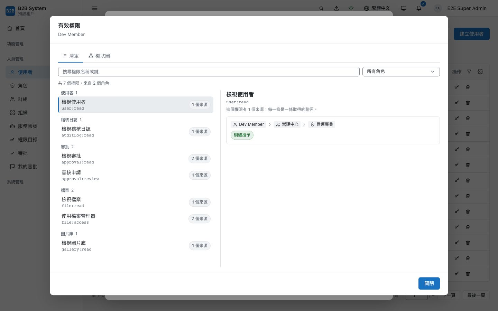

*有效權限與來源。每個權限鍵列出所有來源路徑（使用者 → 群組 → 上層群組 → 角色）；路徑上的節點依「查看者」的權限遮蔽，看不到的只顯示種類。見 [`iam/08-explain.md`](../../architecture/iam/08-explain.md)。*

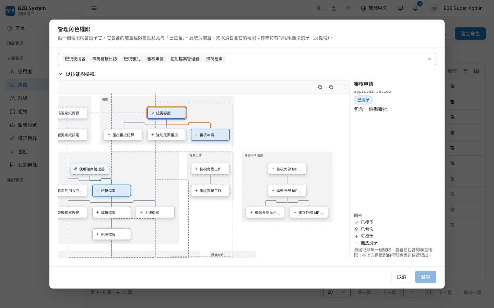

*權限技能樹。點上層權限會自動點亮前置（例如「審核申請」包含「檢視審批」，路徑以橘框標出）；自己沒有的權限標成「無法授予」並鎖住，這是反提權在 UI 上的樣子。*

| 情況 | 怎麼處理 |
| --- | --- |
| 反提權的通用規則 | 把主體放進某個 `物件#關係` 時，主體因此取得的能力，操作者必須全部都有。同一條規則套在授權限、指派角色、加群組成員、資料夾授權、還原、審批核准上（[`architecture/backend/05-rbac.md`](../../architecture/backend/05-rbac.md) §4.1） |
| super-admin 的陷阱 | super-admin 只有一條 `superAdmin` 邊，沒有任何權限鍵的邊。只比對鍵的話會得到空陣列而直接通過，所以 `superAdmin` 本身也算一種能力 |
| 權限依賴樹的不變條件 | 啟動時驗證：受反提權限制的鍵（如 `user:assignRole`）不能被任何鍵包含，否則「能編輯使用者」會悄悄等於「能指派角色」 |
| 最後一位 super-admin | 先取 `pg_advisory_xact_lock` 再計數，兩位 super-admin 同時刪掉對方時不會一個都不剩 |
| 群組互相包含 | 寫成員時用 advisory lock 排隊，避免「A 加進 B」和「B 加進 A」同時通過循環檢查；巢狀上限 6 層在寫入端擋下，因為超過的部分閉包走不到，權限會靜靜消失 |
| 審批成為後門 | 「核准等同代為執行」：審核者自己必須做得到那個操作，否則 `approval:review` 就能繞過 `user:create`。另有四眼原則，不能審自己的申請 |
| 主管為了審一張單看到全公司的審批 | 多階段流程裡，被指派就能審這一關，不需要 `approval:review`；可見性是請求層級的。最後一關的候選人只留下做得到那個操作的人，定案時再檢查一次（[`backend/20-approval.md`](../../architecture/backend/20-approval.md) §9） |
| 會簽時兩個人同時按同意 | 同一筆請求的決定以 `SELECT … FOR UPDATE` 排隊，「是不是最後一關」與最後一關的權限檢查都在鎖之內：只推進一次、只執行一次 |
| 審核者離職、部門被刪，關卡卡住 | 不自動處理（任何自動處理都等於在租戶不知情下放寬控制），通知 `approval:override` 的持有者：重新展開審核者，或逐關強制定案（意見必填、四眼） |
| 設定流程等於決定誰能代為執行 | `approvalFlow:update` 受反提權限制：設定流程的人要持有該類型申請所需的權限 |
| 審核者不知道有事要做、看不出卡在誰 | 側欄徽章與首頁「待辦」由 `approval` 推播失效、不輪詢；詳情是整頁，進行中的關卡逐人列出同意、駁回、尚未動作。被駁回的申請可以留言詢問，或「修改後重新送出」（後端驗證同類型、同申請人）（[`backend/20-approval.md`](../../architecture/backend/20-approval.md) §11） |
| 改流程影響進行中的申請 | 請求在送出時快照關卡，儲存前說明「進行中的 N 筆照送出時的版本」；流程可以重設回單關，整份舊設定留在稽核（§9.16） |
| 快取跨程序失效 | 寫 tuple 時 trigger 讓 `authz_revision` 加一，提交後透過 `NOTIFY` 廣播；收到的程序只處理更新的 revision。快取載入期間被失效，舊結果不寫回 |

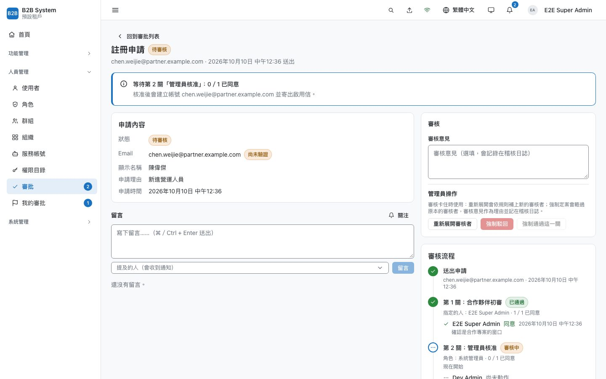

*多階段審批的整頁詳情。上方一句話說明停在哪一關、核准後會發生什麼；右邊逐人列出誰同意了、誰還沒動作。第 1 關只在 email 網域符合時經過（條件在送出時判斷、規則在送出時快照），候選審核者在關卡啟動時展開並落地。*

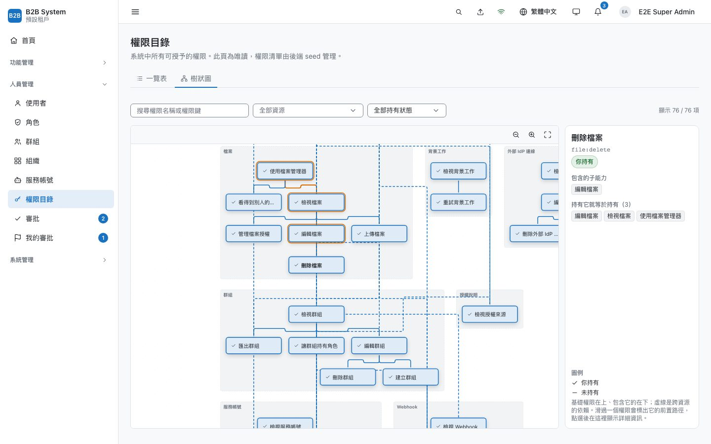

*權限目錄的樹狀圖。基礎權限在上、包含它的在下，虛線是跨資源的依賴。用的是設計系統裡的 TreeEditor（React Flow＋dagre，[`frontend/07-ui-system.md`](../../architecture/frontend/07-ui-system.md) §12），不載入 React Flow 的全域 CSS，改走 design token。*

*深連結的 403。一般成員直接打開 `/role/create`：登入後回到原網址、顯示 403 而不是導走，方便拿網址請人開權限；選單只列出他看得到的項目。見 [`architecture/frontend/06-permission.md`](../../architecture/frontend/06-permission.md)。*

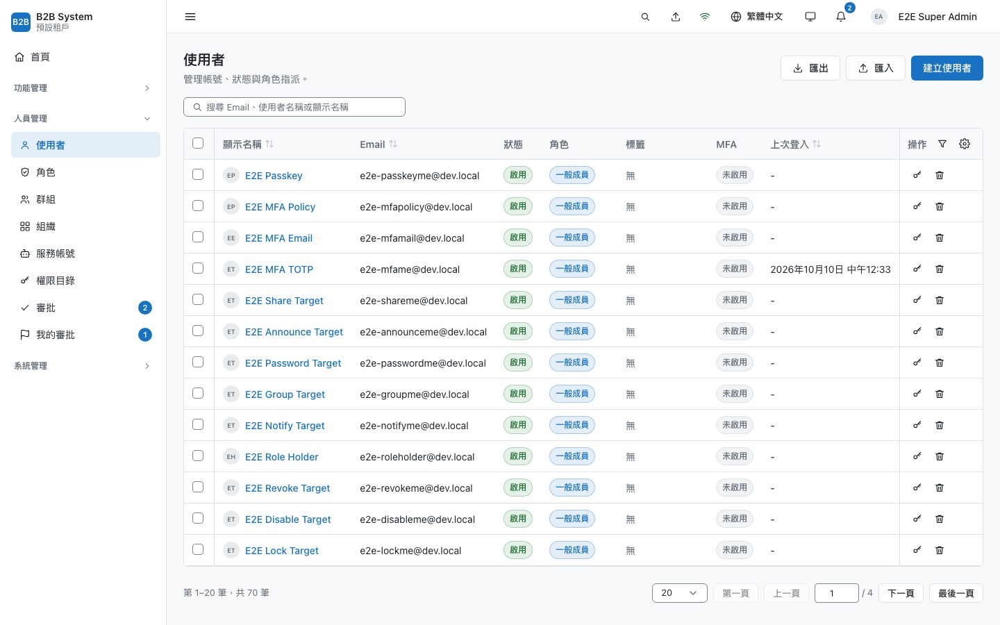

*使用者列表。RichTable 支援跨頁選取、欄位排序與釘選、篩選草稿。截圖帳號自己那一列的刪除鈕是停用的；鎖定的帳號多出解鎖鈕。*

---

## 5. 稽核、樂觀鎖、版本、回收桶

這四件事在一般後台常常各寫各的，這裡共用同一組原則：寫在業務交易內、副作用在提交後、不改寫歷史。規格見 [`architecture/backend/06-audit-log.md`](../../architecture/backend/06-audit-log.md)、[`03-api-conventions.md`](../../architecture/backend/03-api-conventions.md) §11、[`13-trash.md`](../../architecture/backend/13-trash.md)、[`14-revisions.md`](../../architecture/backend/14-revisions.md)。

| 情況 | 怎麼處理 |
| --- | --- |
| 稽核寫不進去 | 整個操作失敗。應用程式的 DB 角色只有 INSERT 和 SELECT；trigger 擋 UPDATE、DELETE。熱表 90 天，冷表 lz4 壓縮，搬移用 `SKIP LOCKED`，重疊的排程不互搶 |
| 人被刪了，紀錄還看得懂嗎 | 稽核快照 actor_email 與 resource_name。授權變更記完整的前後清單，能直接回答「那時候他有哪些權限」 |
| 有人登入，你的表單就衝突 | `version` 只在實體自己可編輯的欄位變動時遞增，登入、關聯寫入不遞增。衝突時同一交易內重讀，區分 409（衝突）與 404（已刪除） |
| 藉「還原舊版」偷改權限 | 還原到某一版是一次新的更新：權限鍵會改變時另外要求 `role:grantPermission`，否則只有 `role:update` 的人能藉還原拿掉角色的權限 |
| 還原時名稱已被佔用 | 回 409 並帶 `conflictingUserId`；檢查與寫入之間的競態由 partial unique index 擋下。還原也重跑反提權 |
| 永久刪除被外鍵卡住 | 依外鍵順序處理，每批一個交易、每列一個 savepoint，一列刪不掉只略過它自己；keyset 往後走，每一輪一定會結束。物件儲存的內容在交易提交後才刪 |
| 滾動部署期間誤刪檔案 | 「刪除時保留物件」拆成兩次部署，避免舊版的維護排程把新版保留的物件當成孤兒刪掉 |
| 匯入一萬列，第 37 列失敗 | 套用是背景工作，每一列一個交易、該列的結果在同一個交易寫入：一列失敗只影響它自己，工作重試也恰好一次。失敗的列帶回預覽修正後重新套用（[`backend/22-data-transfer.md`](../../architecture/backend/22-data-transfer.md) §13） |
| 預覽之後別人改了同一筆 | 修改模式以分析當下快照的 `version` 套用，那一列 409 失敗而不是覆寫 |
| 匯入一列就失效一次全租戶權限 | 交易後的副作用（權限失效、推播）由框架合併，每 100 列或 2 秒執行一次 |
| 匯出的 CSV 在試算表裡執行公式 | 字串欄開頭是 `=`、`+`、`-`、`@` 時前置 `'`，匯入時去掉；匯出要獨立的 `<resource>:export` 權限，下載連結每次重新簽發並重新檢查權限 |

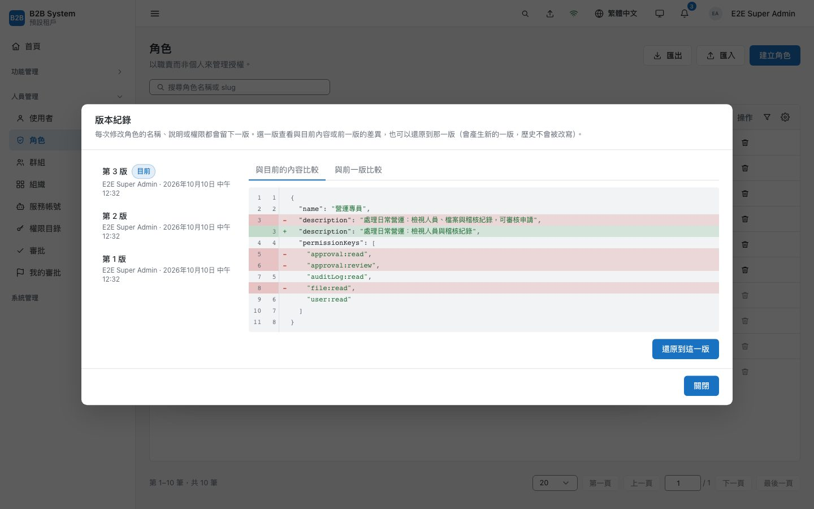

*角色的版本紀錄。選第 1 版、與目前內容比較：看到的就是「還原之後會變成什麼」。差異檢視用 Myers 演算法逐行比對，未變更的段落摺疊。還原會產生新的一版，歷史不被改寫。*

---

## 6. 背景工作、寄信、通知

佇列用 pg-boss，放在平台 DB，不引入 Redis（[`backend/10-jobs.md`](../../architecture/backend/10-jobs.md) §9）。但業務交易在租戶 DB，兩個資料庫不能同一個交易，於是交易內入列改寫租戶 DB 的 `job_outbox`：提交後立刻搬進佇列，每 10 分鐘 sweep 補搬，outbox 的 id 就是工作 id，重搬也只會有一筆。規格見 [`architecture/backend/10-jobs.md`](../../architecture/backend/10-jobs.md)、[`11-mail.md`](../../architecture/backend/11-mail.md)、[`15-notification.md`](../../architecture/backend/15-notification.md)、[`16-notification-event.md`](../../architecture/backend/16-notification-event.md)。

| 情況 | 怎麼處理 |
| --- | --- |
| 工作資料裡有 token | 啟用信、重設密碼信的 token 在寄出當下才簽發，因為持有 `job:read` 的人看得到工作資料。重試會簽新 token，信箱裡只有最後一封能用 |
| 入列後情況變了 | 寄出前再檢查一次狀態（已啟用、已刪除），標成 skipped，不寄也不重試 |
| production 誤設成 console 寄信 | 啟動失敗，因為 console 會把可登入的連結寫進日誌。另外發現 pino-http 會記下 `?token=` 與 set-cookie，加了遮蔽 |
| 一個租戶塞爆佇列 | 排程工作展開成每個租戶一筆，exclusive 與 throttle 以租戶區分 |
| 通知送丟 | 通知由擁有者模組在業務交易內寫入，刻意不訂閱程序內的事件匯流排（那是 fire-and-forget）。存的是 route id 加參數而不是網址，功能被停用或路徑改名時只顯示文字、不給壞掉的連結 |

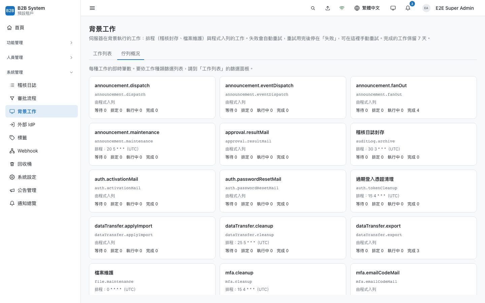

*背景工作。稽核封存、檔案維護、回收桶清除、版本修剪、通知清理、過期的登入憑證與 MFA 驗證紀錄清理、Webhook 與匯入匯出紀錄的清理都是排程工作；匯出、匯入的套用與 Webhook 投遞由程式入列。失敗自動重試，重試用完停在「失敗」可手動重試（兩人同時按，後到的回 409）。*

*事件通知。事件目錄寫在程式碼，DB 只存租戶層覆寫；可以決定是否允許個人關閉。關掉再打開不補發關閉期間的事件。*

---

## 7. 檔案：直傳、分塊、同源防護

檔案內容不經過 api，瀏覽器拿 presigned URL 直傳物件儲存（開發用自帶的 S3 相容服務 `apps/file-storage`）。規格見 [`architecture/backend/09-file.md`](../../architecture/backend/09-file.md)、[`architecture/frontend/12-file-manager.md`](../../architecture/frontend/12-file-manager.md)、[`iam/06-resource-grants.md`](../../architecture/iam/06-resource-grants.md)。

| 情況 | 怎麼處理 |
| --- | --- |
| 直傳的大小與覆寫 | presigned PUT 把 `Content-Length` 與 `If-None-Match: *` 簽進網址：只能傳登記的大小、完成後不能用同一個網址覆寫；`complete` 再比對一次大小。兩個 `complete` 同時到由 `WHERE status='pending'` 決勝 |
| 大檔傳到一半網址過期 | 分塊的網址按需索取，每塊各自重試；`complete` 被重送時先 HeadObject，已組好就照常完成 |
| 上傳的 HTML 偷 refresh cookie | HTML、JS、PDF 等型別強制 attachment 與 `octet-stream`，回應帶 `nosniff` 和 `CSP sandbox` |
| `` 帶不了 token | 影像 API 用 HMAC 簽章網址授權，302 轉到物件儲存；簽章時間取整到 TTL/2，同一時間窗網址不變，瀏覽器快取命中 |
| 關掉分頁上傳就斷 | 檔案暫存在 IndexedDB，上傳佇列跑在 SharedWorker，其他分頁接手繼續傳 |
| 照片洩漏位置 | sharp 產生變體時 EXIF 轉正並去除 GPS；原圖限制 128 MiB／1 億像素，不處理 SVG |

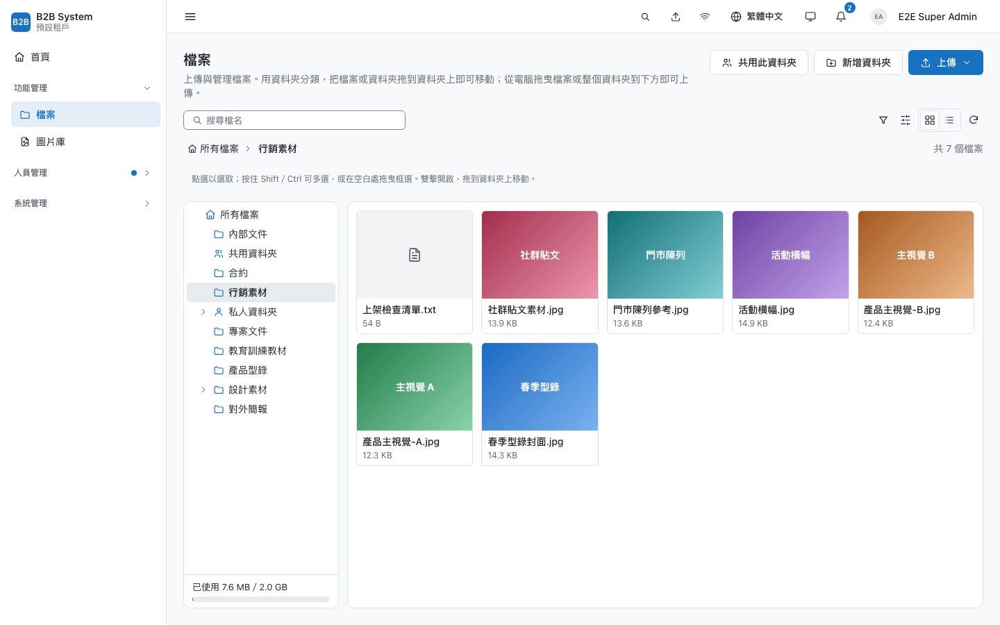

*檔案管理器。縮圖是上傳後由伺服器產生的影像變體。沒有權限的資料夾也會列出並標成鎖住，可以直接申請存取。*

---

## 8. 圖片：存參照不存網址，讀圖不打 api

圖片會出現在大多數頁面上，所以先定原則再大量使用：持久化的內容只存 id，網址在輸出當下簽發；回應直接帶簽好的物件網址，讀圖不經過 api、不查 DB；物件只寫一次，尺寸是處理時就產生的具名 preset。頭像這類圖片是獨立的圖片資產，圖片庫是與檔案管理平行的素材庫，兩者都可以由部署開啟自架的 CDN 邊緣。規格見 [`architecture/backend/25-image.md`](../../architecture/backend/25-image.md)、[`26-gallery.md`](../../architecture/backend/26-gallery.md)、[`09-file.md`](../../architecture/backend/09-file.md) §16、[`frontend/23-image-picker.md`](../../architecture/frontend/23-image-picker.md)。

| 情況 | 怎麼處理 |
| --- | --- |
| 富文本、email 存了簽章網址，一小時後破圖 | 只存 `image_asset_id`，網址在輸出當下產生；富文本的 schema 不允許圖片節點帶網址（[`25-image.md`](../../architecture/backend/25-image.md) §1、§7） |
| 頁面開很久，50 個頭像同時過期 | 效期依用途（頭像 12 小時、圖片庫 1 小時）；`SignedImage` 只在載入失敗時重抓，同一頁的多張圖合併成一次失效（§4、§5） |
| 開放 `?w=` 任意寬度被拿來塞爆轉檔 | 沒有任意寬度：具名尺寸附 2x，處理時就產生好（§6） |
| 重新裁切後 CDN 與瀏覽器還顯示舊圖 | 變體的 key 帶版本 `r<rev>`，重新裁切或旋轉寫到新版本，舊版本在網址效期過後才刪（§16.2） |
| 頭像直接引用檔案管理器的檔案 | 一律複製成新的資產，之後原檔改名、刪除或授權改變都與它無關；裁切只送 0～1 的比例，由伺服器依主檔套用（§15.2、[`frontend/23`](../../architecture/frontend/23-image-picker.md) §5） |
| 每個租戶的容量加總大於實際空間 | 平台的止水線 `STORAGE_TOTAL_LIMIT_MB` 在上傳登記時檢查，超過回 409、只擋新的寫入；量測超過 1 小時沒更新時放行並告警，保險不能變成全平台停擺（[`25-image.md`](../../architecture/backend/25-image.md) §12） |
| 素材庫的原檔被下載，拍攝地點外洩 | `gallery.stripOriginalLocation`（預設開）在原檔的 EXIF 把 GPS 填 0，不重新編碼像素；找不到 EXIF 位置時寧可重新輸出一份沒有中繼資料的原檔（[`26-gallery.md`](../../architecture/backend/26-gallery.md) §5.1） |
| 從檔案管理加入圖片庫後原檔被刪 | 加入時就複製，兩邊從此無關；同一張重複加入會略過並告訴你已經在哪裡（§8） |
| CDN 把整個 presigned 網址當 key，每個時間窗都重新回源 | 邊緣以 njs 驗自己的 HMAC 簽章，快取 key 只有物件路徑；回源拿掉查詢參數、帶 `X-Origin-Auth`，有人改寫 `response-content-type` 也污染不了共用快取（[`09-file.md`](../../architecture/backend/09-file.md) §16.3） |
| 刪掉的圖在網址效期內仍讀得到 | 物件刪除成功之後才清每一個邊緣節點；順序相反的話，清完又會被回源存回去（§16.6） |
| 邊緣沒準備好就開啟、或其實沒在驗簽章 | 平台的 CDN 頁面不必重啟就能開關；開啟前必須通過節點檢查，不提供強制開啟。定期以竄改的簽章測試邊緣，沒被拒絕就發 critical 告警（§16.9、§16.10） |

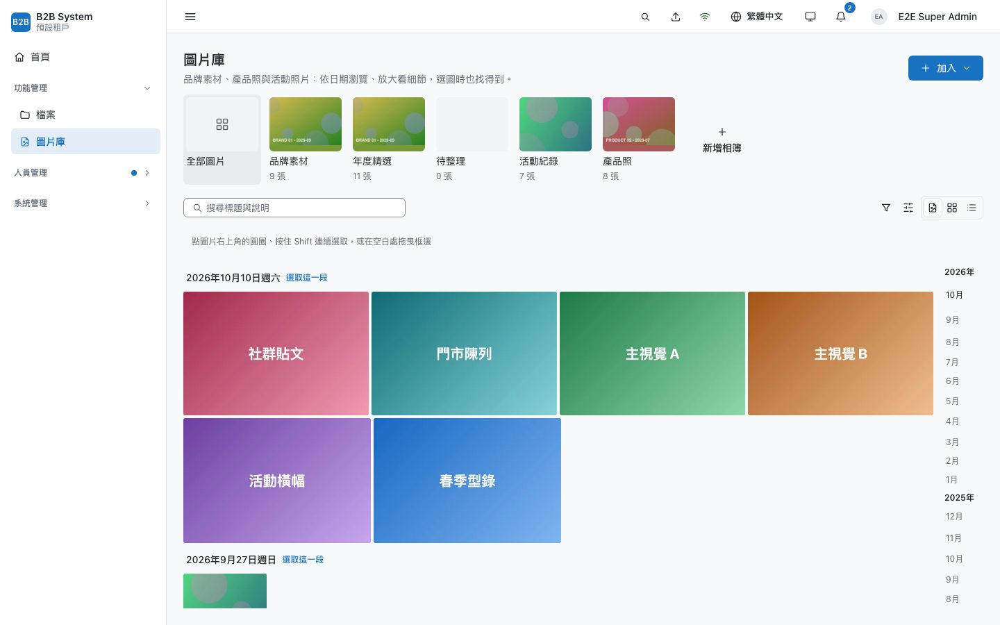

*圖片庫。依日期的等高排列與右側的日期捲軸，上方是相簿；從檔案管理加入的圖片是複製的，兩邊互不認識。*

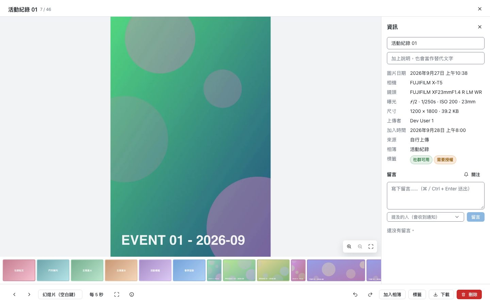

*檢視器。縮放平移、整個結果之間切換、幻燈片；右邊是 EXIF、相簿、標籤與留言。旋轉寫成新的變體版本，不改原檔。*

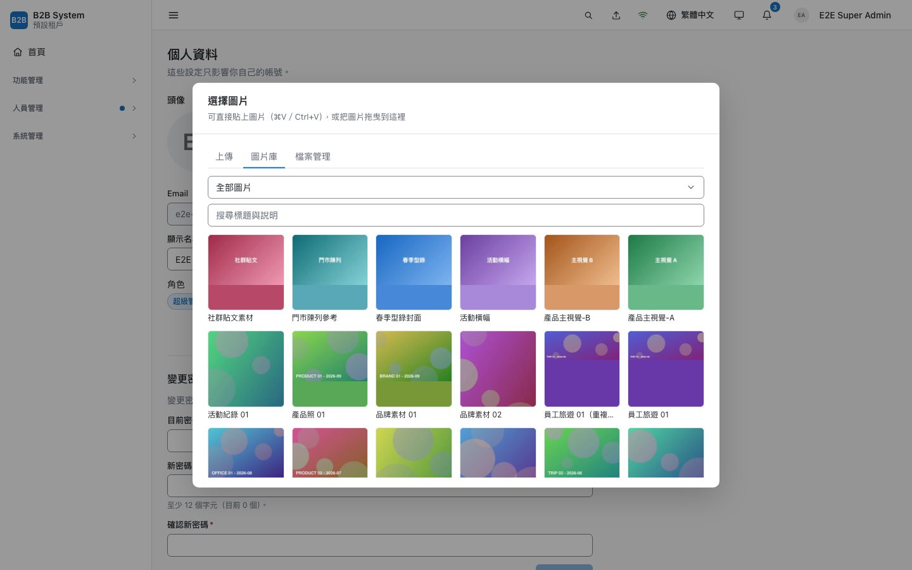

*選擇頭像。來源由各 feature 登記（上傳永遠在、圖片庫與檔案管理依 feature 與權限出現）；選好之後裁切，伺服器複製並依比例套用。*

---

## 9. 前端架構：plugin、依賴圖、單一連線

規格見 [`architecture/frontend/`](../../architecture/frontend/README.md)。

**一個功能，一行 `.use()`。** `apps/backstage/src/main.tsx` 用 `createAppContext().use(...).load()` 組裝所有 feature（[`frontend/02-plugin-system.md`](../../architecture/frontend/02-plugin-system.md) §8）。plugin 的 factory 同步執行，登記權限、選單、批次操作、route id；I/O（語系包）放在非同步的 `onInit`。權限一定在同步階段，因為 `requirePagePermission()` 找不到時會拋錯而不是放行，放在非同步階段就會有 render 早於註冊的競態。註解掉一行，路由、選單、權限、語系一起消失。租戶停用某功能時，plugin 在執行期卸載；使用者正在該頁就先導回首頁並提示（[`frontend/02-plugin-system.md`](../../architecture/frontend/02-plugin-system.md) §9）。

**不手列 query key。** mutation 成功後呼叫 `invalidateResources([{ resource, kind, id }])`，由 `apps/backstage/src/apis/resources.ts` 宣告的資源依賴圖決定要失效哪些查詢。只走一層、不遞移；delete 直接移除快取而不重抓，避免打出 404；按一次「已讀」不會讓稽核列表重抓。

**只有一個分頁連 WebSocket。** 可見的分頁參與 leader 選舉，只有 leader 持有 Socket.io 連線，再把「哪個來源變了」轉給其他分頁（帶 term 與序號，跳號就整批重新驗證）。背景分頁只標 stale，可見分頁延遲 150–750 ms 隨機時間再重抓來削峰。重連退避 2 秒起、上限 30 秒、±50% 抖動，api 重新部署時不會被上千條連線同時打回來。推播只是加速，斷線就退回 staleTime 與 focus 重抓。

**批次操作沒有批次端點。** 一開始做了後端批次端點，實際用過後全部移除（[`frontend/07-ui-system.md`](../../architecture/frontend/07-ui-system.md) §13）：批次改成前端佇列，逐筆呼叫單筆 API，讓單筆端點是業務規則的唯一來源。每筆帶列表上的 `version`，過時的那筆個別失敗；被別人刪掉的自動移出選取。佇列 worker 刻意不自己打 API，否則會和分頁搶輪替中的 refresh token，觸發整條 family 撤銷。

**自己的設計系統。** UI 建在 Base UI（只提供焦點管理、ARIA、彈層定位，[`frontend/07-ui-system.md`](../../architecture/frontend/07-ui-system.md) §10）上，視覺全部自寫：約 40 個元件，每個都有測試與 Storybook story。Base UI 的 Select 需要所有項目都在 DOM 上而無法虛擬捲動，所以 Select／Menu 改成 Popover 加自製列表（`aria-activedescendant`）與 TanStack Virtual。顏色走三層 token，`contrast.test.ts` 對兩個主題各驗 WCAG 對比，`theme-init.js` 在首次繪製前設定主題，不閃白。

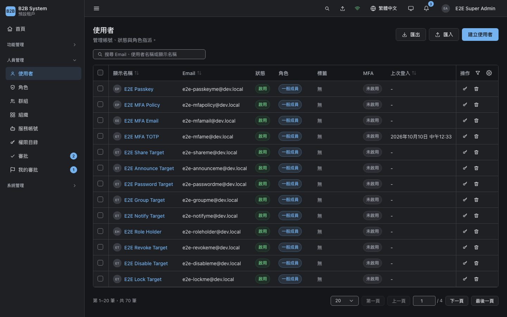

*深色主題。深色只覆寫 alias 層 token；狀態色分「填色」與「前景」兩組，兩個主題都過對比測試。*

*同一個 TreeEditor 在深色主題。沒有載入第三方 CSS，所以元件跟著 token 一起換色。*

---

## 10. 工程紀律：漏掉就跑不起來

- **路由稽核**：程序在 `listen()` 前掃描所有 HTTP 路由與 WebSocket handler（`apps/api/src/common/route-audit.ts`）。沒宣告 `@Public`／`@Authenticated`／`@RequirePermissions`、平台端點誤標租戶功能、flag key 不在目錄裡，都讓程序啟動失敗。測試另外釘住每個路由用到的權限鍵，`role:updte` 這種錯字不會讓端點靜靜地永遠回 403。
- **結構測試**：後端層級依賴由 `apps/api/src/__tests__/layer-dependencies.spec.ts` 掃 import；前端 `design-system.test.ts` 擋寫死的色碼、外洩的 Base UI 型別，並要求每個元件都有測試與 story；只有一個檔案能 import socket.io-client。
- **語系完整性**：測試比對兩個語系檔的鍵集合，並確認每個錯誤碼、每個權限鍵都有翻譯。
- **暫時的開關會過期**：每個 feature flag 必填 `removeBy`，過期還留在目錄裡，單元測試直接失敗（[`architecture/05-tenancy.md`](../../architecture/05-tenancy.md) §11）。
- **測試的層次**：後端整合測試用 Testcontainers 起真的 Postgres 17，平台 DB 與租戶 DB 分開；前端元件測試以 MSW 模擬權限行為；E2E 跑真的 api、backstage、apps/platform，含模擬的外部 OIDC IdP 與 Mailpit 收信。
