# 功能導覽

> 一頁一頁看 B2B System 現在能做什麼，以及每個畫面背後的規則。規格細節以各章節文件為準，這裡只導覽並附上連結。
>
> 截圖由 E2E 的導覽劇本自動拍攝（`apps/e2e/tour/`）：重置資料庫、跑 seed（含 `db:seed:dev` 的 50 位使用者、部門樹、Webhook 與公告），再以 API 補上導覽用的示範資料，用 Playwright 逐頁操作。
> 畫面改版後重跑一次即可更新，見文末〈[重新產生截圖](#重新產生截圖)〉。帳號、名稱與數字都是示範資料。截圖更新於 2026-10-08。

## 目錄

1. [登入](#1-登入)：登入互動頁、多重驗證
2. [人員與權限](#2-人員與權限)：使用者、角色、群組、組織、權限目錄、服務帳號
3. [資料與協作](#3-資料與協作)：檔案、審批、標籤、匯入／匯出、留言與關注
4. [稽核與維運](#4-稽核與維運)：稽核日誌、回收桶、版本紀錄、背景工作、系統設定、外部 IdP
5. [通知與對外](#5-通知與對外)：站內通知、公告、Webhook
6. [平台後台（apps/platform）](#6-平台後台appsplatform)：租戶與用量、平台管理者、MFA 驗證方式、feature flag
7. [個人帳號與介面](#7-個人帳號與介面)

先看一眼全貌：租戶的後台（`apps/backstage`）分三組選單——「功能管理」放業務功能（目前是檔案），「人員管理」放身分、組織與權限，「系統管理」放維運與設定。
選單只列出目前使用者有權限、而且租戶有啟用的項目。

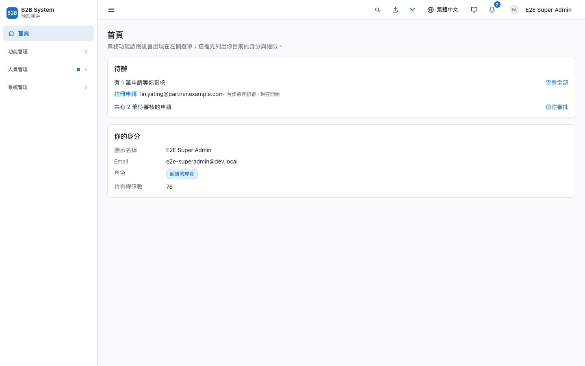

*super-admin 的首頁。頂列由左到右是命令面板、批次處理佇列、即時連線狀態、語言、主題、通知與帳號選單；頂列工具可以在偏好設定裡排序與隱藏。*

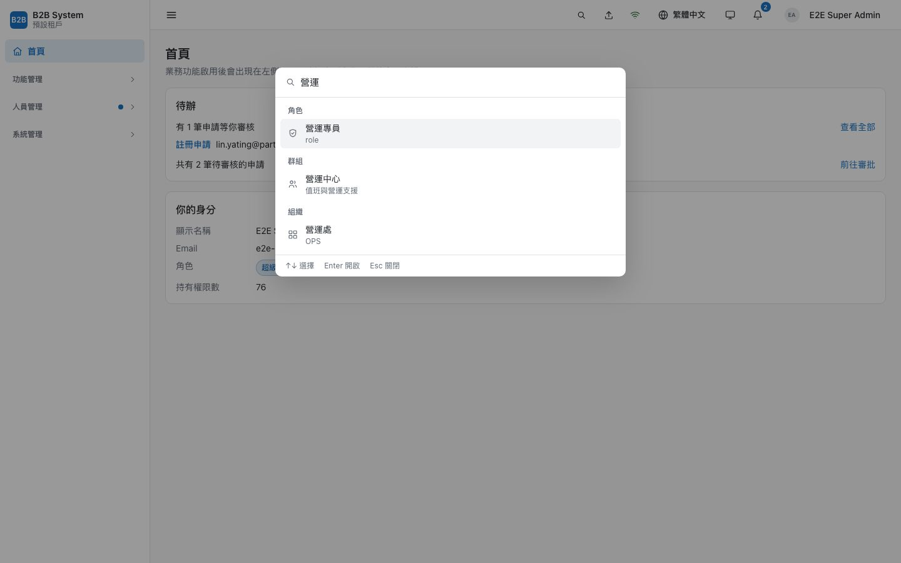

*命令面板（⌘K／Ctrl+K，或頂列的放大鏡）。輸入「營運」同時搜到角色、群組與部門；沒輸入時列出頁面、最近造訪與「建立使用者」這類捷徑。
每一組結果由擁有它的 feature 登記，依權限過濾：一般成員只看得到自己進得去的頁面，沒有資料搜尋。apps/platform 也有一樣的面板。*

規格：[`architecture/frontend/18-command-palette.md`](../../architecture/frontend/18-command-palette.md)。

---

## 1. 登入

後台沒有自己的登入頁。打開 backstage，會被導到 `apps/platform` 的登入互動頁（OIDC 授權碼 ＋ PKCE），登入後帶著授權碼回到原本的網址。
同一個入口服務所有租戶與產品，畫面上寫明正在登入哪個租戶、哪個產品。

|  | 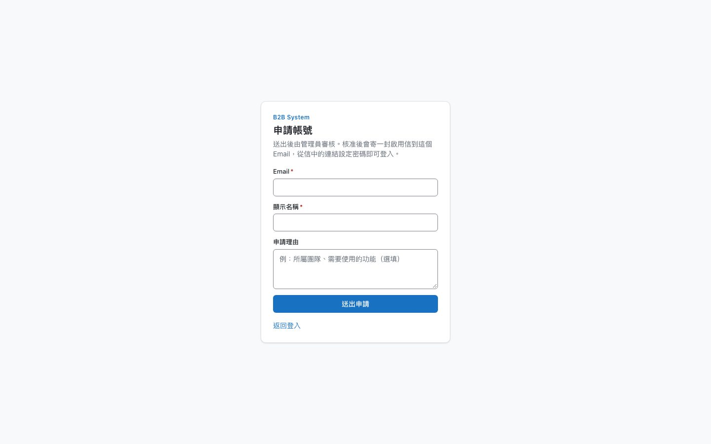 |
| --- | --- |
| *登入互動頁。輸入 email 後，若網域登記在某條外部 IdP 連線上，會出現以該 IdP 登入的按鈕。* | *申請帳號。送出後進入審批，核准才建立帳號；系統設定可以關閉這個入口。* |

- 密碼錯誤 5 次鎖定 15 分鐘（次數與時間可在系統設定調整），但 **不踢掉既有的 session**：否則任何人猜錯 5 次就能把線上的管理者踢下線。
- 忘記密碼一律回「已寄出」，回應時間與帳號是否存在無關。
- Access token 只存在記憶體；refresh token 每用一次就換新，多個分頁以 Web Locks 協調，不會互相踢掉。

規格：[`architecture/04-sso.md`](../../architecture/04-sso.md)、[`architecture/backend/04-auth.md`](../../architecture/backend/04-auth.md)。

### 1.1 多重驗證

| 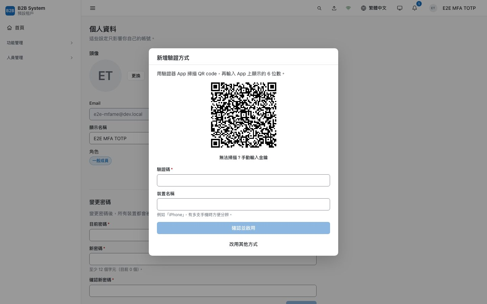 | 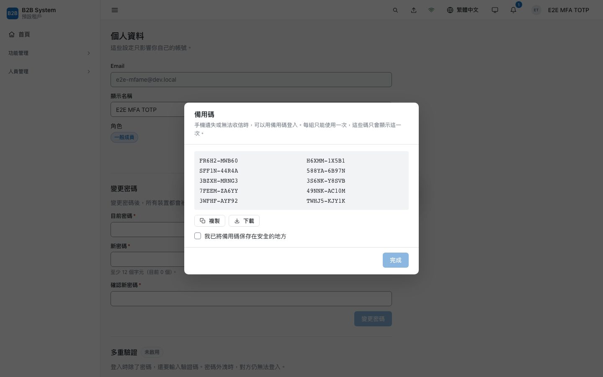 |
| --- | --- |
| *在個人資料頁「新增驗證方式」：驗證器 App 掃 QR code（或手動輸入金鑰）、輸入 6 位數確認；另一種是寄到帳號 email 的驗證碼。驗證器 App 每人最多 5 個裝置。* | *第一次啟用後拿到 10 組一次性備用碼，只顯示這一次、資料庫只存雜湊；勾「我已保存」才能關閉。* |


*啟用後，密碼通過時停在第二步：輸入驗證碼，或改用備用碼。第二步的狀態存在登入互動裡，握著回呼網址也跳不過它。*

- 每種驗證方式是一個登記進註冊表的模組；登入互動、資料表、限流與稽核只認介面，之後加 Passkey 不必改登入流程。
- 租戶的政策在「系統設定 → 安全性」（[§4.4](#44-系統設定安全性與外部-idp)）：允許哪些方式、全員或指定角色必須啟用。必須啟用卻還沒設定的人，登入時先設定才能進入。
- 平台可以全面關閉某一種方式（[§6.2](#62-平台管理者mfa-驗證方式feature-flag-與平台稽核)）。只剩被關掉的方式的人不能改綁新裝置（否則只知道密碼的人就能綁上自己的裝置），以備用碼或管理員重設作為出路。
- 經外部 IdP 登入的人不另外要求本系統的 MFA：外部 IdP 已經驗過本人。

規格：[`architecture/backend/21-mfa.md`](../../architecture/backend/21-mfa.md)。

---

## 2. 人員與權限

### 2.1 使用者


*使用者列表：搜尋、欄位排序、篩選、欄位設定（可釘選與隱藏），每一列顯示狀態、角色、標籤與 MFA 是否啟用。右上角是匯出、匯入（[§3.4](#34-匯入匯出)）與建立。
狀態分啟用、停用、待啟用、鎖定；鎖定的帳號多一個解鎖鈕，自己那一列的刪除鈕是停用的。*

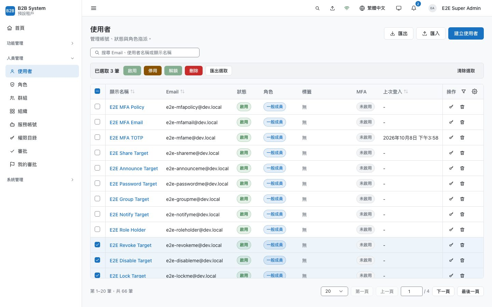

*勾選幾列後出現批次操作列，也可以只匯出選取的列。批次不是一個「批次端點」，而是前端佇列逐筆呼叫單筆 API：單筆端點是業務規則的唯一來源，過時的那一筆（`version` 不符）個別失敗，不拖累其他筆。
被選取的帳號都是啟用中，所以「啟用」「解鎖」是灰的。*

| 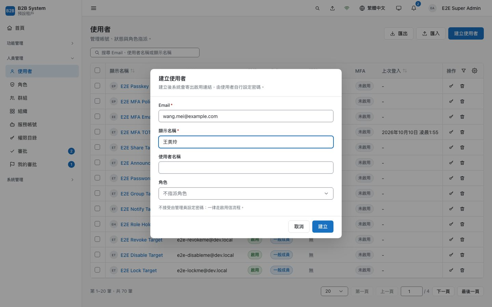 |  |
| --- | --- |
| *建立使用者不設密碼：系統寄出啟用信，由本人設定。可以一併指派角色，但只能選自己持有其全部權限的角色。* | *使用者詳情可以貼標籤；標籤的名稱與顏色在標籤管理頁統一設定。* |


*使用者詳情的「有效權限」。每個權限鍵列出所有來源路徑：Dev User 50 的 `user:read` 同時來自直接持有的「客服」「發佈管理」角色，以及「營運中心」群組持有的「營運專員」角色。
查看者看不到的群組或角色只顯示種類，不洩漏名稱；「樹狀圖」分頁以權限依賴樹畫出同一份結果。*

使用者詳情的下半部還有個人 API token、MFA 狀態（管理者可以重設）與留言（[§3.5](#35-留言與關注)）。
規格：[`iam/04-api.md`](../../architecture/iam/04-api.md)、[`iam/08-explain.md`](../../architecture/iam/08-explain.md)。

### 2.2 角色

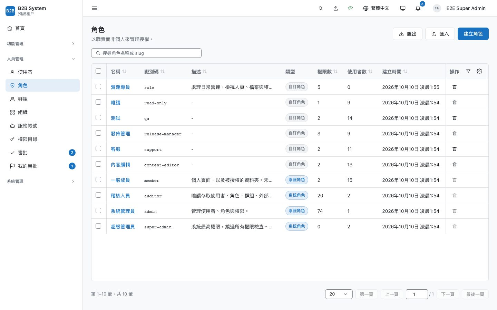

*角色列表。四個系統角色（藍色標籤）不可刪除、不可改名；super-admin 的權限數是 0，因為它是一條「全集」的邊，不列任何權限鍵。*


*角色詳情：已授予的權限、直接持有與經由群組持有的人。底部可以複製為新角色、看版本紀錄、管理權限。*


*管理角色權限的技能樹。點一個權限就授予它，它包含的前置權限自動點亮為「已包含」（鎖頭圖示）：這裡滑到「審核申請」，路徑上的「檢視審批」以橘框標出。
你自己沒有的權限會標成「無法授予」——這就是反提權在畫面上的樣子；後端另外再檢查一次，直接打 API 回 `403 AUTHZ_ESCALATION`。*


*角色的版本紀錄。每次改名稱、說明或權限都留一版。選第 1 版、與目前內容比較：紅色是目前有、還原後會消失的，綠色是第 1 版的內容。
還原會產生新的一版，歷史不被改寫；權限會因此改變時，還原另外要求 `role:grantPermission`，避免只有 `role:update` 的人藉還原改權限。*

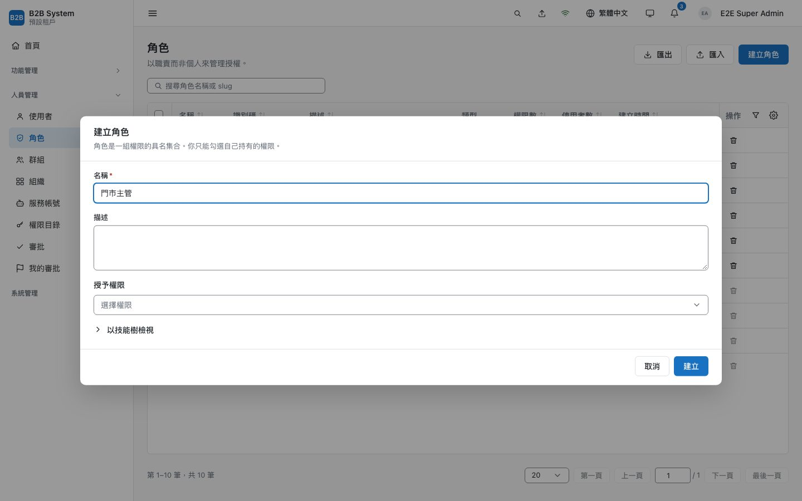

*建立角色時同樣可以展開技能樹挑權限。*

規格：[`iam/01-model.md`](../../architecture/iam/01-model.md)、[`architecture/backend/14-revisions.md`](../../architecture/backend/14-revisions.md)。

### 2.3 群組

|  | 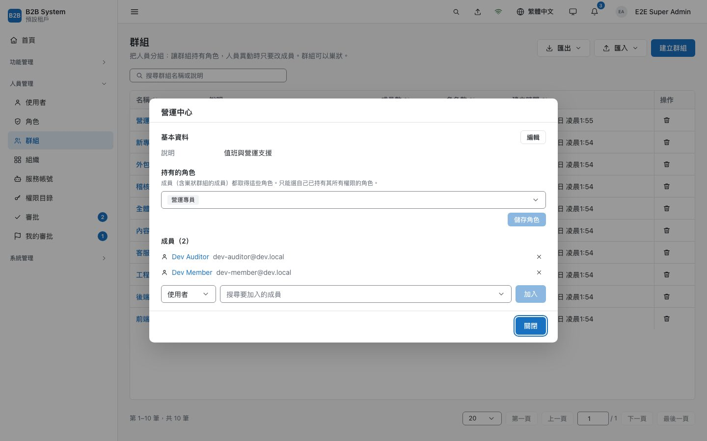 |
| --- | --- |
| *群組列表。群組可以巢狀（全體員工 → 工程部 → 前端組），上限 6 層。* | *群組持有角色，成員（含子群組的成員）都取得這些角色。人員異動時只要改成員，不必一個個改角色。* |

把人加進群組，等於把群組持有的角色給他，所以加成員同樣受反提權限制；群組也不能持有 super-admin。
寫成員時以 advisory lock 排隊，「A 加進 B」和「B 加進 A」同時送出也不會繞過循環檢查。平台可以為租戶關閉群組，關閉期間群組帶來的授權一起暫停。
規格：[`iam/07-groups.md`](../../architecture/iam/07-groups.md)。

### 2.4 組織

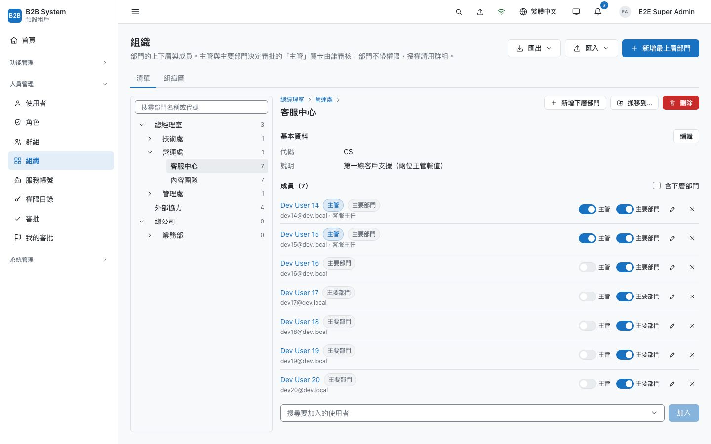

*組織的「清單」：左邊是部門樹（數字是直屬人數），右邊是選中部門的基本資料與成員。成員可以標成主管、設定主要部門與職稱；「客服中心」由兩位主管輪值。
勾「含下層部門」會一併列出下層部門的人。*

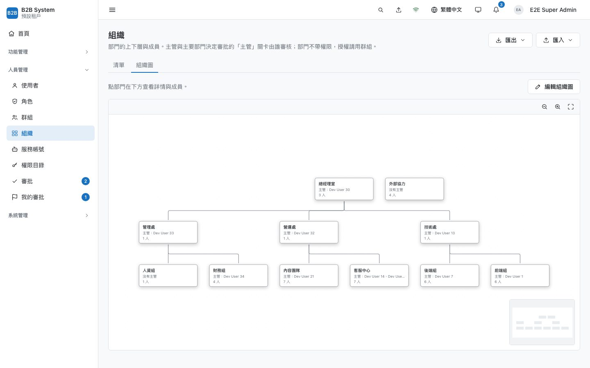

*「組織圖」分頁以同一份資料畫出整棵樹，每個節點顯示主管與人數。「編輯組織圖」可以從節點拖線換上層、改名，累積的變更一次儲存；循環與層數上限（10 層）在拖線時就擋下。*

組織和群組是兩件事：**部門不帶權限**，授權仍然走群組與角色。部門的用途是回答「誰是這個人的主管」——多階段審批的「申請人的主管」關卡（[§3.2](#32-審批)）以主要部門往上找；
使用者列表可以依部門篩選。部門樹與成員都能匯入匯出，刪掉的部門進回收桶。平台可以為租戶關閉組織管理（預設啟用）。
規格：[`architecture/backend/23-organization.md`](../../architecture/backend/23-organization.md)。

### 2.5 權限目錄與有效權限

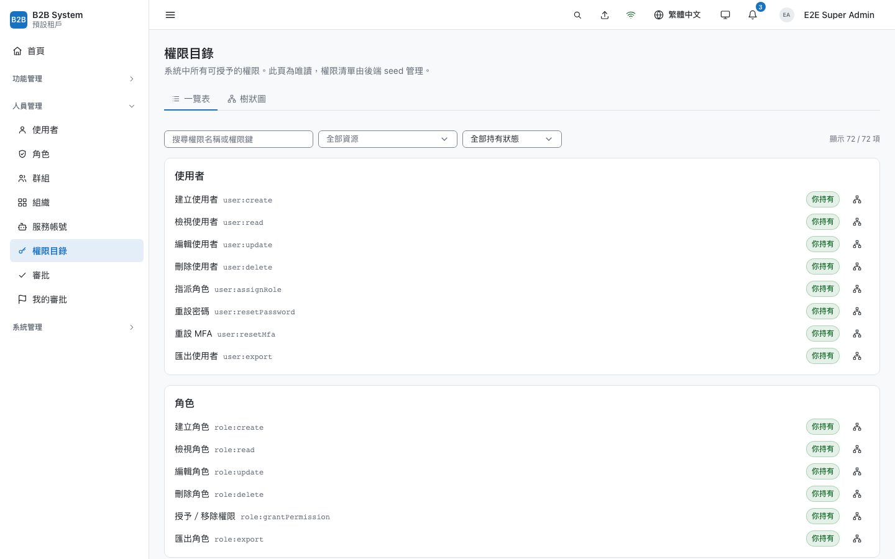

*權限目錄（唯讀）：依資源分組，標出「你持有」。權限清單由後端 seed 管理，前後端共用同一份由 OpenAPI 產生的權限鍵。*


*樹狀圖檢視。基礎權限在上、包含它的在下，虛線是跨資源的依賴。選了「刪除檔案」：它包含「編輯檔案」，持有它就等於持有編輯、檢視與使用檔案管理器（橘框是路徑）。
受反提權限制的鍵（例如「指派角色」）不能被任何鍵包含，這條規則在程序啟動時驗證。*

規格：[`iam/02-permission-catalog.md`](../../architecture/iam/02-permission-catalog.md) §9。

### 2.6 服務帳號與 API token

|  |  |
| --- | --- |
| *服務帳號給 CI、報表、其他系統使用：不能登入後台，只能以 API token 呼叫對外 API。* | *服務帳號持有角色；它的 token 最多只能做到這些角色允許的事。* |

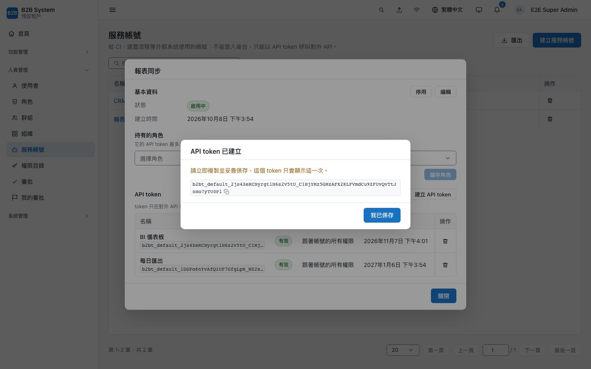

*建立 token 後，完整的值只顯示這一次。清單裡只留 token id 與 secret 的前 4 碼供辨識；資料庫只存雜湊。
token 的格式是 `b2bt_<租戶>_<id>_<secret>`，固定的開頭可以登記到 GitHub 等平台的 secret scanning。*

個人也可以在個人資料頁建立自己的 token。對外 API 是獨立的程序與網域（`/v1`），只認 API token。規格：[`architecture/06-external-api.md`](../../architecture/06-external-api.md)。

### 2.7 沒有權限時


*一般成員直接打開 `/role/create`：登入後回到原網址，顯示 403 而不是被導回首頁，方便拿網址請管理者開通；選單只剩他看得到的項目。
權限水合前畫面顯示骨架屏，不會先閃出內容再消失。*

規格：[`architecture/frontend/06-permission.md`](../../architecture/frontend/06-permission.md)。

---

## 3. 資料與協作

### 3.1 檔案管理器


*檔案管理器。左邊是資料夾樹（共用資料夾、私人資料夾），右邊是內容；依類型、標籤篩選，依時間或名稱排序。
檔案內容不經過 api：瀏覽器拿 presigned URL 直傳物件儲存，大檔分塊、每塊各自重試。縮圖是伺服器產生的影像變體。*

| 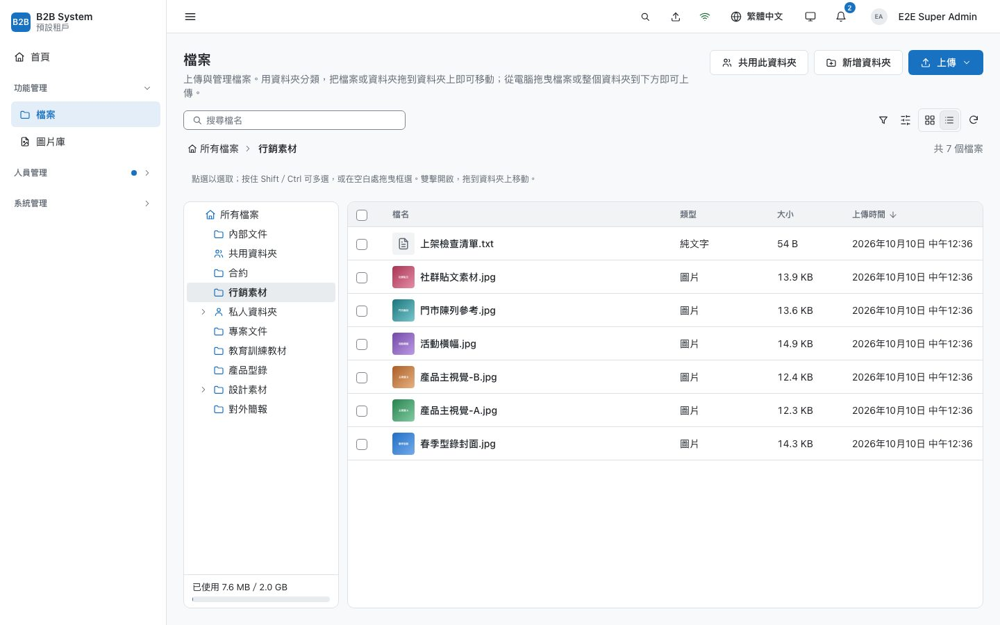 | 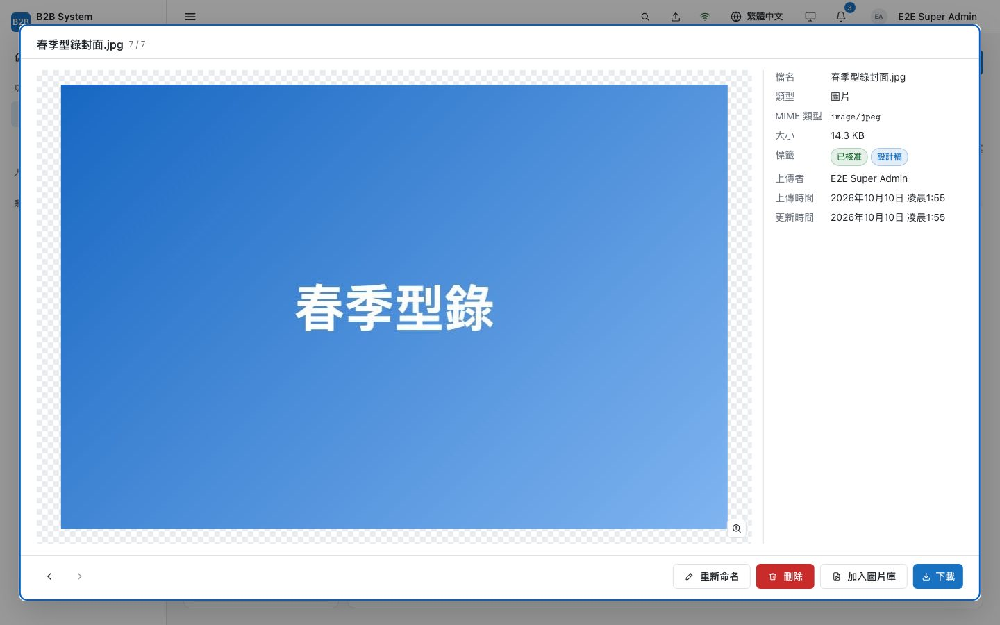 |
| --- | --- |
| *清單檢視。可以框選、Shift／Ctrl 多選、拖曳到資料夾上移動、從電腦拖整個資料夾上傳。* | *預覽：圖片、文字、PDF 等；左右切換同資料夾的檔案。* |

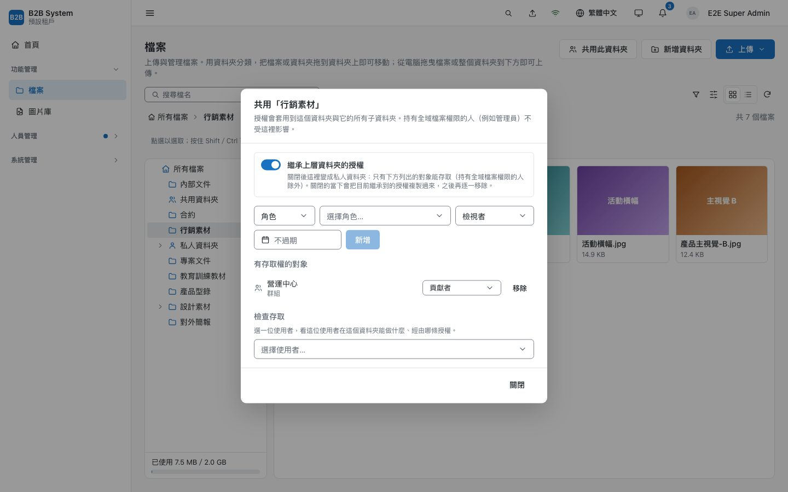

*資料夾授權。可以授權給使用者、群組或角色，等級分檢視者、貢獻者、編輯者、管理者，可設到期日；授權會繼承到所有子資料夾，也可以關閉繼承變成私人資料夾。
「檢查存取」選一位使用者，就顯示他在這個資料夾能做什麼、經由哪條授權。*

- 上傳時宣告的大小在 `complete` 時比對，不符就刪除物件；HTML、JS、PDF 等型別強制下載並帶 `CSP sandbox`，上傳的檔案偷不到 cookie。
- 影像變體去除 EXIF 的 GPS；`` 用 HMAC 簽章網址授權，同一時間窗網址不變，瀏覽器快取命中。
- 關掉分頁上傳不會斷：佇列跑在 SharedWorker，其他分頁接手。

規格：[`architecture/backend/09-file.md`](../../architecture/backend/09-file.md)、[`architecture/frontend/12-file-manager.md`](../../architecture/frontend/12-file-manager.md)、[`iam/06-resource-grants.md`](../../architecture/iam/06-resource-grants.md)。

### 3.2 審批

需要核准才生效的申請：帳號註冊、資料夾存取申請。預設是單關（持有 `approval:review` 且做得到那個操作的人核准）；註冊申請可以另外設定多階段流程。

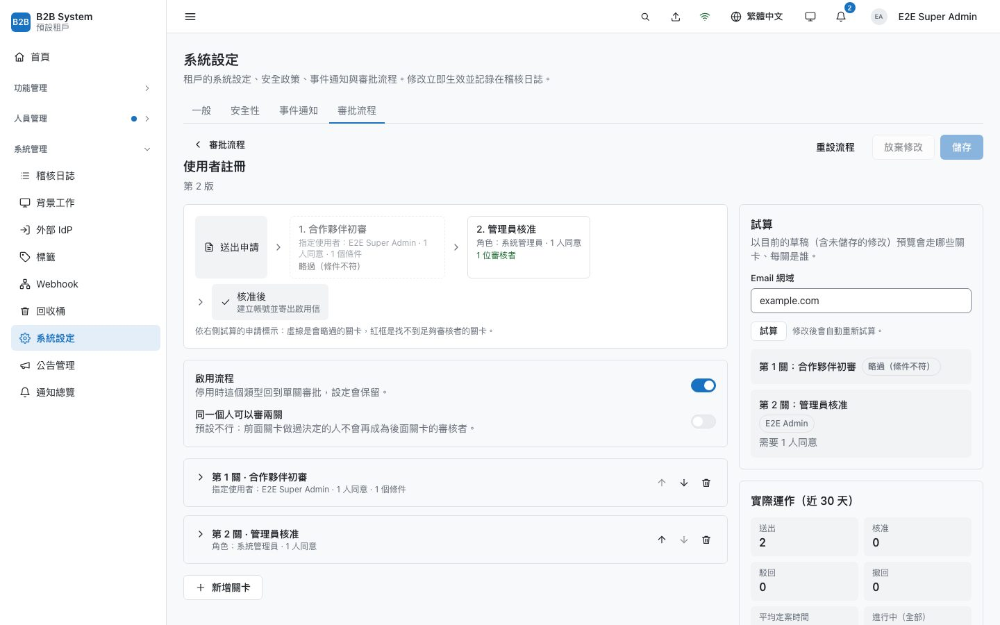

*「系統管理 → 審批流程」為註冊申請設定兩關：第 1 關「合作夥伴初審」只在 email 網域是 `partner.example.com` 時經過（條件），由指定的人審；第 2 關由持有「系統管理員」角色的人審。
每一關的審核者可以是指定的人、群組、角色、部門或申請人的主管，需要 M 人同意或全部同意（會簽）。右邊的「試算」以未儲存的草稿預覽一筆申請會走哪些關卡、每關是誰。*


*一筆走多階段流程的註冊申請：第 1 關已同意（意見記在時間軸上），停在第 2 關，候選審核者是 E2E Admin。最後一關核准時才建立帳號，可以一併指派角色。
審核者離職、部門被刪而找不到人時，持有 `approval:override` 的人可以「重新展開審核者」或強制定案這一關（意見必填）。*

| 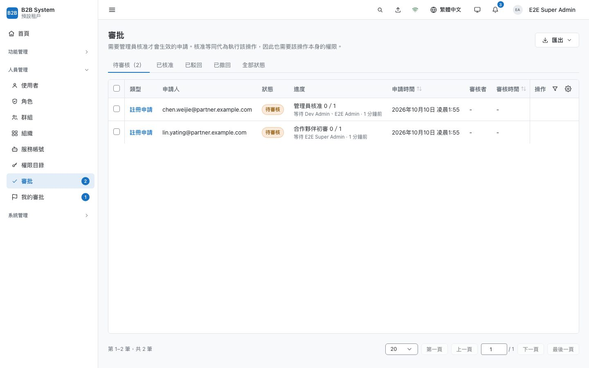 | 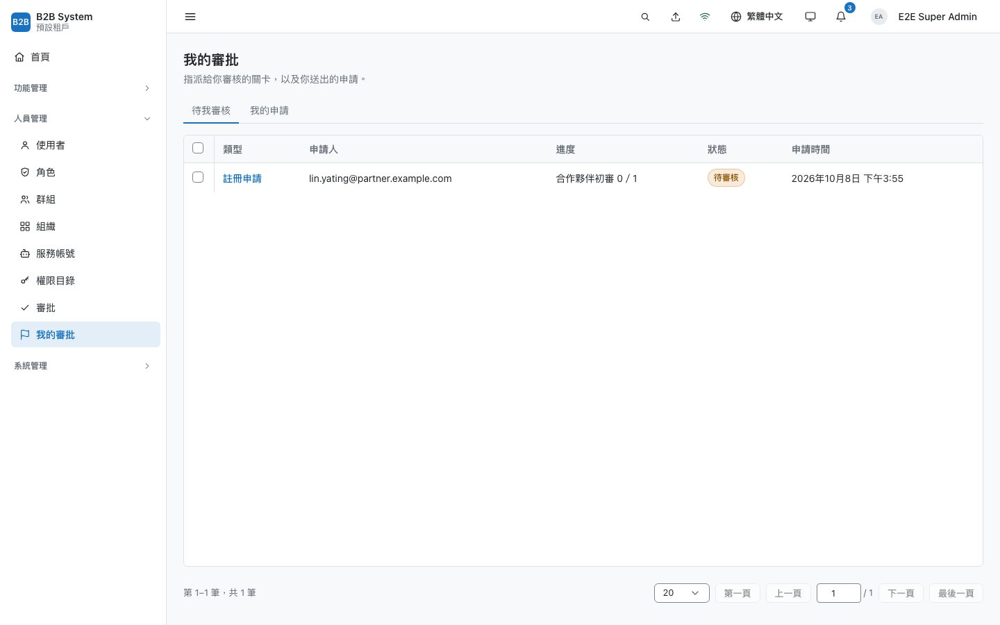 |
| --- | --- |
| *審批總表：所有申請與目前的狀態。* | *「我的審批」：指派給我審核的關卡（被流程指派即可審，不需要 `approval:review`），以及我送出、可以撤回的申請。* |

- **核准等同代為執行**：審核者自己必須做得到那個操作（例如核准註冊要能建立使用者、指派的角色要通過反提權），否則 `approval:review` 會變成後門；多階段流程的最後一關同樣檢查。
- 四眼原則：不能審自己的申請；同一個人在一筆申請只能做一次決定，除非流程允許。
- 條件只在送出時判斷；規則在送出時快照、人在關卡啟動時展開。會簽時兩個人同時同意，也只會推進一次。
- 平台可以為租戶關閉多階段審批（預設啟用），關閉後新申請回到單關，進行中的申請一次定案。

規格：[`backend/20-approval.md`](../../architecture/backend/20-approval.md)（多階段在 §9）。

### 3.3 標籤

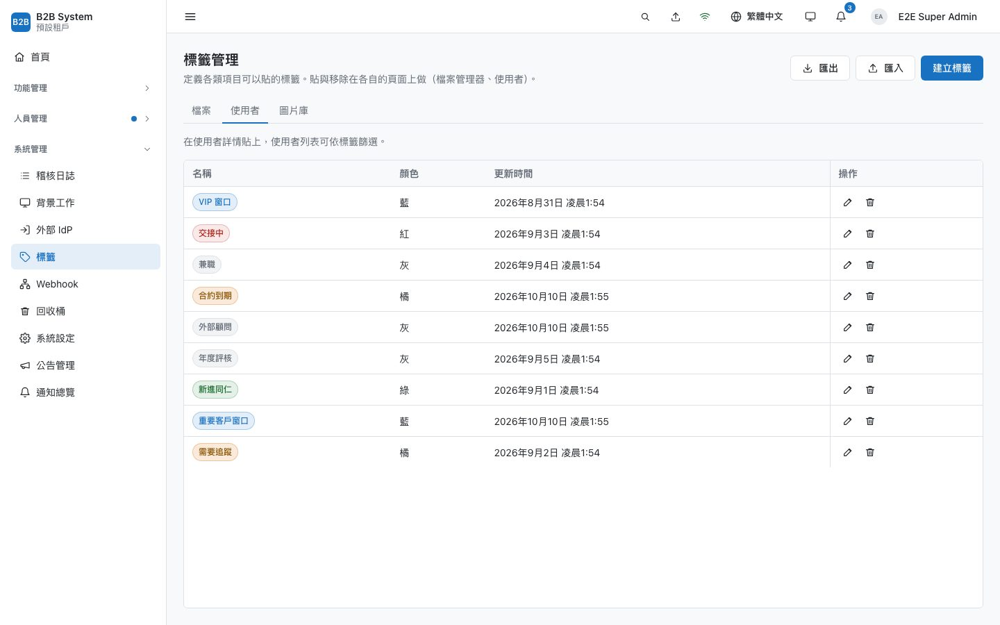

*標籤依資源類型分開管理（使用者、檔案），各自有名稱與顏色；列表可以依標籤篩選。貼與移除標籤跟著目標資源的編輯權限走。
新的資源類型由擁有它的模組登記，標籤模組不必認識業務模組。*

規格：[`architecture/backend/18-tag.md`](../../architecture/backend/18-tag.md)。

### 3.4 匯入／匯出

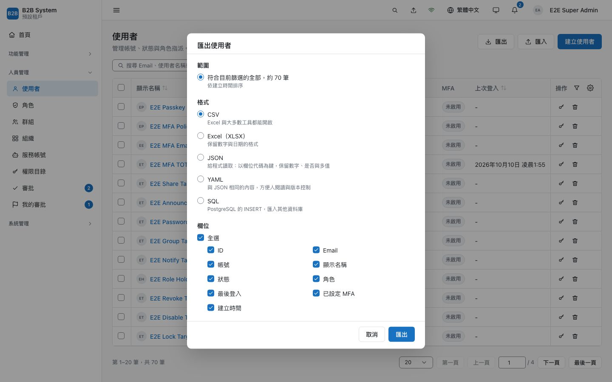

*匯出使用者：範圍是目前篩選的全部（或批次列上選取的列），格式有 CSV、Excel、JSON、YAML 與 SQL，可以挑欄位。
匯出一律是背景工作：對話框等它完成並自動下載；關掉也沒關係，完成時會收到通知。CSV 對開頭是 `=`、`+` 這類字元的字串前置 `'`，防止試算表執行公式。*

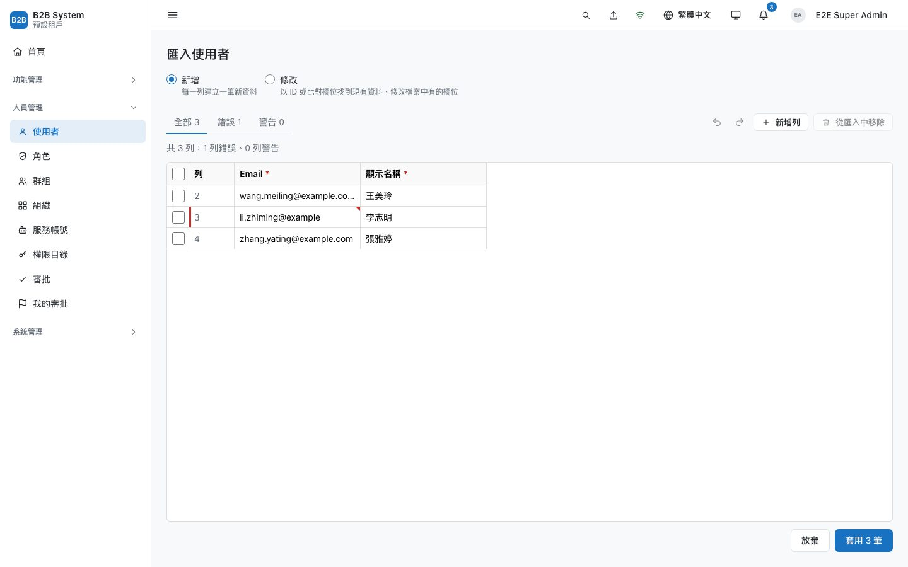

*匯入使用者：上傳 CSV／XLSX／JSON／YAML 後，伺服器分析並驗證每一列，前端以類似 Excel 的表格預覽。第 3 列的 email 少了網域，儲存格標紅、「錯誤 1」分頁只列出有問題的列。
可以直接在表格裡修正（下拉選單、自動完成、複製貼上、復原／重做）、新增或移除列；修改模式另可手動指定要更新哪一筆。預覽存成加密的草稿，重新整理後可以接續。*

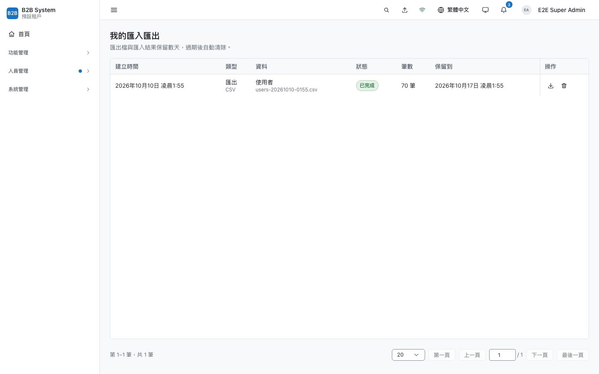

*帳號選單的「我的匯入匯出」：每一次匯出與匯入的狀態、筆數與保留期限（預設 7 天）。下載連結每次重新簽發，下載當下再檢查一次權限。*

- 欄位定義由擁有資源的模組登記一份，匯出與匯入共用。目前可以匯入匯出使用者、角色、群組與群組成員、部門與部門成員、標籤；稽核日誌、審批、服務帳號只能匯出。
- 匯出要獨立的 `<resource>:export` 權限（整批帶走的風險高於逐頁閱讀）；匯入的每一列走 create／update 原本的檢查，包括反提權。
- 套用是背景工作，**每一列一個交易**：一列失敗不影響其他列，結果報告列出每一列的結果；失敗的列可以帶回預覽修正後重新套用。匯入不支援刪除。
- 同一份檔案裡的列可以互相引用（例如部門的上層寫在同一份檔案裡）。

規格：[`architecture/backend/22-data-transfer.md`](../../architecture/backend/22-data-transfer.md)、[`architecture/frontend/21-data-transfer.md`](../../architecture/frontend/21-data-transfer.md)。

### 3.5 留言與關注

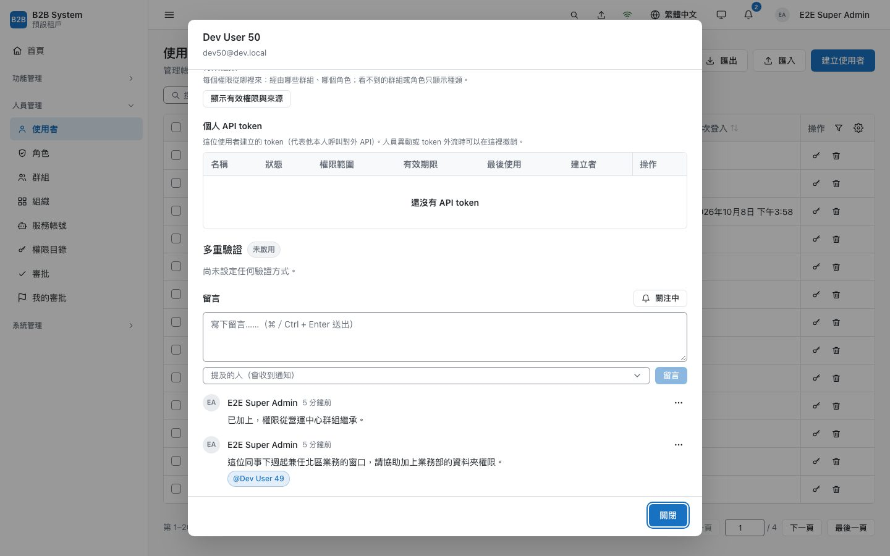

*使用者詳情最下方的留言。可以 @ 提及同事（被提及的人收到通知、點進來就是這個頁面）；留言的人自動「關注」這個資源，之後有新留言或資源被修改時收到通知。*

- 權限跟著資源走：看得到這位使用者就能讀留言、留言與關注，不另設權限；只提及得到看得到這個資源的人。刪除別人的留言要 `comment:delete`（預設給 admin），並寫稽核。
- 內文是純文字，被提及的人另外存一份清單，不在內文裡嵌標記。
- 第一批接上使用者；其他資源由擁有者模組登記資源類型，前端在詳情頁的面板註冊表加一個面板即可。

規格：[`architecture/backend/24-comment.md`](../../architecture/backend/24-comment.md)、[`architecture/frontend/22-comment.md`](../../architecture/frontend/22-comment.md)。

---

## 4. 稽核與維運

### 4.1 稽核日誌

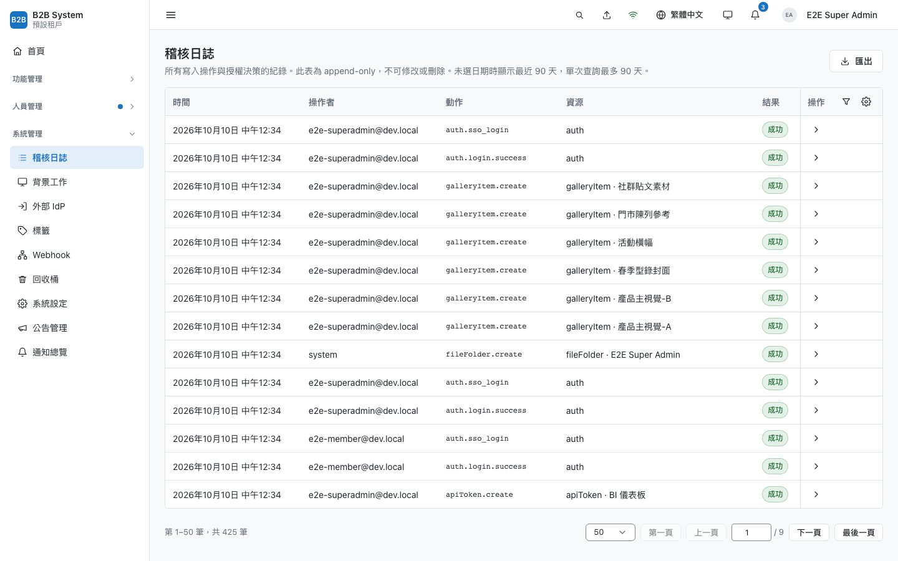

*所有寫入操作與授權決策。紀錄和業務寫入在同一個交易：寫不進去，整個操作就失敗。應用程式的 DB 角色只有 INSERT 與 SELECT，trigger 擋下 UPDATE／DELETE。*

|  | 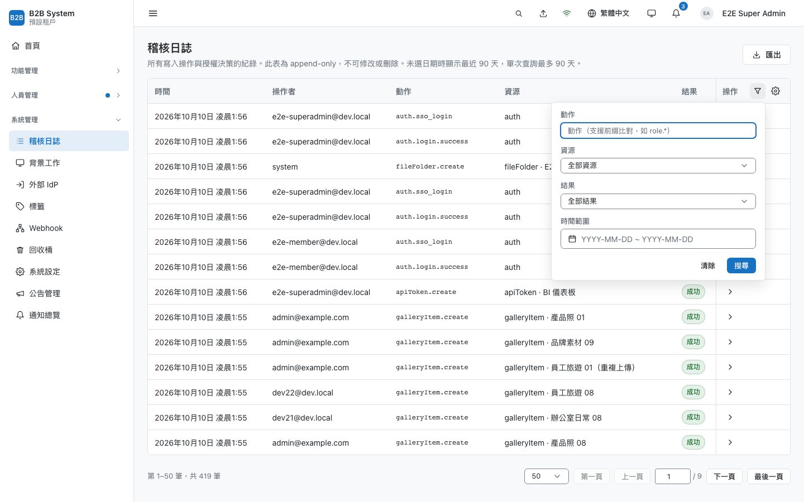 |
| --- | --- |
| *展開一筆紀錄：左邊是變更前後差異（只記實際變更的欄位），右邊是 IP、requestId、User-Agent 等中繼資料。操作者的 email 與資源名稱是快照，人被刪了紀錄仍看得懂。* | *依動作（支援前綴，如 `role.*`）、資源、結果、時間範圍篩選。熱表保留 90 天，之後搬到壓縮、按月分區的冷表。* |

規格：[`architecture/backend/06-audit-log.md`](../../architecture/backend/06-audit-log.md)。

### 4.2 回收桶與版本紀錄

|  | 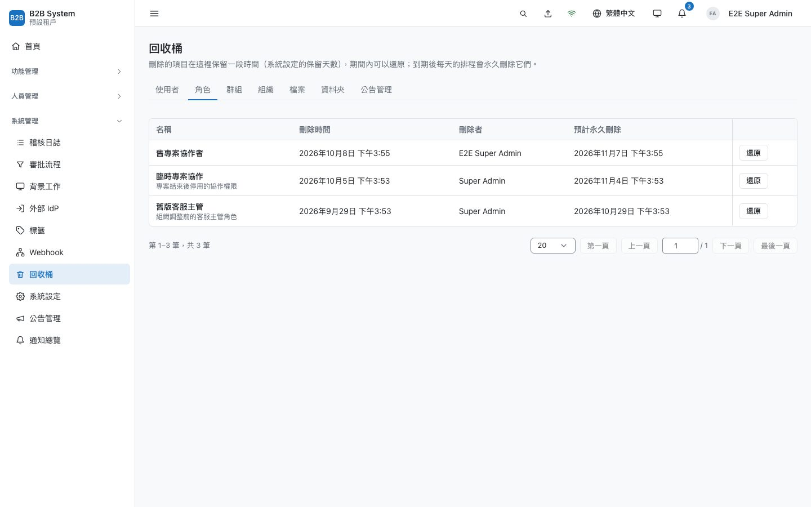 |
| --- | --- |
| *使用者、角色、群組、部門、檔案、資料夾、公告刪除後進回收桶，保留期內可以還原。* | *還原會重新檢查唯一值（名稱被佔用回 409）與反提權。到期由排程逐列永久刪除，一列被外鍵卡住只略過它自己。* |

可編輯的實體都有 `version`：更新必須帶上讀取時的版本，別人先改了就回 409，畫面保留使用者的輸入。版本紀錄見 [§2.2](#22-角色)。
規格：[`architecture/backend/13-trash.md`](../../architecture/backend/13-trash.md)、[`architecture/backend/14-revisions.md`](../../architecture/backend/14-revisions.md)、[`architecture/backend/03-api-conventions.md`](../../architecture/backend/03-api-conventions.md) §11。

### 4.3 背景工作


*「佇列概況」分頁每個佇列一張卡片（另一個分頁是工作列表）：排程（cron，UTC）或由程式入列，等待、排定、執行中、完成的數量。稽核封存、檔案維護、回收桶清除、版本修剪、通知清理、過期的登入憑證與 MFA 驗證紀錄清理、Webhook 與匯入匯出紀錄的清理都是排程工作；匯出、匯入的套用與 Webhook 投遞是由程式入列的工作。*

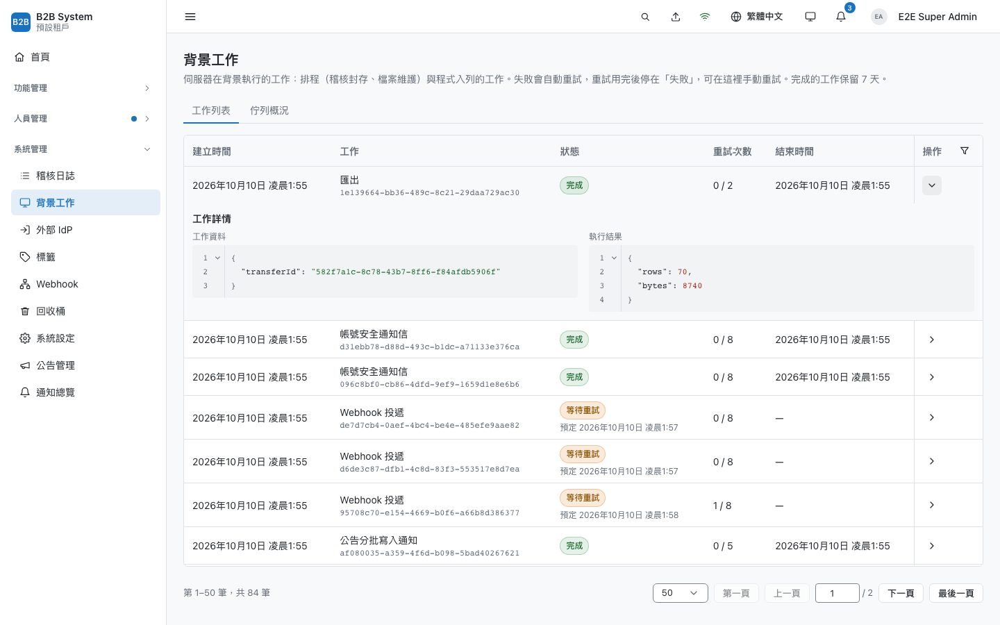

*展開一筆工作：左邊是工作資料，右邊是執行結果或錯誤。失敗的工作自動重試，重試用完停在「失敗」，可以手動重試。*

佇列用 pg-boss，放在平台 DB；業務交易在租戶 DB，所以交易內入列先寫租戶 DB 的 `job_outbox`，提交後搬進佇列，漏搬的由排程補上。
寄信的 token 在寄出當下才簽發，持有 `job:read` 的人從工作資料看不到可用的連結。規格：[`architecture/backend/10-jobs.md`](../../architecture/backend/10-jobs.md)、[`architecture/backend/11-mail.md`](../../architecture/backend/11-mail.md)。

### 4.4 系統設定、安全性與外部 IdP

系統設定分三個分頁：「一般」是執行期可調的設定、「安全性」是 MFA 政策、「事件通知」見 [§5.1](#51-站內通知)。

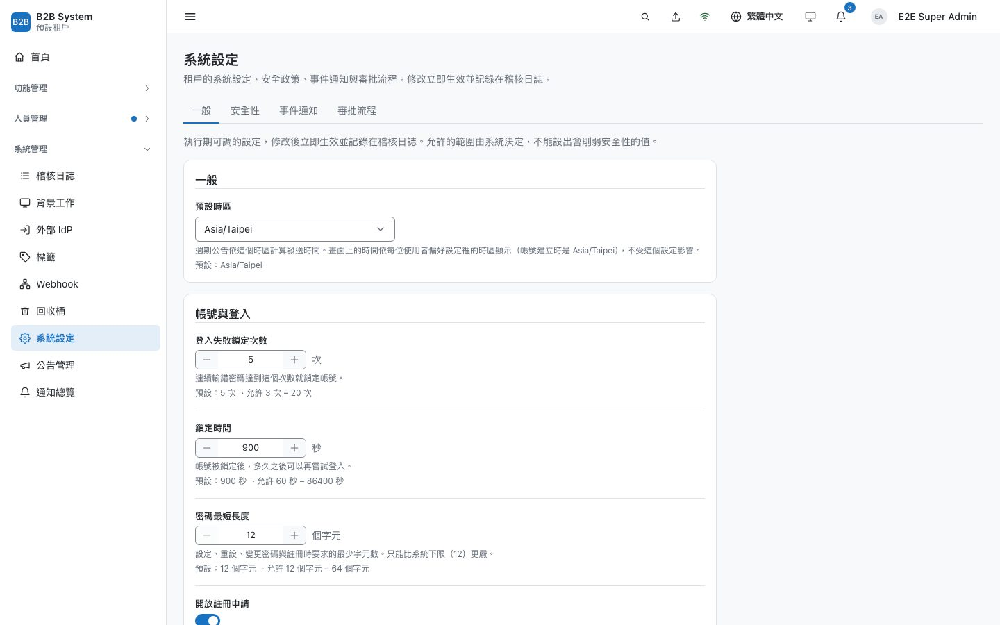

*每個租戶在執行期可調的設定：預設時區、登入鎖定、密碼長度、是否開放註冊、啟用信與重設密碼信的效期、API token 的最長效期、上傳上限、回收桶與版本的保留、通知與公告的上限……。每個值都有允許的範圍，不能設出削弱安全性的值（例如密碼最短長度不能低於 12）；修改即時生效並記入稽核。*

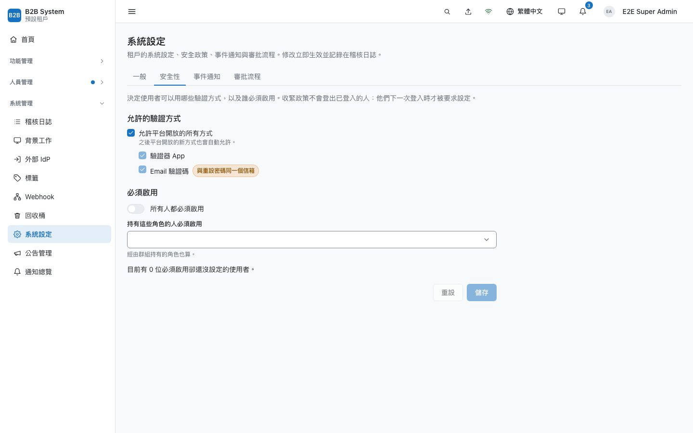

*「安全性」分頁的 MFA 政策：允許哪些驗證方式（只能在平台開放的範圍內挑），以及全員必須或持有指定角色（含經由群組持有）的人必須啟用；下方即時算出「必須啟用卻還沒設定」的人數。
收緊政策不會登出已登入的人，他們下一次登入時被要求設定。修改政策是獨立的權限 `mfaPolicy:update`，預設只有 super-admin——系統設定可以交給 admin，而不交出安全政策。*

| 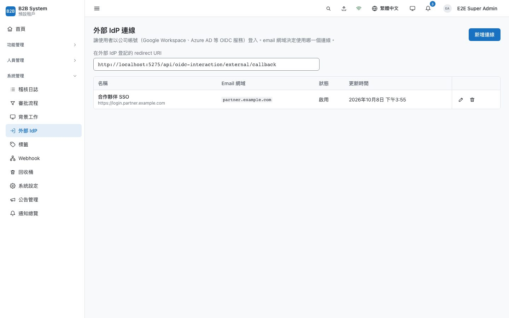 | 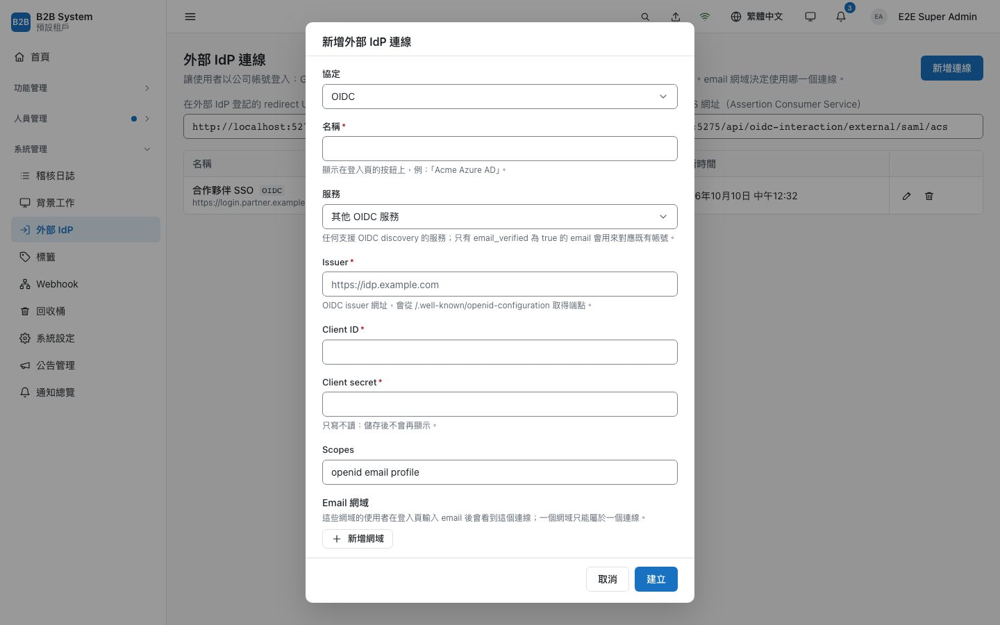 |
| --- | --- |
| *租戶自己的外部 IdP（OIDC）連線，例如公司的 Azure AD、Google Workspace。* | *登記 issuer、client、scopes 與 email 網域；找不到對應帳號時拒絕登入，或自動建立帳號。* |

以 email 自動連結既有帳號時，要求 `email_verified`、網域登記在這條連線上、而且帳號沒有 member 以外的系統角色——否則能改 IdP 設定的人可以自架 IdP 簽出 super-admin 的 email。
規格：[`architecture/backend/12-settings.md`](../../architecture/backend/12-settings.md)、[`architecture/backend/21-mfa.md`](../../architecture/backend/21-mfa.md)、[`architecture/04-sso.md`](../../architecture/04-sso.md)。

---

## 5. 通知與對外

### 5.1 站內通知

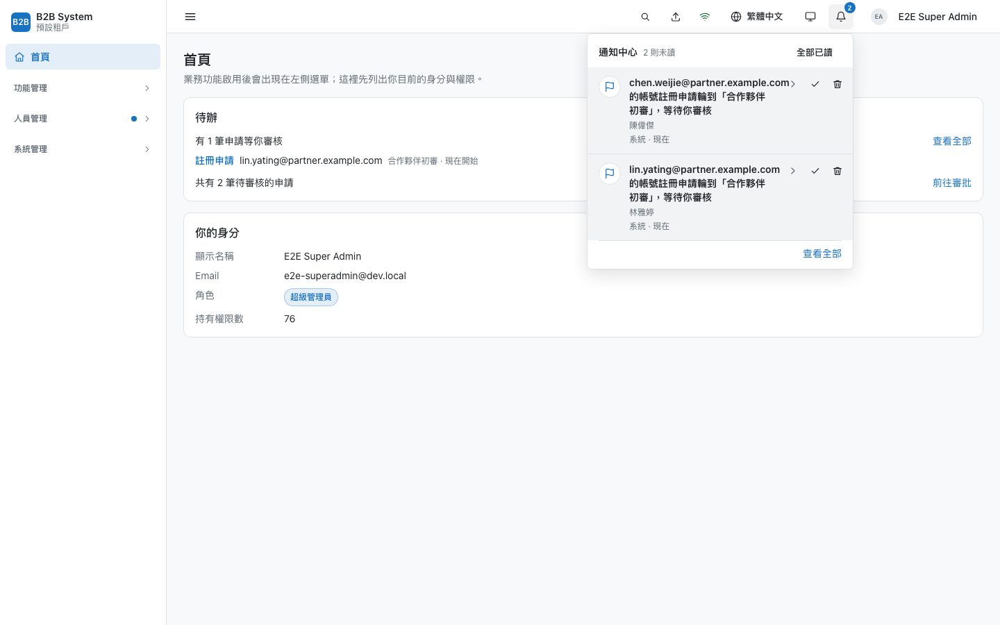

*頂列的鈴鐺與未讀數。這兩則是有人送出註冊申請，通知給這一關可以審核的人；點開直接到審批詳情。通知是推播到瀏覽器的，不必重新整理。*

| 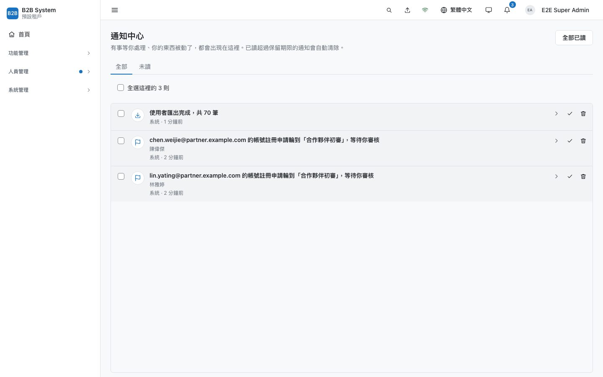 | 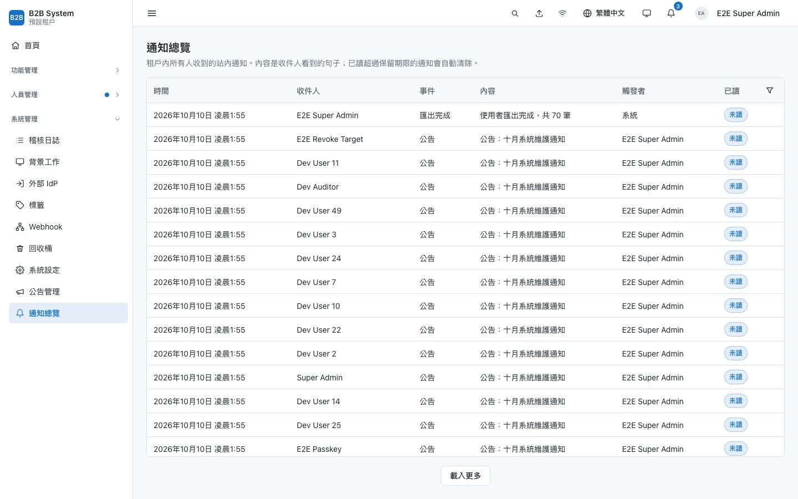 |
| --- | --- |
| *自己的通知：全部／未讀、全部已讀；已讀超過保留期限的自動清除。* | *管理者的通知總覽：租戶內所有人收到的通知與已讀狀態。* |


*事件通知：每種事件可以分管道（站內、Email）開關，並決定是否允許個人關閉。關掉再打開不補發。事件目錄寫在程式碼裡，資料庫只存租戶層的覆寫。*

通知由擁有者模組在業務交易內寫入，不訂閱程序內的事件匯流排（那是 fire-and-forget，會丟）。通知存的是 route id 加參數而不是網址：
功能被停用或路徑改名時只顯示文字，不給壞掉的連結。規格：[`architecture/backend/15-notification.md`](../../architecture/backend/15-notification.md)、[`architecture/backend/16-notification-event.md`](../../architecture/backend/16-notification-event.md)。

### 5.2 公告

| 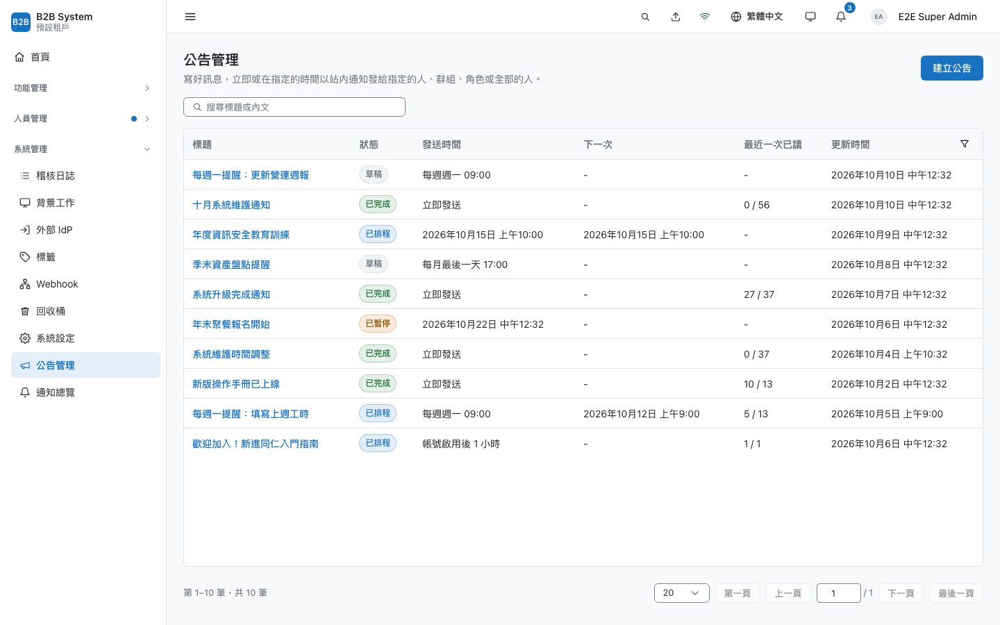 | 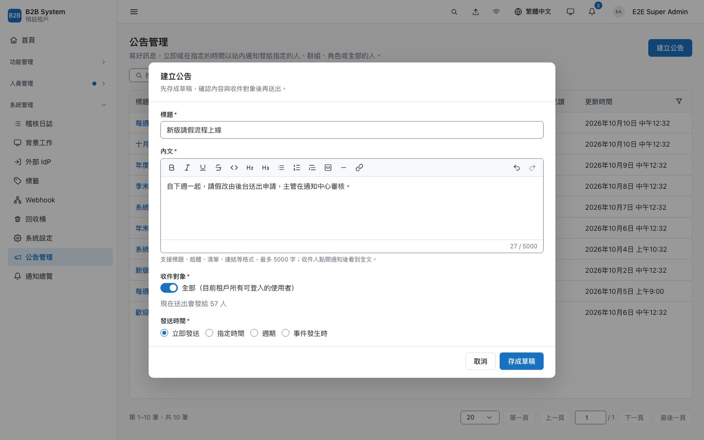 |
| --- | --- |
| *公告列表：立即發送、指定時間、每週與每月的週期、「帳號啟用後 1 小時」這類事件點，以及草稿與暫停中的公告；「最近一次已讀」是已讀／收件人數。* | *內文是富文本（標題、清單、引言、連結等）。收件對象可以是全部、指定的人、群組（含子群組）或角色，即時算出會發給幾人；發送時間有立即、指定時間、週期、事件發生時（帳號啟用、被指派角色、加入群組）。* |

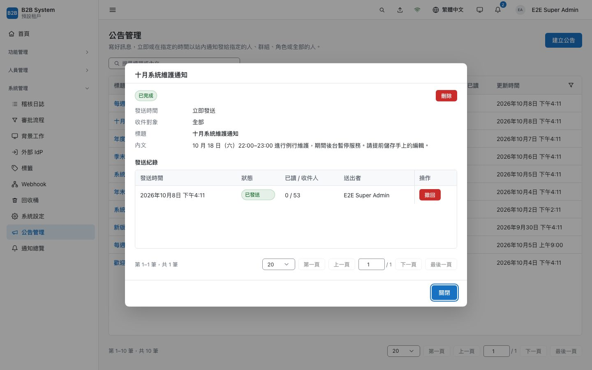

*公告詳情：每次發送一筆紀錄，顯示已讀／收件人數，可以撤回。週期依租戶的預設時區計算。*

| 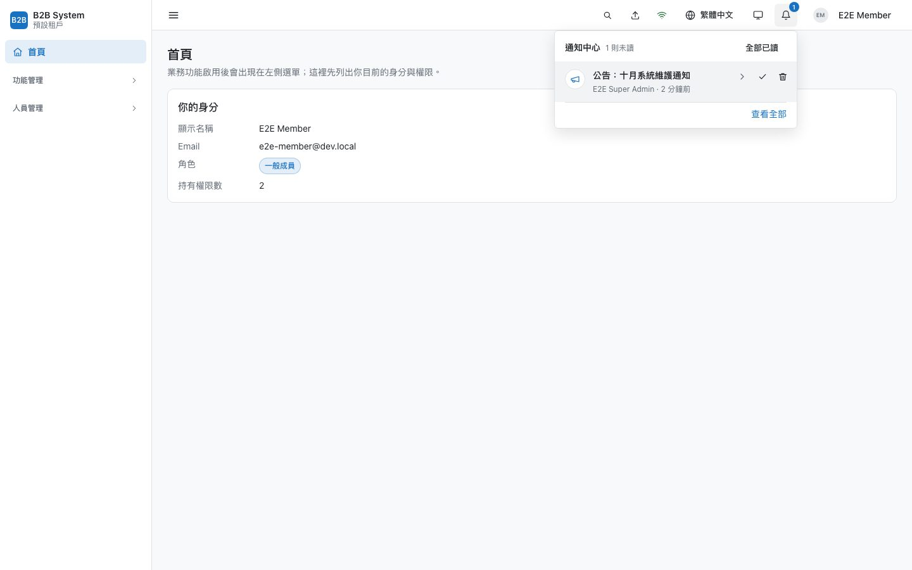 | 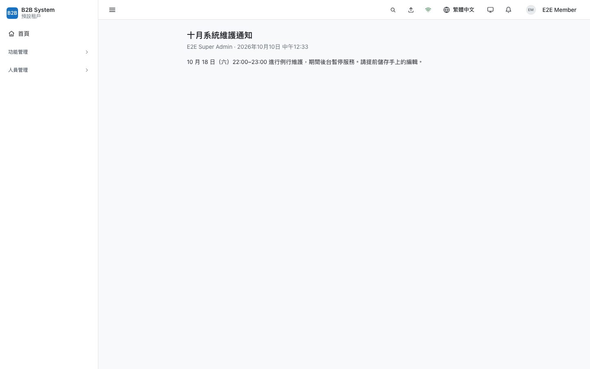 |
| --- | --- |
| *一般成員收到公告。* | *點開通知看全文。* |

富文本存的是文件 JSON 而不是 HTML；寄 Email、對外 API 需要 HTML 時，以只輸出白名單元素的轉換器產生。
規格：[`architecture/backend/19-announcement.md`](../../architecture/backend/19-announcement.md)、[`architecture/frontend/16-announcement.md`](../../architecture/frontend/16-announcement.md)、[`architecture/frontend/07-ui-system.md`](../../architecture/frontend/07-ui-system.md) §3.16（富文本）。

### 5.3 Webhook

| 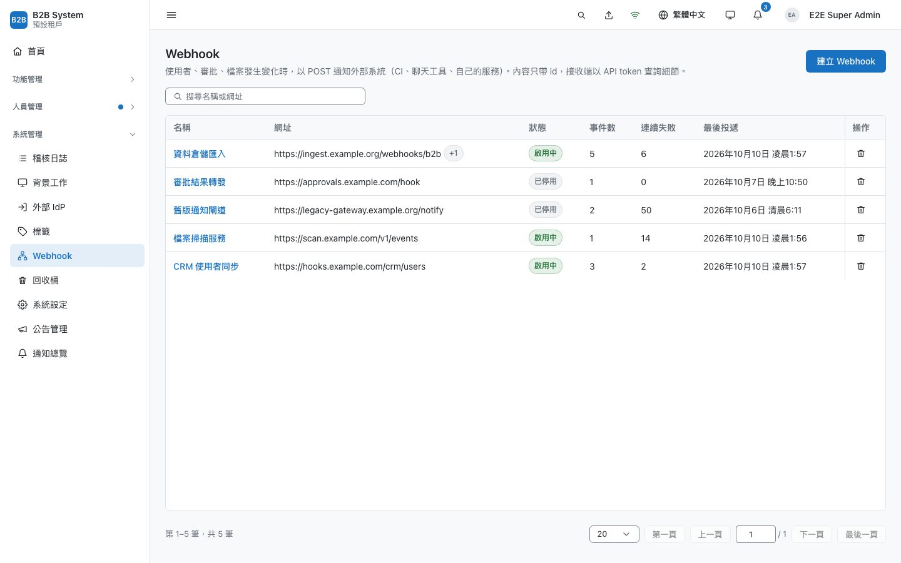 | 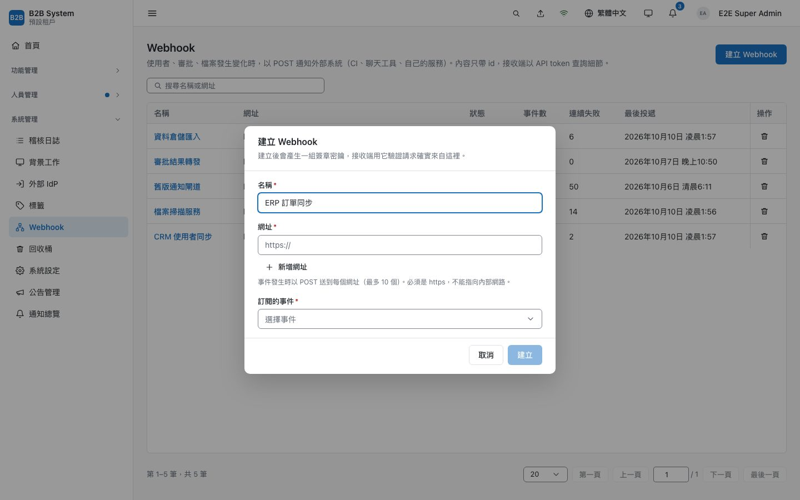 |
| --- | --- |
| *Webhook 列表：事件數、連續失敗次數、最後投遞時間。* | *選擇要訂閱的事件與目標網址（可以多個）；簽章用的 secret 只在建立時顯示一次。* |

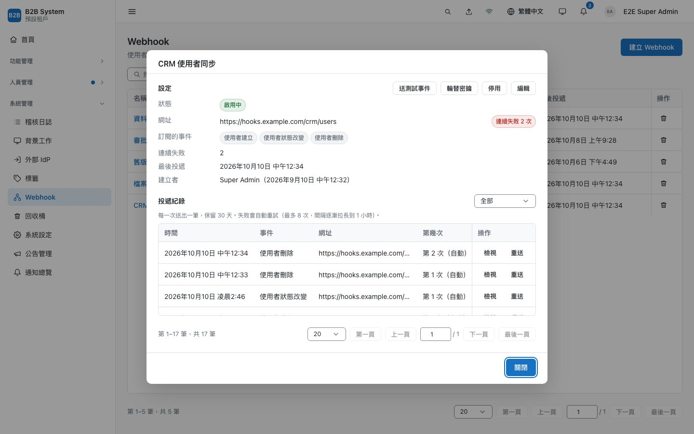

*Webhook 詳情：訂閱的事件、連續失敗次數與投遞紀錄。最上面那一筆是示範資料刪除使用者時送出的 `使用者刪除`，目標網址不存在而失敗，會自動重試。*

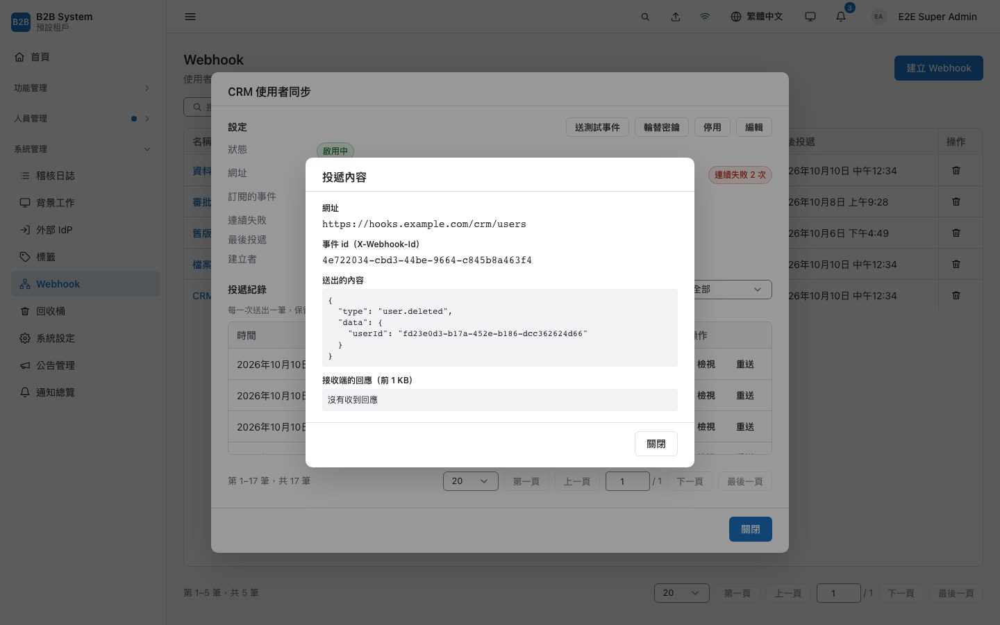

*投遞紀錄與內容。payload 只帶 id 與列舉值、不帶個資，接收端要細節時以 API token 經對外 API 回查，套用的是 token 自己的權限；外洩的影響因此很小。每次投遞帶 HMAC 簽章；失敗自動重試（最多 8 次，間隔逐漸拉長到 1 小時），連續失敗太多次自動停用並通知能修好它的人，也可以手動重送。*

目標網址在連線時才解析並綁定已驗證的位址，擋下指向內網或 metadata 服務的 SSRF。規格：[`architecture/backend/17-webhook.md`](../../architecture/backend/17-webhook.md)。

---

## 6. 平台後台（apps/platform）

平台管理者是另一份帳號（平台 DB 的 `platform_admins`），登入同一個入口，但沒有任何租戶的授權。平台的端點只在 apps/platform 的網域有效，
其他網域一律回 `404 PLATFORM_ONLY`，WAF 與 IP 白名單只要套在一個網域上。

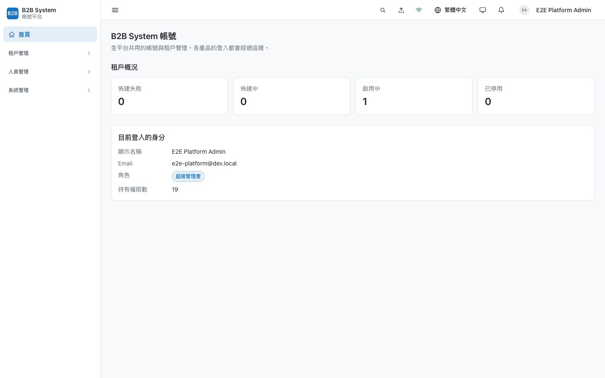

*平台首頁：各狀態的租戶數。*

### 6.1 租戶

| 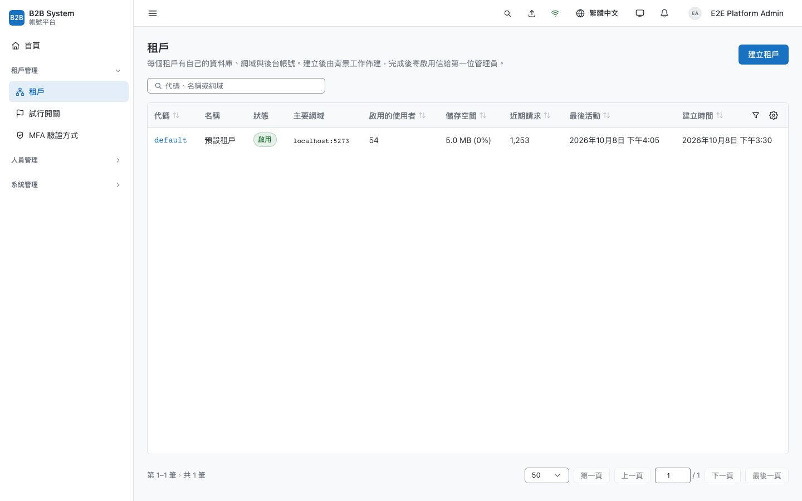 | 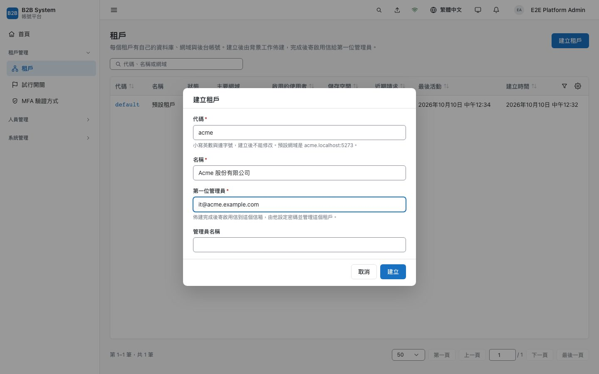 |
| --- | --- |
| *租戶列表：每個租戶的啟用使用者、儲存空間（與配額的比例）、近 7 天的請求數與最後活動，都可以排序。* | *建立租戶：代碼、名稱、第一位管理員的 email。佈建在背景進行（建 database、DB 角色、bucket、跑 migration），完成後寄啟用信給管理員。* |


*租戶概覽與網域。每個租戶一個 database 與一組網域，請求由網域決定租戶；沒有租戶脈絡時直接拋錯，不退回預設資料庫。*

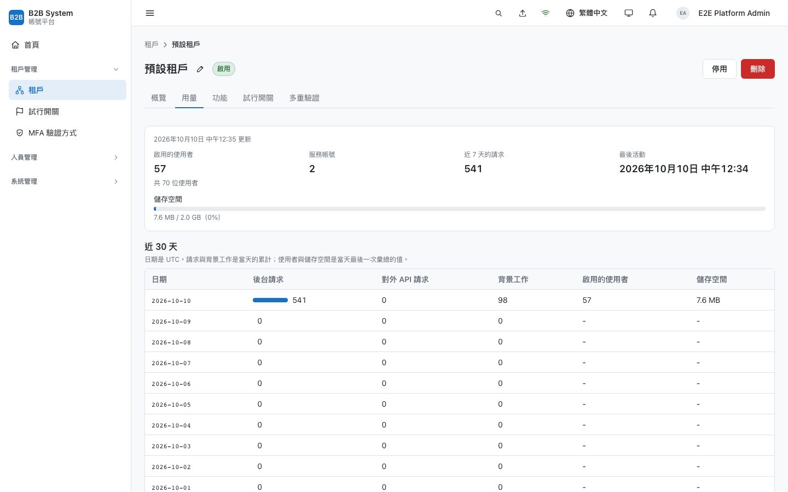

*「用量」分頁：最近一次快照的使用者與服務帳號數、近 7 天的請求、最後活動與儲存配額的使用率，下方是近 30 天每天的後台請求、對外 API 請求、背景工作、使用者與儲存量。
使用者與儲存是每小時的快照；請求與背景工作由每個程序在記憶體累計、每分鐘加到當天那一列。儲存越過配額的 80% 時發平台通知。租戶自己的管理者看不到這些數字。*


*為租戶開關功能（檔案、稽核日誌、背景工作、回收桶、系統設定、外部 IdP、切換租戶、Webhook、公告、對外 API、群組、匯入匯出、組織、多階段審批），並設定各自的配額與上限（檔案容量、稽核熱／冷資料天數、同時執行的工作數、外部 IdP 連線數、Webhook 網址數……）。
關掉的功能在 API 回 `404 FEATURE_DISABLED`，前端在執行期卸載該 feature；資料不刪，重新打開即恢復。「多重驗證」分頁可以為這個租戶覆寫平台的 MFA 驗證方式開關。*

生命週期是 provisioning → active／failed → disabled → deleted，每一步冪等；佈建到一半程序重啟，排程會把卡住的租戶收成 failed。
規格：[`architecture/05-tenancy.md`](../../architecture/05-tenancy.md)（用量在 §5.4）。

### 6.2 平台管理者、MFA 驗證方式、feature flag 與平台稽核

| 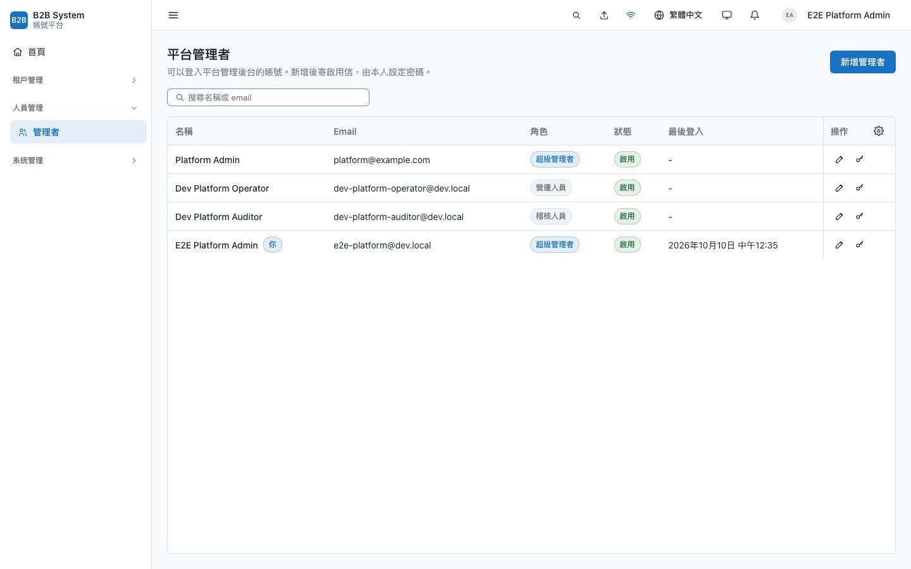 | 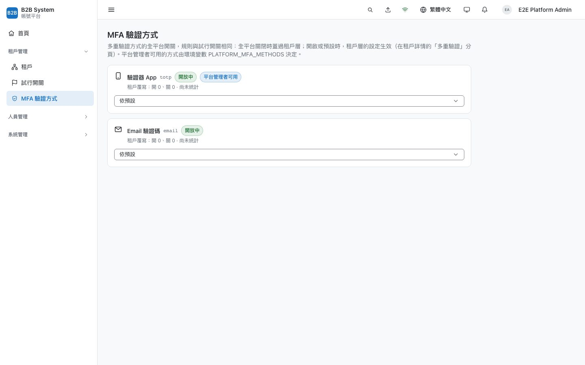 |
| --- | --- |
| *平台管理者分 super-admin、operator、auditor 三種角色。平台管理者必須啟用 MFA（production 強制），可用的方式由環境變數決定，不提供執行期放寬的開關。* | *MFA 驗證方式的全平台開關，規則與試行開關相同：全平台關閉時蓋過租戶層；開啟或「依預設」時，租戶層的設定生效。* |

| 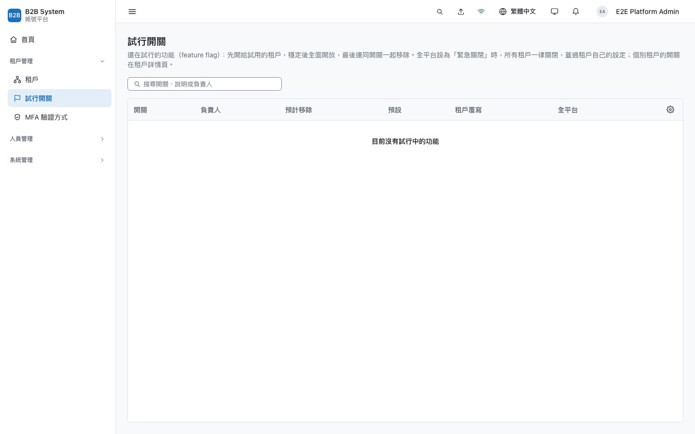 | 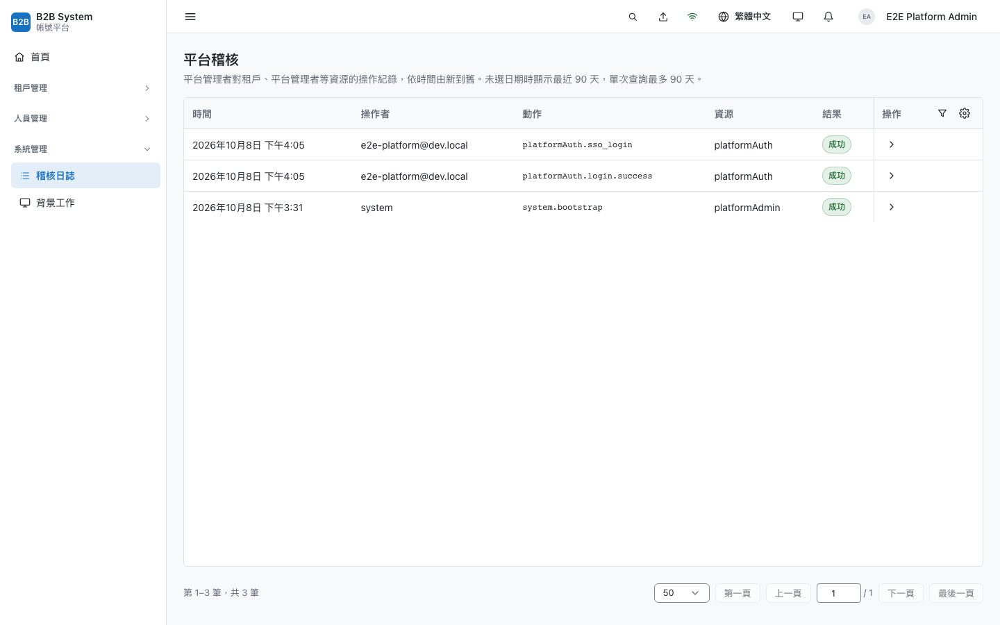 |
| --- | --- |
| *試行開關（feature flag）：先開給試用的租戶，穩定後全面開放，最後連同開關一起移除。每個 flag 必填預計移除日，過期沒移除會讓測試失敗。目前沒有試行中的功能。* | *平台層的稽核：租戶與管理者的操作。* |


*全平台的背景工作：佇列在平台 DB，排程工作展開成每個租戶一筆，一個租戶塞車不影響其他租戶；租戶用量的彙總是平台自己的工作。*

規格：[`architecture/05-tenancy.md`](../../architecture/05-tenancy.md) §10–11、[`architecture/backend/21-mfa.md`](../../architecture/backend/21-mfa.md)。

---

## 7. 個人帳號與介面

| 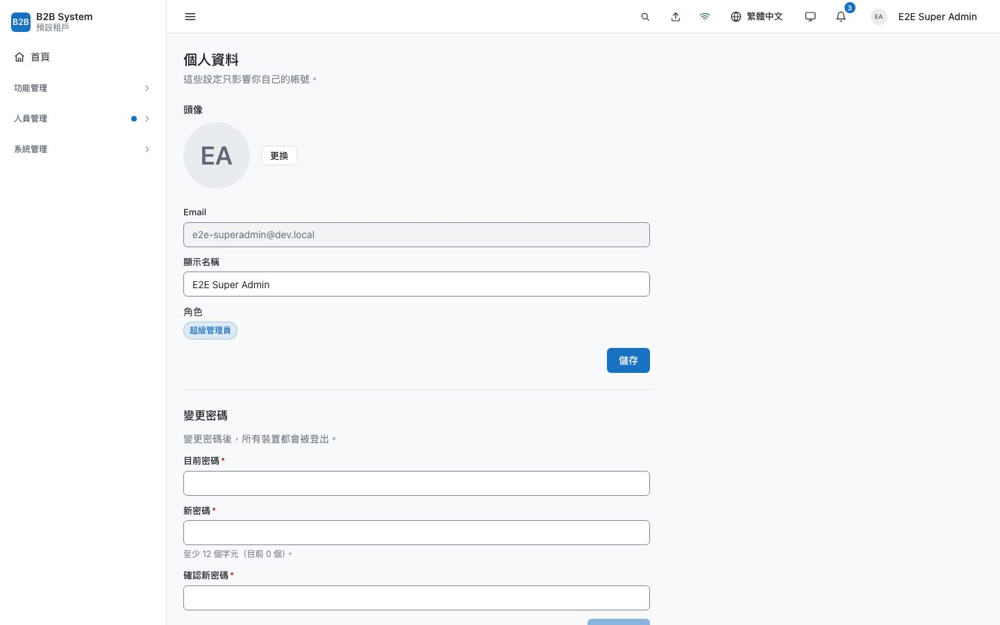 | 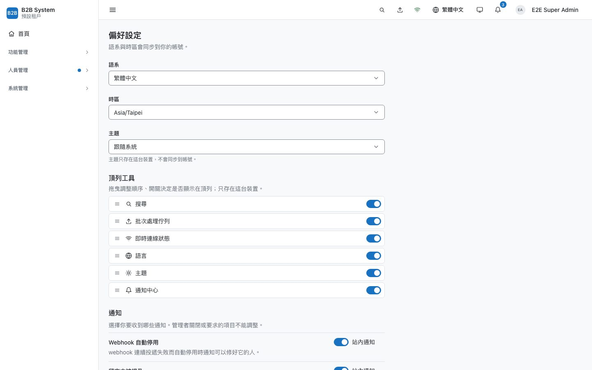 |
| --- | --- |
| *個人資料：顯示名稱、變更密碼、多重驗證（[§1.1](#11-多重驗證)）、自己的有效權限與來源、個人 API token。* | *語系與時區同步到帳號；主題與頂列工具只存在這台裝置；可以關閉管理者允許關閉的通知。* |

### 深色主題

|  |  |
| --- | --- |
| *Design Token 分三層，深色只覆寫 alias 層；狀態色分填色與前景兩組，兩個主題都通過 WCAG 對比測試。* | *樹狀圖沒有載入第三方 CSS，跟著 token 一起換色。* |

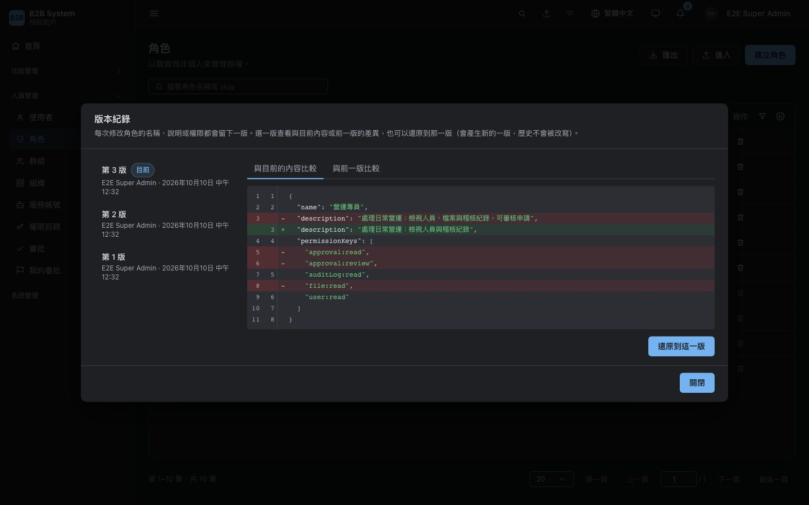

*主題預設「跟隨系統」；`theme-init.js` 在首次繪製前決定主題，不閃白。*

規格：[`architecture/frontend/07-ui-system.md`](../../architecture/frontend/07-ui-system.md) §4。

---

## 重新產生截圖

導覽劇本在 `apps/e2e/tour/`：`demo-data.ts` 以 API 補上示範資料（沿用 `db:seed:dev` 的部門樹與 Webhook，另外設定註冊的兩關審批流程、留言等），
`feature-tour.spec.ts` 逐頁拍照，輸出到 `docs/guide/images/tour/`。
它會 **重置資料庫**，所以要對著隔離的環境跑（做法同 [`frontend/10-testing.md`](../../architecture/frontend/10-testing.md) §4.3「與正在跑的 dev 環境並行」）：
先依該節起好暫用的 postgres（平台與租戶兩個 database）、api、file-storage、backstage、platform 與環境變數，再執行：

```bash
pnpm --filter @b2b-system/e2e tour
```

- 租戶用量要有快照才有數字：暫用的 api 加上 `TENANT_USAGE_ROLLUP_CRON='* * * * *'`（每分鐘彙總一次）。
- 多重驗證的畫面用 E2E 的專用帳號 `e2e-mfame` 設定驗證器 App，拍完由 super-admin 重設，回到沒有驗證方式的起點。
- 某一張拍不到時劇本不中斷，最後列出沒拍到的畫面；畫面改版通常只要調整那一段的 testid。只重拍一部分時以 `-g "準備示範資料|<test 名稱>"` 篩選（每次都會重置資料庫）。
- 新增功能時在劇本加一個 `scene`、在本文加一段說明。截圖是 JPEG（1440×900），整份約 6 MB。
