# 專案介紹 — 一套把邊際情況當成主規格來寫的後台

> 給第一次接觸這個專案的人：它做了哪些事、每個機制替哪些容易被忽略的情況想過答案、和常見的後台範本有什麼不同。
> 規格細節以各章節文件為準，本文只做導覽並附上連結。
> 截圖取自 2026-10-01 的本機 dev 環境（`pnpm dev`），使用 seed 產生的測試帳號與資料；數字以當天的程式碼與文件為準。

B2B System 是通用型的多租戶 B2B 後台骨架。它不綁任何業務領域，先把每個後台都需要的身分、權限、稽核、檔案、背景工作、通知做成 **會被強制使用** 的機制，業務功能再以 feature（前端）＋ module（後端）的形式加上去。

| 規模 | 數量 |
| --- | --- |
| 架構決策紀錄（`docs/adr/`） | 28 份 |
| 規格文件（`docs/`） | 103 份 |
| 自動化測試案例 | 約 3,200 個 |
| 具名錯誤碼（`apps/api/src/core/errors/error-code.ts`） | 108 個 |
| 權限鍵（租戶／平台） | 39／12 個 |
| commit（2026-09-20～10-01） | 417 個 |

---

## 目錄

1. [一張對照表](#1-一張對照表)
2. [登入與 token](#2-登入與-token攻擊者和網路都不可靠)
3. [多租戶](#3-多租戶每個租戶一個資料庫由網域決定租戶)
4. [權限](#4-權限伺服器解析關係圖可以解釋)
5. [稽核、樂觀鎖、版本、回收桶](#5-稽核樂觀鎖版本回收桶)
6. [背景工作、寄信、通知](#6-背景工作寄信通知)
7. [檔案](#7-檔案直傳分塊同源防護)
8. [前端架構](#8-前端架構plugin依賴圖單一連線)
9. [工程紀律](#9-工程紀律規則由程式強制決定都寫下來)
10. [現況](#10-現況)

---

## 1. 一張對照表

大多數後台範本（ant-design-pro、vue-element-admin，或一個 NestJS／Spring 的 admin 起手式）都能在一週內跑起來：一張 roles 表、一串權限字串、JWT 放 localStorage、所有租戶共用一個資料庫並用 `tenant_id` 區分。它們在 demo 時沒有問題，問題出在上線之後。

| 主題 | 常見後台範本 | B2B System |
| --- | --- | --- |
| Token | JWT 存 localStorage，權限寫進 token，要等過期才能撤銷 | 5 分鐘 access token 只在記憶體；不帶權限；refresh 輪替＋重用偵測；`token_version` 加一即全面失效 |
| 多租戶 | 共用 DB＋`tenant_id`，漏一個 WHERE 就跨租戶外洩 | 每個租戶一個 database、一個 DB 角色、一組網域；沒有租戶脈絡時直接拋錯，不退回預設 DB |
| 權限模型 | roles × permissions 靜態表 | Zanzibar 式關係圖（`relation_tuples`），角色、群組、資料夾授權是同一張圖上的邊；可以回答「他為什麼能做 X」 |
| 忘了加 guard | 端點預設公開 | 程序啟動時掃描所有路由，漏宣告就啟動失敗 |
| 授權給別人 | 能進角色頁就能勾任何權限 | 反提權：你給出去的能力，你自己必須全部持有 |
| 前端路由守衛 | 沒權限就導回首頁或 404 | 原網址顯示 403；權限水合前顯示骨架屏，不閃、不洩漏有哪些頁面 |
| 併發編輯 | 後寫者勝 | `version` 必填，衝突回 409 並保留使用者輸入 |
| 刪除 | 直接 DELETE，或加了 `deleted_at` 之後就不管 | 回收桶；還原時重驗唯一值與反提權；到期清除逐列 savepoint，一列卡住不拖垮整批 |
| 稽核 | 另寫一張 log 表，失敗就算了 | 和業務寫入同一個交易，寫不進去整個操作就失敗；DB trigger 禁止 UPDATE／DELETE |

---

## 2. 登入與 token：攻擊者和網路都不可靠

登入不在產品本身。`apps/api` 用經過 OpenID 認證的 `oidc-provider` 當 OIDC Provider，`apps/auth` 是全平台共用的登入入口，每個後台都是它的 client（授權碼＋PKCE＋BFF）。全部是 host-only cookie，不用 iframe、不用 `postMessage` 傳 token，產品和登入入口不必同站。規格見 [`architecture/04-sso.md`](../architecture/04-sso.md)、[`architecture/backend/04-auth.md`](../architecture/backend/04-auth.md)。

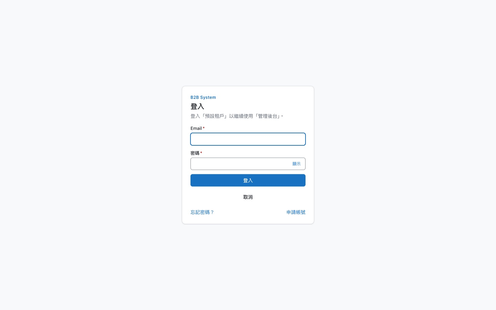

*apps/auth 的登入互動頁。從後台 `localhost:5173` 被導到 `localhost:5175/interaction/…`；畫面寫明正在登入哪個租戶、哪個產品。*

| 情況 | 怎麼處理 |
| --- | --- |
| 兩個分頁同時續期 | refresh token 每用一次就換新，兩個分頁拿同一張去換會被判定為重用攻擊。前端用 Web Locks 做跨分頁互斥，加上分頁內單飛；筆電闔上再打開、所有分頁同時醒來也不會互相踢掉 |
| 回應在路上遺失 | 續期成功但回應沒送到，瀏覽器會拿剛用掉的那張再試。30 秒寬限期內，若它是該 family 最後被使用的那張，視為重送而非攻擊，稽核記 `auth.refresh.replayed` |
| 真正的重用 | 拿出一張早已用過的 token，整條 family 全部撤銷並寫高嚴重度稽核。標記「已用」是條件式 `UPDATE … WHERE used_at IS NULL`，兩個併發請求不可能都換到新 token |
| 偷到 cookie 一直續期 | family 有 30 天絕對壽命 |
| 用回應時間猜帳號 | 帳號不存在時照樣用實際參數算一次 Argon2 dummy hash；忘記密碼一律回 200 並只入列 |
| 猜錯 5 次踢人下線 | 鎖定只寫 `locked_until`，不改狀態也不踢掉既有 session，否則任何人都能把線上的 super-admin 踢下線 |
| Cookie 永遠送不出去 | 文件原寫 `Path=/auth`，但瀏覽器看到的路徑帶 `/api` 前綴；實作改成 `/api/auth`，記在 `CLAUDE.md` 的「與文件不同的實作決定」 |
| 外部 IdP 帳號接管 | 以 email 自動連結既有帳號時，要求 `email_verified`、網域登記在這條連線上、帳號沒有 member 以外的系統角色。否則有 `identityProvider:update` 的人可以自架 IdP，簽出 super-admin 的 email |

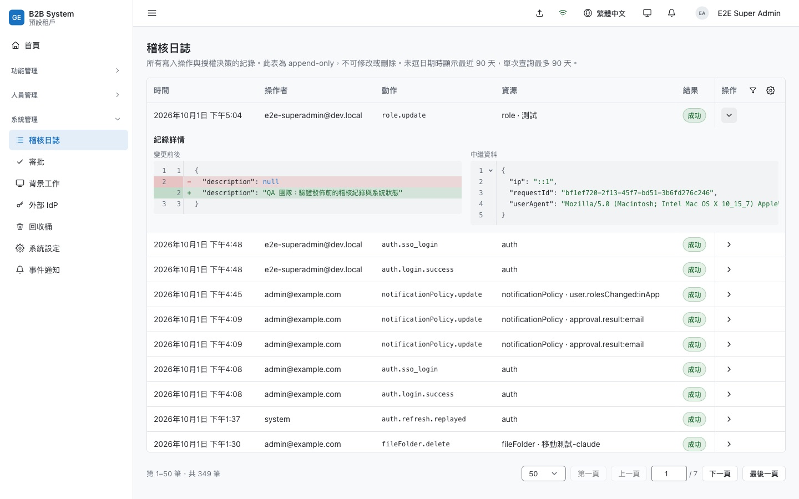

*稽核日誌。資料裡有一筆 `auth.refresh.replayed`（操作者 system），表示寬限期確實被觸發過。展開的列只記實際變更的欄位，右邊是請求的中繼資料。*

---

## 3. 多租戶：每個租戶一個資料庫，由網域決定租戶

專案曾經用共用資料表加 `workspace_id` 做完一整套工作區隔離（[ADR-0018](../adr/0018-workspace-tenancy.md)），後來整個丟掉，改成實體隔離（[ADR-0020](../adr/0020-physical-tenant-isolation.md)）。被否決的方案也寫得很清楚：schema-per-tenant 只要 `search_path` 設錯一次就讀到別人的表；RLS 仍然是同一個資料庫裡的應用層紀律。規格見 [`architecture/05-tenancy.md`](../architecture/05-tenancy.md)。

| 情況 | 怎麼處理 |
| --- | --- |
| 沒有租戶脈絡 | `TENANT_DB` 是一個 Proxy，每次存取轉到目前租戶的 DB；沒有脈絡時直接拋錯。29 個 repository 只換了注入的 token |
| A 租戶的 token 拿到 B 租戶 | access token 帶 `tid`，必須等於請求網域對應的租戶 |
| 亂造 Host 打爆記憶體 | 網域解析的三個快取都是上限 5000 筆的 LRU；不在快照裡的 Host 直接當找不到，不查平台 DB |
| 平台管理暴露在每個網域 | 平台端點在 apps/auth 以外的網域一律回 `404 PLATFORM_ONLY`，WAF 和 IP 白名單只要套在一個網域上 |
| 滾動部署時 migration 落後 | api 不自己跑 migration；進入租戶時比對 journal，落後的租戶回 `503 TENANT_UNAVAILABLE`，其他租戶不受影響 |
| 佈建到一半程序重啟 | 生命週期 provisioning → active／failed → disabled → deleted，每一步冪等；每 5 分鐘把卡住的租戶收成 failed。`pnpm db:drop-tenant` 不加 `--confirm` 只列出要做的事 |

> **整合測試抓到的漏洞**：實作 ADR-0020 時，整合測試發現 A 租戶簽發的 token 拿到 B 租戶的網域，以 userId 為 key 的權限快取會用 A 的使用者與權限判斷 B 的請求。修正是把租戶前綴提前到解析的第 2 步，並在 access token 加上 `tid`。這段記在 ADR 的「實作時改掉的做法」表裡。

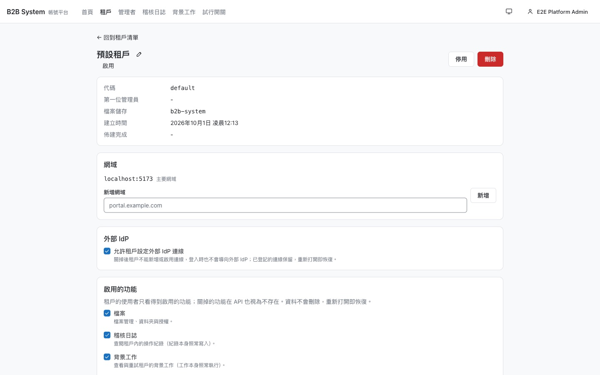

*平台後台的租戶詳情（apps/auth）。網域與可啟用的功能（檔案、稽核、背景工作、回收桶、系統設定、外部 IdP、切換租戶）都在這裡管。關掉某個功能，租戶的 API 對它回 `404 FEATURE_DISABLED`，前端在執行期卸載該 feature；資料不刪，重新打開即恢復。*

---

## 4. 權限：伺服器解析、關係圖、可以解釋

權限不進 token。每個請求查一次記憶體快取（命中時小於 1 ms），換來權限變更立即生效（[ADR-0005](../adr/0005-permission-resolved-server-side.md)）。底層是在 Postgres 上自建的 Zanzibar 子集：角色持有、角色的權限鍵、資料夾授權、群組成員，全部是 `relation_tuples` 上的邊（[ADR-0024](../adr/0024-relationship-based-access-control.md)）。否決 OpenFGA／SpiceDB 的理由是：稽核和授權寫入必須在同一個交易，外部服務會變成雙寫問題。切換採 trigger 雙寫加影子比對，分 G1～G3b 逐步完成。

模型刻意沒有 deny。[ADR-0006](../adr/0006-flat-permission-scope.md) 的理由是：一旦有 deny，「為什麼不能做 X」就變成需要推理的問題。

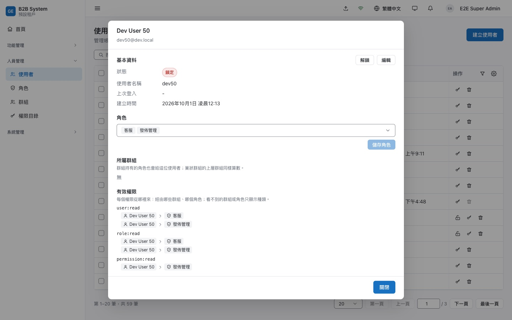

*有效權限與來源。每個權限鍵列出所有來源路徑（使用者 → 群組 → 上層群組 → 角色）；路徑上的節點依「查看者」的權限遮蔽，看不到的只顯示種類。見 [`rbac/09-explain.md`](../rbac/09-explain.md)。*

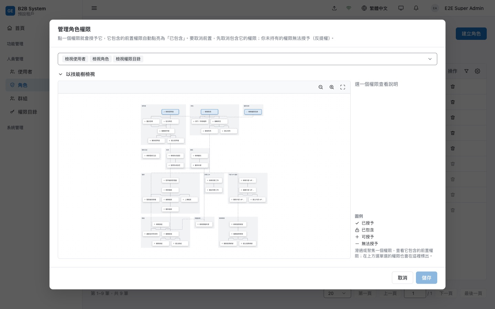

*權限技能樹。點上層權限會自動點亮前置（`file:delete ⇒ update ⇒ read`）；自己沒有的權限標成「無法授予」並鎖住，這是反提權在 UI 上的樣子。*

| 情況 | 怎麼處理 |
| --- | --- |
| 反提權的通用規則 | 把主體放進某個 `物件#關係` 時，主體因此取得的能力，操作者必須全部都有。同一條規則套在授權限、指派角色、加群組成員、資料夾授權、還原、審批核准上（[`architecture/backend/05-rbac.md`](../architecture/backend/05-rbac.md) §4.1） |
| super-admin 的陷阱 | super-admin 只有一條 `superAdmin` 邊，沒有任何權限鍵的邊。只比對鍵的話會得到空陣列而直接通過，所以 `superAdmin` 本身也算一種能力 |
| 權限依賴樹的不變條件 | 啟動時驗證：受反提權限制的鍵（如 `user:assignRole`）不能被任何鍵包含，否則「能編輯使用者」會悄悄等於「能指派角色」 |
| 最後一位 super-admin | 先取 `pg_advisory_xact_lock` 再計數，兩位 super-admin 同時刪掉對方時不會一個都不剩 |
| 群組互相包含 | 寫成員時用 advisory lock 排隊，避免「A 加進 B」和「B 加進 A」同時通過循環檢查；巢狀上限 6 層在寫入端擋下，因為超過的部分閉包走不到，權限會靜靜消失 |
| 審批成為後門 | 「核准等同代為執行」：審核者自己必須做得到那個操作，否則 `approval:review` 就能繞過 `user:create`。另有四眼原則，不能審自己的申請 |
| 快取跨程序失效 | 寫 tuple 時 trigger 讓 `authz_revision` 加一，提交後透過 `NOTIFY` 廣播；收到的程序只處理更新的 revision。快取載入期間被失效，舊結果不寫回 |

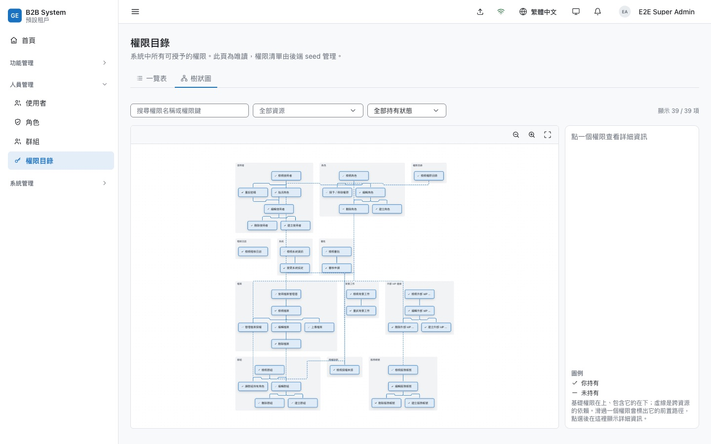

*權限目錄的樹狀圖。基礎權限在上、包含它的在下，虛線是跨資源的依賴。用的是設計系統裡的 TreeEditor（React Flow＋dagre，[ADR-0023](../adr/0023-react-flow-tree-editor.md)），不載入 React Flow 的全域 CSS，改走 design token。*

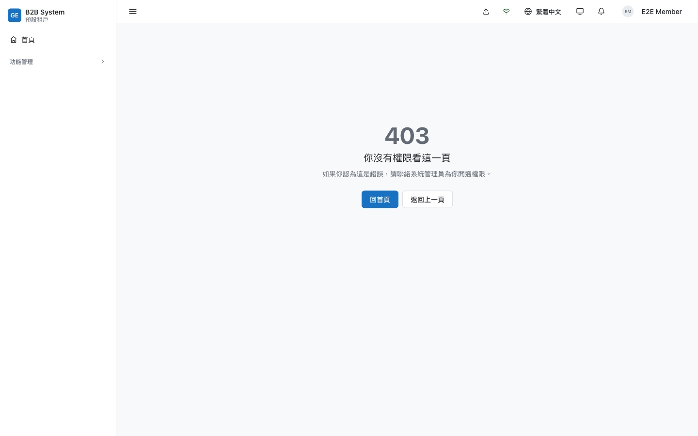

*深連結的 403。一般成員直接打開 `/role/create`：登入後回到原網址、顯示 403 而不是導走，方便拿網址請人開權限；選單只列出他看得到的項目。見 [`architecture/frontend/06-permission.md`](../architecture/frontend/06-permission.md)。*

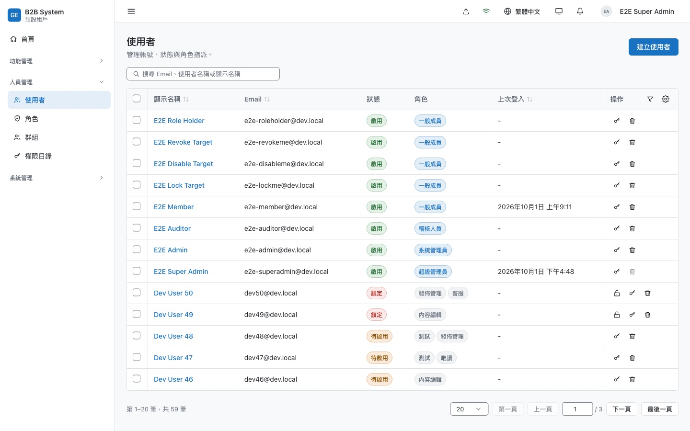

*使用者列表。RichTable 支援跨頁選取、欄位排序與釘選、篩選草稿。截圖帳號自己那一列的刪除鈕是停用的；鎖定的帳號多出解鎖鈕。*

---

## 5. 稽核、樂觀鎖、版本、回收桶

這四件事在一般後台常常各寫各的，這裡共用同一組原則：寫在業務交易內、副作用在提交後、不改寫歷史。規格見 [`architecture/backend/06-audit-log.md`](../architecture/backend/06-audit-log.md)、[`03-api-conventions.md`](../architecture/backend/03-api-conventions.md) §11、[`13-trash.md`](../architecture/backend/13-trash.md)、[`14-revisions.md`](../architecture/backend/14-revisions.md)。

| 情況 | 怎麼處理 |
| --- | --- |
| 稽核寫不進去 | 整個操作失敗。應用程式的 DB 角色只有 INSERT 和 SELECT；trigger 擋 UPDATE、DELETE。熱表 90 天，冷表 lz4 壓縮，搬移用 `SKIP LOCKED`，重疊的排程不互搶 |
| 人被刪了，紀錄還看得懂嗎 | 稽核快照 actor_email 與 resource_name。授權變更記完整的前後清單，能直接回答「那時候他有哪些權限」 |
| 有人登入，你的表單就衝突 | `version` 只在實體自己可編輯的欄位變動時遞增，登入、關聯寫入不遞增。衝突時同一交易內重讀，區分 409（衝突）與 404（已刪除） |
| 藉「還原舊版」偷改權限 | 還原到某一版是一次新的更新：權限鍵會改變時另外要求 `role:grantPermission`，否則只有 `role:update` 的人能藉還原拿掉角色的權限 |
| 還原時名稱已被佔用 | 回 409 並帶 `conflictingUserId`；檢查與寫入之間的競態由 partial unique index 擋下。還原也重跑反提權 |
| 永久刪除被外鍵卡住 | 依外鍵順序處理，每批一個交易、每列一個 savepoint，一列刪不掉只略過它自己；keyset 往後走，每一輪一定會結束。物件儲存的內容在交易提交後才刪 |
| 滾動部署期間誤刪檔案 | 「刪除時保留物件」拆成兩次部署，避免舊版的維護排程把新版保留的物件當成孤兒刪掉 |

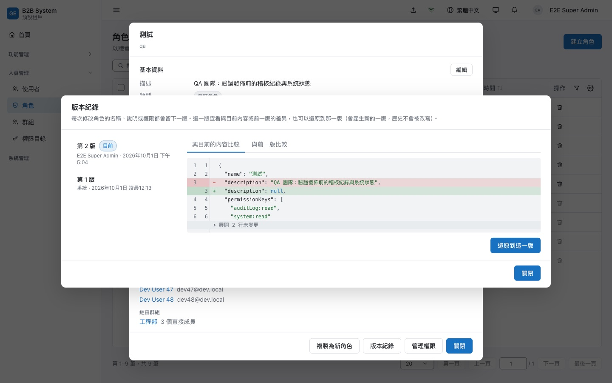

*角色的版本紀錄。選第 1 版、與目前內容比較：看到的就是「還原之後會變成什麼」。差異檢視用 Myers 演算法逐行比對，未變更的段落摺疊。還原會產生新的一版，歷史不被改寫。*

---

## 6. 背景工作、寄信、通知

佇列用 pg-boss，放在平台 DB，不引入 Redis（[ADR-0016](../adr/0016-background-jobs.md)）。但業務交易在租戶 DB，兩個資料庫不能同一個交易，於是交易內入列改寫租戶 DB 的 `job_outbox`：提交後立刻搬進佇列，每 10 分鐘 sweep 補搬，outbox 的 id 就是工作 id，重搬也只會有一筆。規格見 [`architecture/backend/10-jobs.md`](../architecture/backend/10-jobs.md)、[`11-mail.md`](../architecture/backend/11-mail.md)、[`15-notification.md`](../architecture/backend/15-notification.md)、[`16-notification-event.md`](../architecture/backend/16-notification-event.md)。

| 情況 | 怎麼處理 |
| --- | --- |
| 工作資料裡有 token | 啟用信、重設密碼信的 token 在寄出當下才簽發，因為持有 `job:read` 的人看得到工作資料。重試會簽新 token，信箱裡只有最後一封能用 |
| 入列後情況變了 | 寄出前再檢查一次狀態（已啟用、已刪除），標成 skipped，不寄也不重試 |
| production 誤設成 console 寄信 | 啟動失敗，因為 console 會把可登入的連結寫進日誌。另外發現 pino-http 會記下 `?token=` 與 set-cookie，加了遮蔽 |
| 一個租戶塞爆佇列 | 排程工作展開成每個租戶一筆，exclusive 與 throttle 以租戶區分 |
| 通知送丟 | 通知由擁有者模組在業務交易內寫入，刻意不訂閱程序內的事件匯流排（那是 fire-and-forget）。存的是 route id 加參數而不是網址，功能被停用或路徑改名時只顯示文字、不給壞掉的連結 |

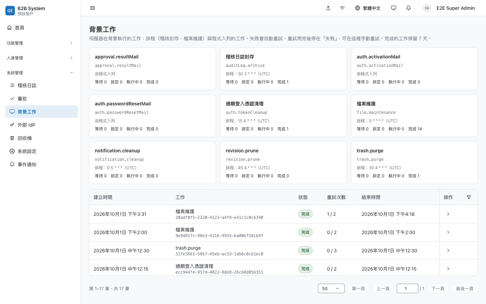

*背景工作。稽核封存、檔案維護、回收桶清除、版本修剪、通知清理都是排程工作；失敗自動重試，重試用完停在「失敗」可手動重試（兩人同時按，後到的回 409）。*

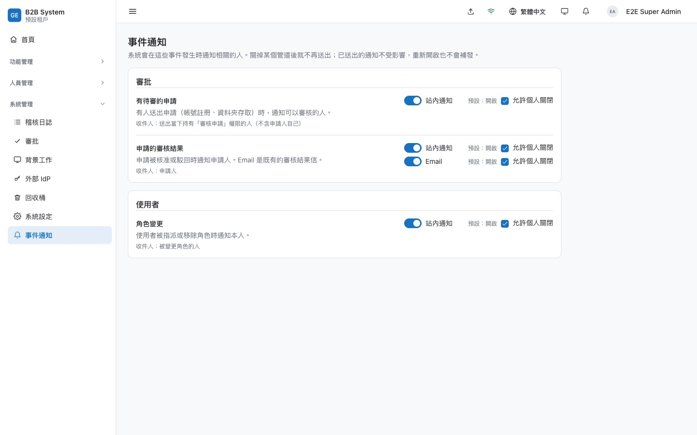

*事件通知。事件目錄寫在程式碼，DB 只存租戶層覆寫；可以決定是否允許個人關閉。關掉再打開不補發關閉期間的事件。*

---

## 7. 檔案：直傳、分塊、同源防護

檔案內容不經過 api，瀏覽器拿 presigned URL 直傳物件儲存（開發用自帶的 S3 相容服務 `apps/file-storage`）。規格見 [`architecture/backend/09-file.md`](../architecture/backend/09-file.md)、[`architecture/frontend/12-file-manager.md`](../architecture/frontend/12-file-manager.md)、[`rbac/07-resource-grants.md`](../rbac/07-resource-grants.md)。

| 情況 | 怎麼處理 |
| --- | --- |
| presigned PUT 限制不了大小 | 在 `complete` 時比對大小，不符就刪除物件。兩個 `complete` 同時到由 `WHERE status='pending'` 決勝 |
| 大檔傳到一半網址過期 | 分塊的網址按需索取，每塊各自重試；`complete` 被重送時先 HeadObject，已組好就照常完成 |
| 上傳的 HTML 偷 refresh cookie | HTML、JS、PDF 等型別強制 attachment 與 `octet-stream`，回應帶 `nosniff` 和 `CSP sandbox` |
| `` 帶不了 token | 影像 API 用 HMAC 簽章網址授權，302 轉到物件儲存；簽章時間取整到 TTL/2，同一時間窗網址不變，瀏覽器快取命中 |
| 關掉分頁上傳就斷 | 檔案暫存在 IndexedDB，上傳佇列跑在 SharedWorker，其他分頁接手繼續傳 |
| 照片洩漏位置 | sharp 產生變體時 EXIF 轉正並去除 GPS；原圖限制 128 MiB／1 億像素，不處理 SVG |

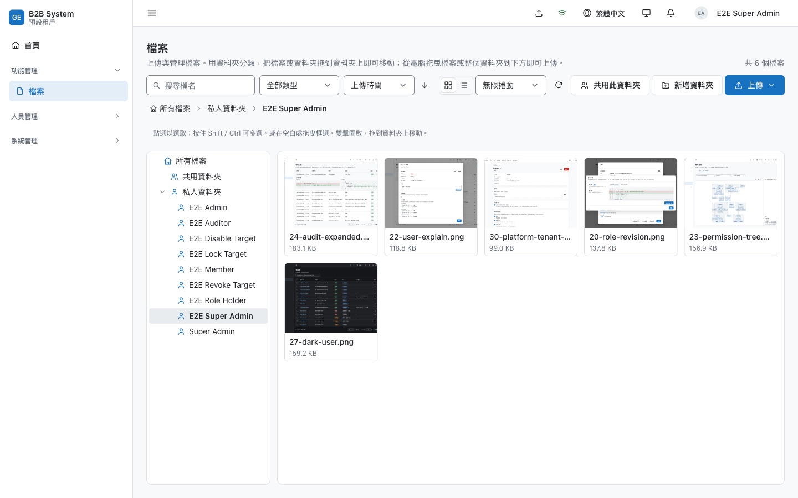

*檔案管理器。這六張縮圖就是本文的截圖，用檔案管理器上傳後由伺服器產生變體。沒有權限的資料夾也會列出並標成鎖住，可以直接申請存取。*

---

## 8. 前端架構：plugin、依賴圖、單一連線

規格見 [`architecture/frontend/`](../architecture/frontend/README.md)。

**一個功能，一行 `.use()`。** `apps/backstage/src/main.tsx` 用 `createAppContext().use(...).load()` 組裝所有 feature（[ADR-0001](../adr/0001-plugin-based-app-context.md)）。plugin 的 factory 同步執行，登記權限、選單、批次操作、route id；I/O（語系包）放在非同步的 `onInit`。權限一定在同步階段，因為 `requirePagePermission()` 找不到時會拋錯而不是放行，放在非同步階段就會有 render 早於註冊的競態。註解掉一行，路由、選單、權限、語系一起消失。租戶停用某功能時，plugin 在執行期卸載；使用者正在該頁就先導回首頁並提示（[ADR-0021](../adr/0021-runtime-feature-activation.md)）。

**不手列 query key。** mutation 成功後呼叫 `invalidateResources([{ resource, kind, id }])`，由 `apps/backstage/src/apis/resources.ts` 宣告的資源依賴圖決定要失效哪些查詢。只走一層、不遞移；delete 直接移除快取而不重抓，避免打出 404；按一次「已讀」不會讓稽核列表重抓。

**只有一個分頁連 WebSocket。** 可見的分頁參與 leader 選舉，只有 leader 持有 Socket.io 連線，再把「哪個來源變了」轉給其他分頁（帶 term 與序號，跳號就整批重新驗證）。背景分頁只標 stale，可見分頁延遲 150–750 ms 隨機時間再重抓來削峰。重連退避 2 秒起、上限 30 秒、±50% 抖動，api 重新部署時不會被上千條連線同時打回來。推播只是加速，斷線就退回 staleTime 與 focus 重抓。

**批次操作沒有批次端點。** [ADR-0009](../adr/0009-table-batch-operations.md) 做了後端批次端點，實際用過後全部移除（[ADR-0012](../adr/0012-batch-queue-worker.md)）：批次改成前端佇列，逐筆呼叫單筆 API，讓單筆端點是業務規則的唯一來源。每筆帶列表上的 `version`，過時的那筆個別失敗；被別人刪掉的自動移出選取。佇列 worker 刻意不自己打 API，否則會和分頁搶輪替中的 refresh token，觸發整條 family 撤銷。

**自己的設計系統。** UI 建在 Base UI（只提供焦點管理、ARIA、彈層定位，[ADR-0002](../adr/0002-base-ui-over-mui.md)）上，視覺全部自寫：42 個元件、43 個 Storybook story。Base UI 的 Select 需要所有項目都在 DOM 上而無法虛擬捲動，所以 Select／Menu 改成 Popover 加自製列表（`aria-activedescendant`）與 TanStack Virtual。顏色走三層 token，`contrast.test.ts` 對兩個主題各驗 WCAG 對比，`theme-init.js` 在首次繪製前設定主題，不閃白。

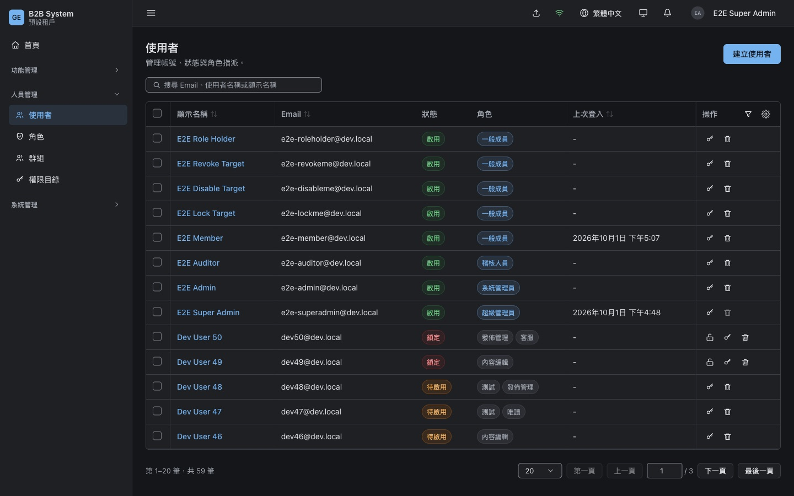

*深色主題。深色只覆寫 alias 層 token；狀態色分「填色」與「前景」兩組，兩個主題都過對比測試。*

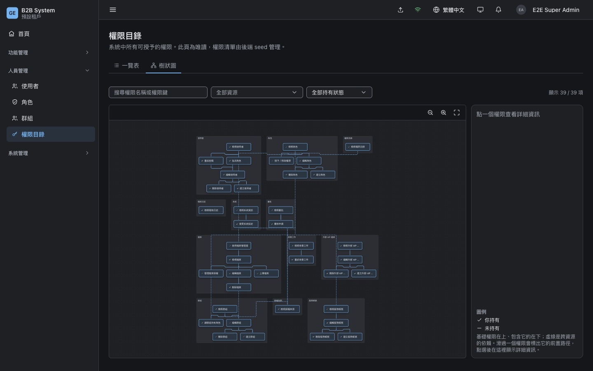

*同一個 TreeEditor 在深色主題。沒有載入第三方 CSS，所以元件跟著 token 一起換色。*

---

## 9. 工程紀律：規則由程式強制，決定都寫下來

### 9.1 漏掉就跑不起來

- **路由稽核**：程序在 `listen()` 前掃描所有 HTTP 路由與 WebSocket handler（`apps/api/src/common/route-audit.ts`）。沒宣告 `@Public`／`@Authenticated`／`@RequirePermissions`、平台端點誤標租戶功能、flag key 不在目錄裡，都讓程序啟動失敗。測試另外釘住每個路由用到的權限鍵，`role:updte` 這種錯字不會讓端點靜靜地永遠回 403。
- **結構測試**：後端層級依賴由 `apps/api/src/__tests__/layer-dependencies.spec.ts` 掃 import；前端 `design-system.test.ts` 擋寫死的色碼、外洩的 Base UI 型別，並要求每個元件都有測試與 story；只有一個檔案能 import socket.io-client。
- **語系完整性**：測試比對兩個語系檔的鍵集合，並確認每個錯誤碼、每個權限鍵都有翻譯。
- **暫時的開關會過期**：每個 feature flag 必填 `removeBy`，過期還留在目錄裡，單元測試直接失敗（[ADR-0022](../adr/0022-feature-flags.md)）。
- **測試規模**：api 約 1,080 個案例（整合測試用 Testcontainers 起 Postgres 17，平台 DB 與租戶 DB 分開）、backstage 約 1,350、auth 約 670、E2E 11 個 spec 約 50 個案例（含 mock OIDC IdP 與 Mailpit 收信）。

### 9.2 敢推翻自己

28 份 ADR 裡有四次明確的反轉，每次都寫清楚是什麼新資訊改變了判斷：

| 反轉 | 內容 |
| --- | --- |
| 0009 → 0012 | 後端批次端點全部移除，改成前端逐筆佇列 |
| 0010 → 0011 | 自製約 1,400 行的 JSON 樹狀編輯器，在還沒有 feature 使用時換成 CodeMirror 6，因為現在換最便宜 |
| 0013 → 0014 | 瀏覽器產生縮圖改成伺服器產生變體：canvas 做不出 progressive JPEG |
| 0018 → 0020 | 已完成的共用表工作區隔離整個丟掉，改成每租戶一個資料庫 |

文件寫法在實作時被證明會出錯的地方，集中列在 `CLAUDE.md` 的「與文件不同的實作決定」表：refresh cookie 的 Path、速率限制（`@nestjs/throttler` 只能用 IP 計數，企業 NAT 後整間公司共用額度，所以改成已登入以「租戶＋使用者」、登入以「email＋IP」計數）、WebSocket guard 的執行順序、回收桶清除的 savepoint 設計等。

### 9.3 還沒做到的部分

- repo 沒有 CI。pre-commit（`lefthook.yml`）只跑 `oxfmt` 與 `oxlint`，[ADR-0007](../adr/0007-openapi-generated-api-sdk.md) 提到的 OpenAPI diff 檢查尚未落地。
- 前端完整的層級依賴矩陣（[`conventions/07-layer-dependencies.md`](../conventions/07-layer-dependencies.md)）只有部分由 lint 與結構測試強制，其餘靠 review 與 `git grep` 自查；「識別字串必須是完整字面量」規則（[`conventions/06-literal-strings.md`](../conventions/06-literal-strings.md)）也只靠 review。
- API Token（[ADR-0027](../adr/0027-api-tokens-external-api.md)）完成了 T0（跨程序快取失效）與 T1（服務帳號與 token 的管理）；對外 API 的獨立程序與 `/v1` 契約（T2～T5）尚未開始。
- 已知問題記錄在 [`issues/`](../issues/README.md)。

---

## 10. 現況

**已完成**：RBAC 骨架、SSO／OIDC、每租戶一個資料庫、群組與關係圖（含 explain）、稽核日誌、審批、系統設定、檔案管理器與影像變體、背景工作、寄信、回收桶、版本歷史與樂觀鎖、站內通知與事件管理（含個人通知設定）、服務帳號與 API token 管理、feature flag 與執行期啟用功能、深色主題。

**待做**：對外 API 服務（API Token 的 T2～T5）、Webhook、匯入匯出、標籤／留言／關注、全域搜尋（P2）；專案層級的關係圖、MFA、可觀測性、多實例部署（P3）。每項都有提案文件在 [`features/`](../features/README.md)。進度見 [`03-roadmap.md`](./03-roadmap.md)。

**技術棧**：NestJS 12、Drizzle ORM、PostgreSQL 17、pg-boss、Socket.io、oidc-provider、sharp；React 19、Vite 8、TanStack Router／Query、Base UI、CodeMirror 6、React Flow；TypeScript 6 strict、Vitest 5、Playwright、Testcontainers、oxlint／oxfmt；Node 24、pnpm monorepo。選型理由見 [`02-technology-selection.md`](./02-technology-selection.md)。
